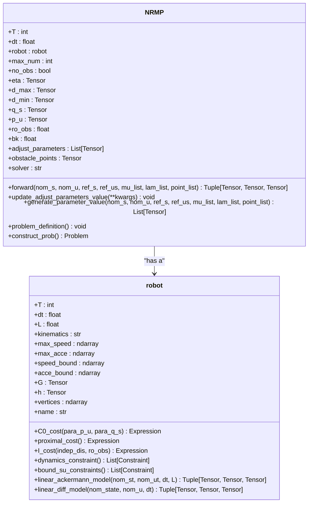
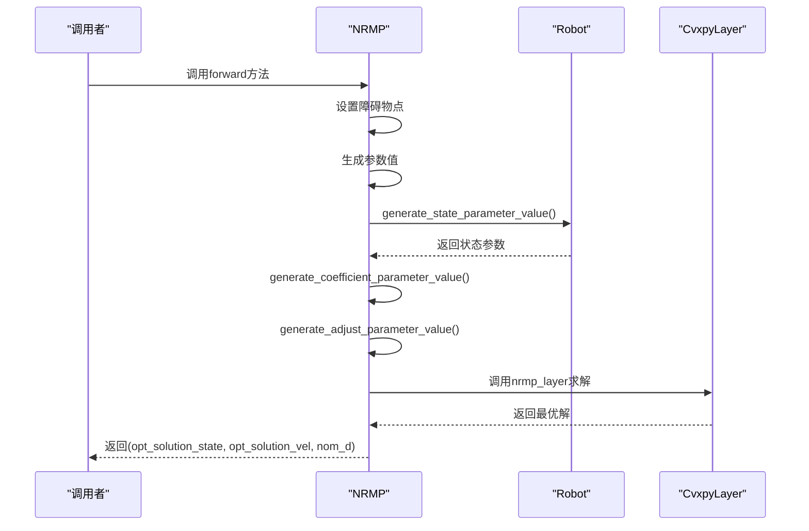

# NRMP类

<cite>
**Referenced Files in This Document**   
- [nrmp.py](file://neupan/blocks/nrmp.py)
- [robot.py](file://neupan/robot/robot.py)
- [planner.yaml](file://example/LON/planner.yaml)
- [planner.yaml](file://example/corridor/acker/planner.yaml)
- [planner.yaml](file://example/convex_obs/diff/planner.yaml)
</cite>

## 目录
1. [简介](#简介)
2. [核心组件](#核心组件)
3. [成本函数设计原理](#成本函数设计原理)
4. [forward方法与优化求解](#forward方法与优化求解)
5. [可调参数及其影响](#可调参数及其影响)
6. [约束条件实现](#约束条件实现)
7. [配置文件示例](#配置文件示例)

## 简介

NRMP（Nonlinear Recursive Minimization Planner）是NeuPAN运动规划框架中的核心优化模块，负责求解最优控制序列。该类基于凸优化理论，通过集成神经网络生成的潜在距离空间信息，实现安全、平滑的路径规划。NRMP模块采用分层优化架构，结合了参考轨迹跟踪、动态约束满足和障碍物避让等多重目标。

**Section sources**
- [nrmp.py](file://neupan/blocks/nrmp.py#L1-L50)

## 核心组件

NRMP类的核心功能围绕三个主要成本函数构建：C0_cost、proximal_cost和I_cost。这些成本函数共同构成了一个凸优化问题，通过cvxpylayers库与PyTorch集成，实现了可微分的优化求解。该模块通过forward方法接收名义状态、参考轨迹和外部特征（μ/λ），并输出最优的状态和控制序列。



**Diagram sources**
- [nrmp.py](file://neupan/blocks/nrmp.py#L29-L324)
- [robot.py](file://neupan/robot/robot.py#L20-L350)

**Section sources**
- [nrmp.py](file://neupan/blocks/nrmp.py#L29-L324)

## 成本函数设计原理

### C0_cost：参考跟踪成本

C0_cost函数衡量规划轨迹与参考轨迹之间的偏差，包含状态跟踪和速度跟踪两部分。其数学形式为：
```
C0_cost = Σ||q_s * s_t - γ_a,t||² + Σ||p_u * u_t - γ_b,t||²
```
其中`s_t`为规划状态，`u_t`为控制输入，`γ_a,t`和`γ_b,t`分别为加权后的参考状态和参考速度。权重参数`q_s`和`p_u`分别控制状态和速度的跟踪精度。

### proximal_cost：邻近成本

proximal_cost函数确保规划解接近名义轨迹，实现平滑优化。其形式为：
```
proximal_cost = Σ||s_t - s_nom,t||²
```
该成本项通过参数`bk`进行加权，有助于避免优化过程中的剧烈跳变，提高数值稳定性。

### I_cost：障碍物避让成本

I_cost函数实现基于安全距离的障碍物避让，其形式为：
```
I_cost = 0.5 * ro_obs * Σ(max(0, d_min - d_t))²
```
其中`d_t`为t时刻到最近障碍物的距离，`d_min`为最小安全距离。该成本项在距离小于安全阈值时产生惩罚，确保避障安全性。

**Section sources**
- [nrmp.py](file://neupan/blocks/nrmp.py#L200-L220)
- [robot.py](file://neupan/robot/robot.py#L100-L150)

## forward方法与优化求解

### 方法签名与参数

```python
def forward(
    self,
    nom_s: torch.Tensor,
    nom_u: torch.Tensor,
    ref_s: torch.Tensor,
    ref_us: torch.Tensor,
    mu_list: Optional[List[torch.Tensor]] = None,
    lam_list: Optional[List[torch.Tensor]] = None,
    point_list: Optional[List[torch.Tensor]] = None,
)
```

### 执行流程



**Diagram sources**
- [nrmp.py](file://neupan/blocks/nrmp.py#L50-L80)
- [robot.py](file://neupan/robot/robot.py#L160-L200)

**Section sources**
- [nrmp.py](file://neupan/blocks/nrmp.py#L50-L80)

## 可调参数及其影响

### 参数列表

| 参数 | 默认值 | 说明 |
|------|--------|------|
| q_s | 1.0 | 状态跟踪权重，值越大越贴近参考状态 |
| p_u | 1.0 | 速度跟踪权重，值越大越贴近参考速度 |
| eta | 10.0 | 安全距离成本权重，值越大越远离障碍物 |
| d_max | 1.0 | 最大安全距离 |
| d_min | 0.1 | 最小安全距离 |

### update_adjust_parameters_value方法

该方法允许在运行时动态调整上述参数，影响规划行为：
- 增大`q_s`使轨迹更贴近参考路径
- 增大`p_u`使速度更贴近参考速度
- 增大`eta`增强避障能力，但可能增加路径长度
- 调整`d_min`改变最小安全距离

```python
def update_adjust_parameters_value(self, **kwargs):
    # 参数更新逻辑
    pass
```

**Section sources**
- [nrmp.py](file://neupan/blocks/nrmp.py#L140-L160)

## 约束条件实现

### 速度与加速度限制

`bound_su_constraints`方法实现了对速度和加速度的物理限制：
```python
def bound_su_constraints(self):
    constraints = []
    constraints += [ cp.abs(self.indep_u[:, 1:] - self.indep_u[:, :-1] ) <= self.acce_bound ] 
    constraints += [ cp.abs(self.indep_u) <= self.speed_bound]
    constraints += [ self.indep_s[:, 0:1] == self.para_s[:, 0:1] ]
    return constraints
```
该约束确保：
1. 加速度不超过物理极限（`acce_bound`）
2. 速度不超过最大允许值（`speed_bound`）
3. 初始状态与名义状态一致

### 动态模型线性化

#### 阿克曼模型线性化

对于阿克曼转向模型，状态转移方程在名义轨迹处进行一阶泰勒展开：
```
A = [[1, 0, -v*dt*sin(φ)], [0, 1, v*dt*cos(φ)], [0, 0, 1]]
B = [[cos(φ)*dt, 0], [sin(φ)*dt, 0], [tan(ψ)*dt/L, v*dt/(L*cos²(ψ))]]
C = [[φ*v*sin(φ)*dt], [-φ*v*cos(φ)*dt], [-ψ*v*dt/(L*cos²(ψ))]]
```

#### 差速模型线性化

对于差速驱动模型，线性化形式更为简单：
```
A = [[1, 0, -v*dt*sin(φ)], [0, 1, v*dt*cos(φ)], [0, 0, 1]]
B = [[cos(φ)*dt, 0], [sin(φ)*dt, 0], [0, dt]]
C = [[φ*v*sin(φ)*dt], [-φ*v*cos(φ)*dt], [0]]
```

**Section sources**
- [robot.py](file://neupan/robot/robot.py#L250-L300)

## 配置文件示例

### LON场景配置

```yaml
# adjust parameters
adjust:
  q_s: 0.1
  p_u: 2.0
  eta: 10
  d_max: 0.2
  d_min: 0.01
  ro_obs: 10
  bk: 0.0
```

### 走廊场景配置（阿克曼）

```yaml
adjust:
  q_s: 1.0
  p_u: 1.0
  eta: 15.0
  d_max: 1.0
  d_min: 0.1
  bk: 1.0
```

### 凸障碍物场景配置（差速）

```yaml
adjust:
  q_s: 1.0
  p_u: 1.0
  eta: 15.0
  d_max: 1.0
  d_min: 0.1
```

这些配置文件展示了不同场景下可调参数的典型取值，反映了对状态跟踪、速度跟踪和避障安全性的不同权衡。

**Section sources**
- [planner.yaml](file://example/LON/planner.yaml#L45-L52)
- [planner.yaml](file://example/corridor/acker/planner.yaml#L35-L41)
- [planner.yaml](file://example/convex_obs/diff/planner.yaml#L45-L51)