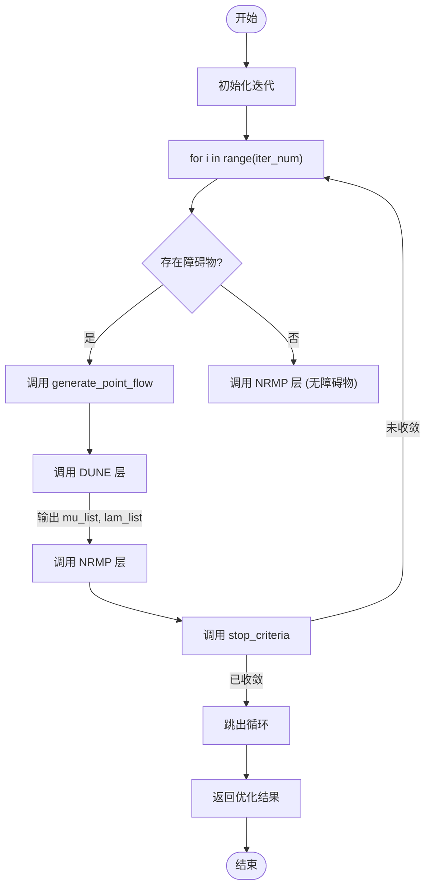
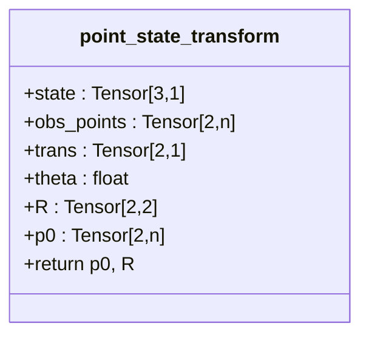

# PAN类

<cite>
**本文档中引用的文件**  
- [pan.py](file://neupan/blocks/pan.py)
- [dune.py](file://neupan/blocks/dune.py)
- [nrmp.py](file://neupan/blocks/nrmp.py)
- [configuration/__init__.py](file://neupan/configuration/__init__.py)
- [util/__init__.py](file://neupan/util/__init__.py)
</cite>

## 目录
1. [简介](#简介)
2. [核心参数配置](#核心参数配置)
3. [数据流解析](#数据流解析)
4. [关键内部方法](#关键内部方法)
5. [属性说明](#属性说明)
6. [使用技巧](#使用技巧)

## 简介

PAN（Proximal Alternating-minimization Network）是NeuPAN算法的核心类，采用近端交替最小化框架，结合DUNE与NRMP两个子模块，解决具有大量点级避障约束的优化问题。该类通过迭代优化名义状态与控制输入，生成安全且高效的运动轨迹。

**Section sources**
- [pan.py](file://neupan/blocks/pan.py#L1-L32)

## 核心参数配置

PAN类的`__init__`方法接受多个关键参数，用于定义算法行为和性能特征。

### 参数说明

- **receding**: `int`，表示预测时域的步数。该值决定了优化问题的时间范围，默认为10步。
- **step_time**: `float`，MPC框架中的时间步长，单位为秒，默认为0.1秒。
- **robot**: `robot`实例，包含机器人几何与动力学信息，用于构建约束与成本函数。
- **iter_num**: `int`，PAN算法的迭代次数，控制优化过程的深度，默认为2次。
- **dune_max_num**: `int`，DUNE模型考虑的最大障碍点数。若实际点云数量超过此值，将进行降采样，默认为100。
- **nrmp_max_num**: `int`，NRMP模型考虑的最大障碍点数，直接影响优化问题的规模与计算复杂度，默认为10。
- **dune_checkpoint**: `str`，DUNE模型的检查点路径。若未提供，系统将尝试训练新模型或报错。
- **iter_threshold**: `float`，判断迭代收敛的阈值。当状态、控制或拉格朗日乘子的变化量平方和小于此值时，提前终止迭代，默认为0.1。
- **adjust_kwargs**: `dict`，传递给NRMP层的调整参数字典，用于微调成本函数权重与安全距离。
- **train_kwargs**: `dict`，传递给DUNE训练模块的参数字典，用于控制模型训练过程。

**Section sources**
- [pan.py](file://neupan/blocks/pan.py#L31-L68)

## 数据流解析

`forward`方法是PAN类的核心执行流程，负责接收输入并输出优化后的状态与控制序列。

### 输入与输出

- **输入**:
  - `nom_s`: 名义状态张量，形状为(3, receding+1)，包含x, y, theta。
  - `nom_u`: 名义控制张量，形状为(2, receding)。
  - `ref_s`: 参考轨迹，形状为(3, receding+1)。
  - `ref_us`: 参考速度数组，形状为(receding,)。
  - `obs_points`: 障碍点云，形状为(2, N)，全局坐标。
  - `point_velocities`: 障碍点速度，形状为(2, N)。
- **输出**:
  - `opt_state`: 优化后的状态序列，形状为(3, receding+1)。
  - `opt_vel`: 优化后的控制序列，形状为(2, receding)。
  - `nom_distance`: 优化过程中的距离信息（可选）。

### 执行流程

**Diagram sources**
- [pan.py](file://neupan/blocks/pan.py#L136-L174)

**Section sources**
- [pan.py](file://neupan/blocks/pan.py#L136-L174)

## 关键内部方法

### generate_point_flow 方法

该方法为每个预测时域步生成障碍点流、旋转矩阵和全局坐标点列表。

- **功能**: 将全局坐标系下的障碍点云，根据名义状态`nom_s`在每个时步`i`进行变换，得到机器人坐标系下的点流`point_flow_list`。
- **数学原理**: 使用`point_state_transform`方法进行坐标变换。对于时步`i`，障碍点位置预测为`obs_points + i * (point_velocities * dt)`，然后通过旋转矩阵`R.T`和位移`trans`转换到机器人坐标系。
- **降采样**: 若`obs_points`数量超过`dune_max_num`，调用`downsample_decimation`进行均匀降采样，并打印提示信息。

**Section sources**
- [pan.py](file://neupan/blocks/pan.py#L136-L174)
- [util/__init__.py](file://neupan/util/__init__.py#L297-L306)

### point_state_transform 方法

该方法实现从全局坐标系到机器人坐标系的坐标变换。

- **输入**: 机器人状态`state` (x, y, theta) 和障碍点云`obs_points`。
- **输出**: 机器人坐标系下的点云`p0`和旋转矩阵`R`。
- **数学原理**: 
  1. 构造旋转矩阵 `R = [[cosθ, -sinθ], [sinθ, cosθ]]`。
  2. 计算相对位置 `p0 = R.T @ (obs_points - trans)`，其中`trans`是机器人的(x, y)位置。

**Diagram sources**
- [pan.py](file://neupan/blocks/pan.py#L169-L211)

**Section sources**
- [pan.py](file://neupan/blocks/pan.py#L169-L211)

## 属性说明

PAN类提供了多个属性用于访问内部状态和计算结果。

### min_distance 属性

- **作用**: 获取当前时刻DUNE模型计算出的最小障碍物距离。
- **计算方式**: 在`DUNE.forward`中，对每个时步计算`distance = mu.T (G @ p0 - h)`，并在`i=0`时将`torch.min(distance)`赋值给`self.min_distance`。
- **访问时机**: 在调用`forward`方法后，可随时访问此属性以获取最近障碍物距离。

**Section sources**
- [pan.py](file://neupan/blocks/pan.py#L241-L247)
- [dune.py](file://neupan/blocks/dune.py#L88-L90)

### dune_points 属性

- **作用**: 获取当前被DUNE模型考虑的障碍点（全局坐标）。
- **计算方式**: 在`DUNE.forward`中，将`obs_points_list[0]`（即当前时刻的障碍点）赋值给`self.obstacle_points`。`dune_points`属性通过`tensor_to_np`将其转换为NumPy数组。
- **访问时机**: 在调用`forward`方法后，可访问此属性以检查实际参与计算的障碍点。

**Section sources**
- [pan.py](file://neupan/blocks/pan.py#L248-L254)
- [dune.py](file://neupan/blocks/dune.py#L66-L67)

### nrmp_points 属性

- **作用**: 获取当前被NRMP模型考虑的障碍点（全局坐标）。
- **计算方式**: 在`NRMP.forward`中，将`point_list[0][:, :max_num]`（即当前时刻排序后的前`nrmp_max_num`个点）赋值给`self.obstacle_points`。`nrmp_points`属性通过`tensor_to_np`将其转换为NumPy数组。
- **访问时机**: 在调用`forward`方法后，可访问此属性以了解优化器实际使用的障碍点。

**Section sources**
- [pan.py](file://neupan/blocks/pan.py#L255-L261)
- [nrmp.py](file://neupan/blocks/nrmp.py#L120-L122)

## 使用技巧

### 自定义迭代阈值

可通过`iter_threshold`参数调整收敛标准。较小的值（如0.01）能获得更精确的解但增加计算时间；较大的值（如0.5）可加速计算但可能牺牲轨迹质量。建议在调试阶段使用较小值，在部署时根据硬件性能调整至可接受范围。

### 打印控制

`print_once`方法确保特定消息（如降采样提示）仅打印一次，避免日志冗余。用户可通过重写此方法或利用`configuration.time_print`标志来全局控制调试信息输出。

**Section sources**
- [pan.py](file://neupan/blocks/pan.py#L263-L271)
- [configuration/__init__.py](file://neupan/configuration/__init__.py#L4-L5)