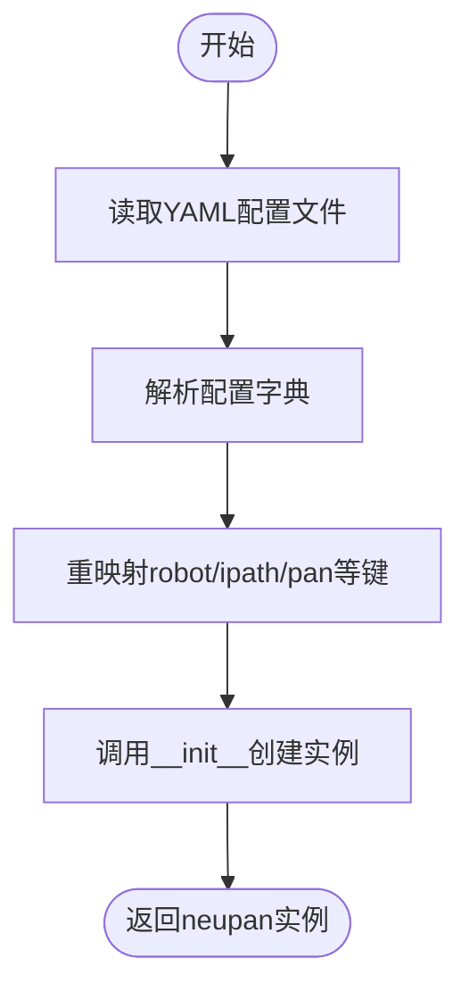

# neupan类

<cite>
**本文档中引用的文件**  
- [neupan.py](file://neupan/neupan.py)
- [pan.py](file://neupan/blocks/pan.py)
- [initial_path.py](file://neupan/blocks/initial_path.py)
- [dune.py](file://neupan/blocks/dune.py)
- [planner.yaml](file://example/corridor/diff/planner.yaml)
</cite>

## 目录
1. [简介](#简介)
2. [核心方法](#核心方法)
   - [init_from_yaml](#init_from_yaml)
   - [forward](#forward)
   - [scan_to_point](#scan_to_point)
   - [set_initial_path](#set_initial_path)
3. [公共属性](#公共属性)
4. [完整使用示例](#完整使用示例)
5. [内部状态与信息字典](#内部状态与信息字典)
6. [依赖关系图](#依赖关系图)

## 简介
`neupan`类是NeuPAN算法的主类，封装了PAN（Proximal Alternating Minimization Network）类并提供了更友好的用户接口。该类用于机器人在动态环境中的实时路径规划，结合了DUNE（Deep Unfolded Neural Encoder）和NRMP（Nonlinear Receding Horizon Motion Planning）模块，实现高效的避障与轨迹优化。

**Section sources**
- [neupan.py](file://neupan/neupan.py#L1-L402)

## 核心方法

### init_from_yaml
从YAML配置文件初始化`neupan`实例，支持通过关键字参数覆盖配置。

**参数：**
- `yaml_file`: YAML配置文件路径
- `**kwargs`: 可选参数，用于覆盖YAML中的配置

**返回值：**
- `neupan`类实例

**调用顺序：**
1. 读取YAML文件并解析为字典
2. 将特定键（如robot, ipath, pan等）重映射为对应模块的参数
3. 调用`__init__`方法创建实例



**Diagram sources**
- [neupan.py](file://neupan/neupan.py#L88-L101)

**Section sources**
- [neupan.py](file://neupan/neupan.py#L88-L101)
- [planner.yaml](file://example/corridor/diff/planner.yaml#L1-L51)

### forward
执行一次前向传播，计算最优控制输入。

**参数：**
- `state`: 机器人当前状态，形状为(3, 1)的矩阵，包含[x, y, θ]
- `points`: 障碍物点云位置，形状为(2, N)的矩阵
- `velocities`: 障碍物点云速度，形状为(2, N)的矩阵（可选）

**返回值：**
- `action`: 最优速度控制输入，形状为(2, 1)的矩阵
- `info`: 包含规划信息的字典

**调用顺序：**
1. 检查是否到达目标
2. 生成名义参考状态
3. 转换为张量格式
4. 调用PAN模块进行优化
5. 更新内部状态和信息字典
6. 检查是否停止
7. 返回控制动作和信息


**Diagram sources**
- [neupan.py](file://neupan/neupan.py#L104-L157)
- [pan.py](file://neupan/blocks/pan.py#L103-L141)

**Section sources**
- [neupan.py](file://neupan/neupan.py#L104-L157)

### scan_to_point
将激光雷达扫描数据转换为全局坐标系下的点云。

**参数：**
- `state`: 机器人当前状态[x, y, θ]
- `scan`: 扫描数据字典，包含ranges, angle_min, angle_max等
- `scan_offset`: 传感器相对于机器人坐标系的偏移[dx, dy, dθ]
- `angle_range`: 处理的角度范围，默认[-π, π]
- `down_sample`: 降采样率，默认为1

**返回值：**
- `(2, n)`形状的点云矩阵，或None（无有效点）

**Section sources**
- [neupan.py](file://neupan/neupan.py#L163-L212)

### set_initial_path
设置初始路径。

**参数：**
- `path`: 路径点列表，每个点为形状(4, 1)的向量，包含[x, y, θ, gear]，gear为-1（倒挡）或1（前进挡）

**功能：**
- 设置初始路径
- 计算平均间隔
- 按挡位分割路径
- 重置路径索引


**Diagram sources**
- [initial_path.py](file://neupan/blocks/initial_path.py#L127-L140)

**Section sources**
- [neupan.py](file://neupan/neupan.py#L286-L293)
- [initial_path.py](file://neupan/blocks/initial_path.py#L127-L140)

## 公共属性
`neupan`类提供了多个只读属性用于访问内部状态和规划结果：

| 属性名 | 类型 | 含义与使用场景 |
|--------|------|----------------|
| min_distance | float | 当前到最近障碍物的最小距离，用于碰撞检测 |
| opt_trajectory | list | MPC重规划范围内的最优轨迹，每个元素为(3,1)状态向量 |
| ref_trajectory | list | 基于初始路径生成的参考轨迹，用于跟踪控制 |
| initial_path | list | 当前设置的初始路径，包含挡位信息 |
| waypoints | list | 生成初始路径所用的路点 |
| dune_points | tensor | DUNE模块考虑的障碍物点云 |
| nrmp_points | tensor | NRMP模块考虑的障碍物点云 |
| adjust_parameters | dict | 调整参数(q_s, p_u, eta等)的当前值 |

**Section sources**
- [neupan.py](file://neupan/neupan.py#L350-L396)

## 完整使用示例
```python
# 1. 从YAML配置初始化
planner = neupan.init_from_yaml('example/corridor/diff/planner.yaml')

# 2. 在控制循环中处理传感器数据
while not arrived:
    # 获取传感器数据
    scan_data = get_lidar_data()
    robot_state = get_robot_state()
    
    # 转换扫描数据为点云
    points = planner.scan_to_point(robot_state, scan_data)
    
    # 执行规划
    action, info = planner.forward(robot_state, points)
    
    # 发送控制指令
    send_command(action)
    
    # 检查到达状态
    if info["arrive"]:
        break

# 3. 动态更新路径和参数
planner.set_initial_path(new_path)
planner.set_reference_speed(5.0)
planner.update_adjust_parameters(q_s=2.0, eta=20.0)

# 4. 重置规划器状态
planner.reset()
```

**Section sources**
- [neupan.py](file://neupan/neupan.py#L88-L157)
- [planner.yaml](file://example/corridor/diff/planner.yaml#L1-L51)

## 内部状态与信息字典
`neupan`类维护了关键的内部状态和信息字典：

### 内部状态
- `cur_vel_array`: 当前速度数组，形状(2, T)，缓存上一次的最优速度序列
- `info`: 信息字典，包含以下字段：
  - `stop`: 是否因碰撞风险停止
  - `arrive`: 是否到达目标
  - `collision`: 是否发生碰撞
  - `state_tensor`: 最优状态张量
  - `vel_tensor`: 最优速度张量
  - `distance_tensor`: 距离张量
  - `ref_state_list`: 参考状态列表
  - `opt_state_list`: 最优状态列表

### 重置机制
`reset()`方法用于重置规划器到初始状态：
- 重置路径索引（point_index, curve_index）
- 清除到达标志（arrive_flag）
- 重置停止和到达标志
- 将当前速度数组清零

**Section sources**
- [neupan.py](file://neupan/neupan.py#L72-L72)
- [neupan.py](file://neupan/neupan.py#L278-L284)

## 依赖关系图


**Diagram sources**
- [neupan.py](file://neupan/neupan.py#L1-L402)
- [pan.py](file://neupan/blocks/pan.py#L1-L272)
- [initial_path.py](file://neupan/blocks/initial_path.py#L1-L483)
- [dune.py](file://neupan/blocks/dune.py#L1-L211)