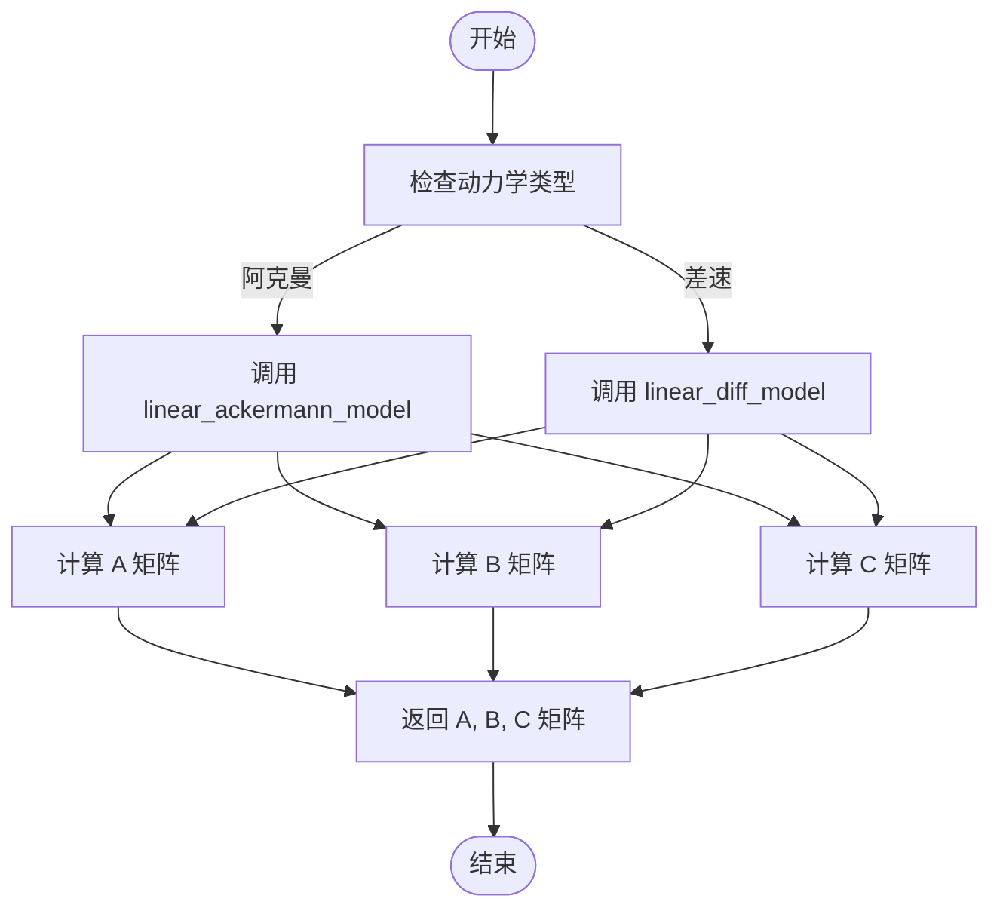
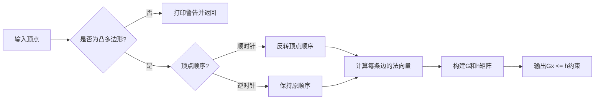

# robot类

<cite>
**Referenced Files in This Document**   
- [robot.py](file://neupan/robot/robot.py)
- [__init__.py](file://neupan/util/__init__.py)
- [__init__.py](file://neupan/configuration/__init__.py)
</cite>

## 目录
1. [简介](#简介)
2. [核心组件](#核心组件)
3. [运动学模型与雅可比矩阵](#运动学模型与雅可比矩阵)
4. [几何约束与顶点生成](#几何约束与顶点生成)
5. [优化变量与参数定义](#优化变量与参数定义)

## 简介

`robot`类是NeuPAN规划框架中的核心组件，负责定义机器人的运动学模型、几何约束，并为优化问题生成相应的约束条件和成本函数。该类支持阿克曼（acker）和差速（diff）两种动力学模型，能够灵活配置机器人的物理参数和运动限制。通过将非线性动力学模型线性化，该类为模型预测控制（MPC）框架提供了必要的雅可比矩阵（A/B/C），并利用半平面表示法（G/h）处理机器人的几何约束。

**Section sources**
- [robot.py](file://neupan/robot/robot.py#L0-L349)

## 核心组件

`robot`类的核心功能围绕其初始化参数和关键方法展开。在`__init__`方法中，用户必须指定`kinematics`参数（'acker'或'diff'），以确定机器人的动力学模型。机器人的几何形状由`vertices`参数定义，若未提供，则可通过`length`、`width`和`wheelbase`参数自动生成矩形顶点。`max_speed`和`max_acce`参数分别定义了速度和加速度的上限，这些限制在优化过程中作为边界约束使用。对于阿克曼转向机器人，系统会自动检查并限制最大转向角不超过1.57弧度（约90度），以确保物理可行性。

**Section sources**
- [robot.py](file://neupan/robot/robot.py#L15-L50)

## 运动学模型与雅可比矩阵

`robot`类实现了`linear_ackermann_model`和`linear_diff_model`两种方法，用于生成动力学模型的雅可比矩阵（A/B/C）。这些矩阵在MPC框架中至关重要，它们将非线性状态转移方程在名义轨迹（nominal trajectory）附近线性化，从而将非线性优化问题转化为一系列可高效求解的二次规划（QP）问题。

**Diagram sources**
- [robot.py](file://neupan/robot/robot.py#L250-L300)

### 阿克曼模型 (linear_ackermann_model)

该方法基于阿克曼转向几何学，计算状态转移方程对状态和控制输入的偏导数。A矩阵描述了当前状态对下一状态的影响，B矩阵描述了控制输入对下一状态的影响，而C矩阵则包含了线性化过程中产生的常数项。具体而言，A矩阵的第三行第一列和第二列元素与车辆航向角和速度相关，B矩阵的第三行包含了转向角和速度的耦合效应。

**Section sources**
- [robot.py](file://neupan/robot/robot.py#L250-L270)

### 差速模型 (linear_diff_model)

该方法适用于差速驱动机器人，其动力学模型相对简单。与阿克曼模型相比，B矩阵的第三行第二列元素为`dt`，直接表示角速度对航向角变化的贡献，而C矩阵的第三行元素为零，表明在名义轨迹上没有额外的常数偏移。

**Section sources**
- [robot.py](file://neupan/robot/robot.py#L275-L295)

## 几何约束与顶点生成

`robot`类通过`cal_vertices_from_length_width`和`gen_inequal_from_vertex`方法处理机器人的几何约束。前者根据车辆的`length`、`width`和`wheelbase`参数生成矩形的四个顶点坐标。后者则将这些顶点转换为半平面表示（Half-Plane Representation），即`Gx <= h`形式的线性不等式约束，其中`G`是法向量矩阵，`h`是距离向量。此转换过程首先检查顶点是否构成凸多边形，并确保顶点按逆时针（CCW）顺序排列，然后通过计算相邻顶点连线的法向量来构建`G`和`h`。

**Diagram sources**
- [robot.py](file://neupan/robot/robot.py#L305-L349)
- [__init__.py](file://neupan/util/__init__.py#L160-L205)

**Section sources**
- [robot.py](file://neupan/robot/robot.py#L305-L349)
- [__init__.py](file://neupan/util/__init__.py#L160-L205)

## 优化变量与参数定义

为了支持CVXPY优化器，`robot`类提供了`define_variable`和`state_parameter_define`等方法来构建优化问题所需的变量和参数。`define_variable`方法定义了独立变量，包括状态变量`indep_s`（3x(T+1)）和控制输入变量`indep_u`（2xT），其中T为预测时域。`state_parameter_define`方法则定义了一系列参数，如名义状态`para_s`、参考状态`para_gamma_a`以及最重要的状态转移模型参数`para_A_list`、`para_B_list`和`para_C_list`。这些参数在每次优化迭代中被更新，使得线性化模型能够跟踪最新的名义轨迹，从而实现非线性MPC的求解。

**Section sources**
- [robot.py](file://neupan/robot/robot.py#L55-L100)