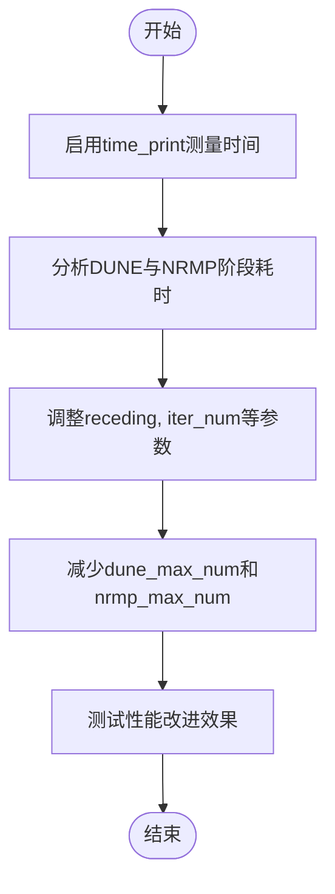

# 性能问题

<cite>
**本文档中引用的文件**  
- [neupan.py](file://neupan/neupan.py)
- [pan.py](file://neupan/blocks/pan.py)
- [dune.py](file://neupan/blocks/dune.py)
- [nrmp.py](file://neupan/blocks/nrmp.py)
- [planner.yaml](file://example/corridor/acker/planner.yaml)
- [README.md](file://README.md)
</cite>

## 目录
1. [引言](#引言)
2. [性能瓶颈分析](#性能瓶颈分析)
3. [执行时间测量方法](#执行时间测量方法)
4. [关键参数优化](#关键参数优化)
5. [硬件性能影响](#硬件性能影响)
6. [配置文件修改示例](#配置文件修改示例)
7. [综合优化建议](#综合优化建议)

## 引言
NeuPAN是一种基于端到端模型学习的实时机器人运动规划算法，其性能受多种因素影响。当系统运行缓慢或控制频率降低时，主要问题通常源于计算负载过高。本指南旨在系统性地分析和解决NeuPAN的性能问题，重点包括通过启用时间打印功能来测量各阶段执行时间，并提供参数调优建议以降低计算复杂度。

## 性能瓶颈分析

NeuPAN的性能瓶颈主要集中在两个核心组件：DUNE（Deep Unfolded Neural Encoder）编码和NRMP（Neural Regularized Motion Planner）优化。DUNE负责将点云数据映射到潜在距离空间，而NRMP则求解包含大量点级避障约束的优化问题。这两个阶段的计算复杂度直接影响整体控制频率。

在实际运行中，forward函数的执行时间是衡量性能的关键指标。当receding horizon（预测步长）、iter_num（迭代次数）、dune_max_num（DUNE层考虑的最大障碍点数）和nrmp_max_num（NRMP层考虑的最大障碍点数）等参数设置过高时，会导致计算负载显著增加，从而降低控制频率。

**Section sources**
- [neupan.py](file://neupan/neupan.py#L0-L402)
- [pan.py](file://neupan/blocks/pan.py#L0-L272)

## 执行时间测量方法

为了准确测量forward函数的执行时间，可以通过启用`time_print`参数来实现。该参数位于YAML配置文件中，设置为`True`后，系统将在控制台输出各阶段的耗时信息，包括DUNE编码和NRMP优化的具体时间消耗。

在代码实现中，`time_it`装饰器被用于测量关键函数的执行时间。例如，在`neupan.py`中，forward方法被`@time_it("neupan forward")`修饰，这使得每次调用forward函数时都会记录并打印其执行时间。类似地，DUNE和NRMP模块内部也使用了相同的机制来分别测量`- dune forward`和`- nrmp forward`的时间消耗。

通过分析这些时间日志，可以识别出性能瓶颈所在的具体阶段，进而针对性地调整相关参数以优化性能。

**Section sources**
- [neupan.py](file://neupan/neupan.py#L0-L402)
- [dune.py](file://neupan/blocks/dune.py#L0-L211)
- [nrmp.py](file://neupan/blocks/nrmp.py#L0-L325)

## 关键参数优化

### receding参数调整
`receding`参数定义了MPC（模型预测控制）框架中的预测步长。较大的值虽然能提供更长远的规划视野，但会显著增加计算复杂度。建议根据实际应用场景适当减小该值，例如从默认的10步减少到6-8步，以降低计算负载。

### iter_num参数调整
`iter_num`参数控制PAN算法的迭代次数。虽然较高的迭代次数有助于保证收敛性，但也会带来更高的计算成本。在保证规划质量的前提下，可尝试将该值从默认的2次降低至1次，或根据实际收敛情况动态调整。

### dune_max_num和nrmp_max_num参数调整
这两个参数分别限制了DUNE和NRMP层处理的最大障碍点数。减少这些值可以直接降低点云数据的处理规模，从而显著提升运行效率。例如，将`dune_max_num`从100降至50，或将`nrmp_max_num`从10降至5，可以在不影响避障效果的情况下有效减少计算时间。



**Diagram sources**
- [pan.py](file://neupan/blocks/pan.py#L64-L107)
- [dune.py](file://neupan/blocks/dune.py#L45-L67)
- [nrmp.py](file://neupan/blocks/nrmp.py#L34-L80)

**Section sources**
- [pan.py](file://neupan/blocks/pan.py#L64-L107)
- [dune.py](file://neupan/blocks/dune.py#L45-L67)
- [nrmp.py](file://neupan/blocks/nrmp.py#L34-L80)

## 硬件性能影响

NeuPAN算法的实时性高度依赖于CPU的计算能力。由于优化求解器cvxpy不支持GPU加速，因此推荐使用高性能CPU来运行该算法。根据实践经验，Intel i7级别的处理器能够实现10Hz以上的控制频率，满足大多数实时应用需求。

在硬件选择上，应优先考虑具有高主频和多核心的CPU，以充分利用并行计算能力。此外，确保系统有足够的内存带宽和低延迟的存储设备也有助于提升整体性能。对于嵌入式部署场景，建议选择工业级高性能处理器平台。

**Section sources**
- [README.md](file://README.md#L115-L118)

## 配置文件修改示例

以下是一个优化后的YAML配置文件示例，展示了如何通过调整关键参数来改善性能：

```yaml
# mpc
receding: 8
step_time: 0.2
ref_speed: 4
device: 'cpu'
time_print: True
collision_threshold: 0.1

robot:
  kinematics: 'acker'
  max_speed: [8, 1.0]
  max_acce: [8, 0.5]
  length: 4.6
  width: 1.6
  wheelbase: 3

ipath:
  waypoints: [[0, 20, 0], [60, 20, 0]]
  curve_style: 'dubins'
  min_radius: 3.0
  loop: False
  arrive_threshold: 0.1
  close_threshold: 0.1
  ind_range: 10
  arrive_index_threshold: 1

pan:
  iter_num: 1
  dune_max_num: 50
  nrmp_max_num: 5
  dune_checkpoint: 'example/model/acker_robot_default/model_5000.pth'
  iter_threshold: 0.1

adjust:
  q_s: 1.0
  p_u: 1.0
  eta: 15.0
  d_max: 1.0
  d_min: 0.1
  bk: 1.0
```

**Section sources**
- [planner.yaml](file://example/corridor/acker/planner.yaml#L0-L41)

## 综合优化建议

为实现最佳性能，建议采取以下综合措施：
1. 启用`time_print`功能，持续监控各阶段执行时间
2. 根据实际场景需求，合理调整`receding`、`iter_num`、`dune_max_num`和`nrmp_max_num`等参数
3. 使用高性能CPU（如Intel i7）确保足够的计算能力
4. 定期评估优化效果，根据运行日志进一步微调参数
5. 在保证安全性和规划质量的前提下，尽可能简化计算复杂度

通过上述方法，可以有效解决NeuPAN运行缓慢和控制频率低的问题，实现高效稳定的实时导航。

**Section sources**
- [README.md](file://README.md#L115-L118)
- [neupan.py](file://neupan/neupan.py#L0-L402)
- [pan.py](file://neupan/blocks/pan.py#L64-L107)