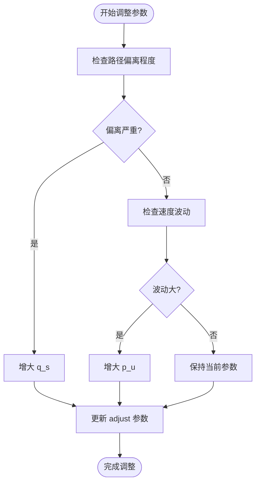
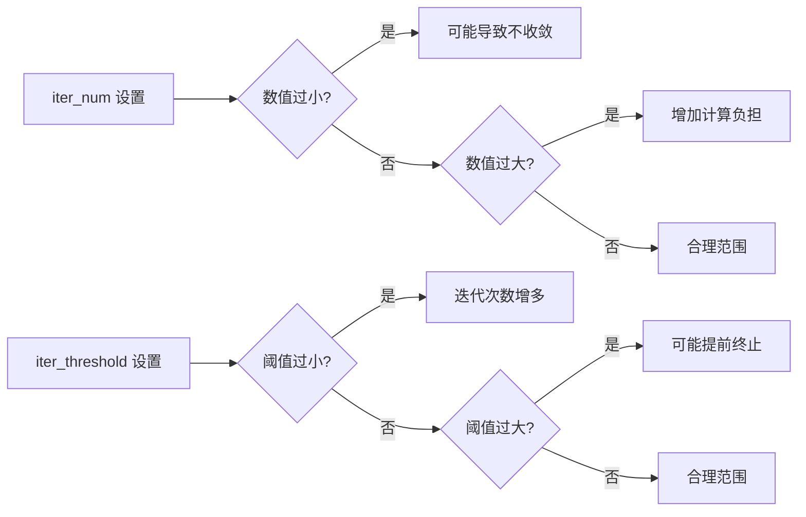

# 收敛问题

<cite>
**本文档中引用的文件**  
- [README.md](file://README.md)
- [neupan.py](file://neupan/neupan.py)
- [pan.py](file://neupan/blocks/pan.py)
- [nrmp.py](file://neupan/blocks/nrmp.py)
- [initial_path.py](file://neupan/blocks/initial_path.py)
</cite>

## 目录
1. [引言](#引言)
2. [初始路径质量对收敛的影响](#初始路径质量对收敛的影响)
3. [调整参数分析](#调整参数分析)
4. [迭代参数设置](#迭代参数设置)
5. [动态路径更新与航点验证](#动态路径更新与航点验证)
6. [总结与建议](#总结与建议)

## 引言
NeuPAN规划器在实际应用中可能出现无法收敛到目标或轨迹振荡的问题。该问题通常与初始路径质量、调整参数设置、迭代参数配置以及路径更新机制密切相关。本文档旨在系统性地分析这些因素，并提供针对性的解决方案，以提升NeuPAN规划器的稳定性与收敛性能。

**Section sources**
- [README.md](file://README.md#L1-L243)

## 初始路径质量对收敛的影响
初始路径（initial_path）作为NeuPAN优化过程的起点，其质量直接影响求解器的收敛速度和稳定性。若初始路径存在剧烈转折、不连续或远离合理轨迹，则优化过程可能陷入局部最优或产生振荡。

NeuPAN通过`InitialPath`类生成初始路径，支持直线（line）、Dubins路径和Reeds-Shepp路径等多种曲线风格。为确保路径平滑且合理，建议：
- 使用`curve_style`参数选择适合机器人运动学的路径类型（如阿克曼车辆使用`dubins`）。
- 确保航点（waypoints）设置合理，避免过近或过远的航点导致路径突变。
- 利用`interval`参数控制路径点密度，推荐设置为`ref_speed * step_time`或更小值以保证路径连续性。

**Section sources**
- [initial_path.py](file://neupan/blocks/initial_path.py#L0-L483)
- [README.md](file://README.md#L120-L135)

## 调整参数分析
`adjust`参数中的权重设置对优化目标的平衡至关重要。主要涉及状态成本权重`q_s`和速度成本权重`p_u`。

- **状态成本权重 `q_s`**：该参数控制机器人对初始路径的跟踪程度。若机器人偏离初始路径过远，应适当增大`q_s`，以增强路径跟随性。
- **速度成本权重 `p_u`**：该参数影响机器人对参考速度的遵循程度。若速度波动较大或控制指令不稳定，应增大`p_u`以抑制速度变化。

用户可通过`update_adjust_parameters`方法动态调整这些参数，根据实际行为偏差进行调优。

**Diagram sources**
- [nrmp.py](file://neupan/blocks/nrmp.py#L112-L149)
- [neupan.py](file://neupan/neupan.py#L330-L355)

**Section sources**
- [nrmp.py](file://neupan/blocks/nrmp.py#L112-L149)
- [neupan.py](file://neupan/neupan.py#L330-L355)
- [README.md](file://README.md#L145-L155)

## 迭代参数设置
迭代次数（`iter_num`）和收敛阈值（`iter_threshold`）是影响收敛性的关键参数。

- **`iter_num`**：表示PAN算法中交替最小化的迭代次数。数值过小可能导致未充分收敛，过大则增加计算负担。建议从默认值2开始，根据收敛情况逐步调整。
- **`iter_threshold`**：用于判断迭代是否收敛的阈值。若迭代差值小于该值则提前终止。若设置过小，可能导致迭代次数过多；若过大，则可能提前退出导致结果不精确。

应结合实际运行时的收敛速度和控制频率，合理权衡计算效率与收敛精度。

**Diagram sources**
- [pan.py](file://neupan/blocks/pan.py#L105-L140)
- [pan.py](file://neupan/blocks/pan.py#L220-L250)

**Section sources**
- [pan.py](file://neupan/blocks/pan.py#L105-L140)
- [pan.py](file://neupan/blocks/pan.py#L220-L250)
- [README.md](file://README.md#L137-L144)

## 动态路径更新与航点验证
为适应动态目标变化，NeuPAN提供`set_initial_path_from_goal`功能，可基于当前状态和目标状态动态生成新路径。

- 使用`update_initial_path_from_goal(start, goal)`方法可实时更新初始路径，适用于目标点变化的场景。
- 需确保航点（waypoints）正确设置，避免空值或格式错误。可通过`waypoints`属性访问当前航点，并验证其有效性。
- 在路径更新后，应调用`reset()`方法重置路径索引，确保从新路径起点开始规划。

**Section sources**
- [neupan.py](file://neupan/neupan.py#L315-L327)
- [initial_path.py](file://neupan/blocks/initial_path.py#L300-L320)

## 总结与建议
为解决NeuPAN规划器的收敛问题，建议采取以下措施：
1. **确保初始路径平滑合理**：选择合适的`curve_style`，合理设置航点与`interval`。
2. **平衡调整参数**：根据行为偏差调整`q_s`和`p_u`，增强路径或速度稳定性。
3. **合理配置迭代参数**：避免`iter_num`过小导致不收敛，或`iter_threshold`过大导致提前终止。
4. **动态更新路径**：利用`update_initial_path_from_goal`适应目标变化，并验证航点正确性。

通过上述方法，可显著提升NeuPAN规划器的收敛性能与运行稳定性。

**Section sources**
- [README.md](file://README.md#L120-L160)
- [neupan.py](file://neupan/neupan.py#L315-L355)
- [pan.py](file://neupan/blocks/pan.py#L105-L140)
- [nrmp.py](file://neupan/blocks/nrmp.py#L112-L149)
- [initial_path.py](file://neupan/blocks/initial_path.py#L300-L320)