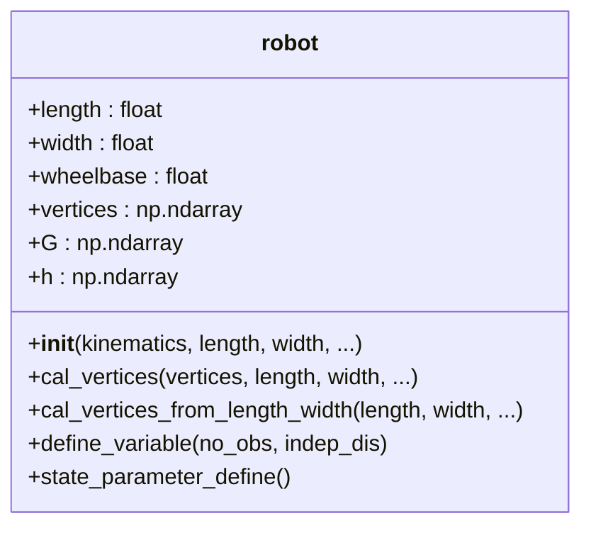
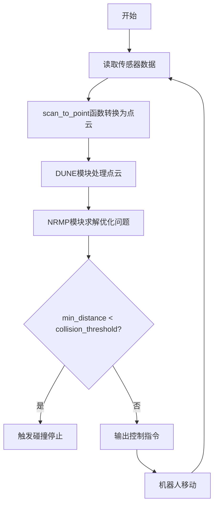
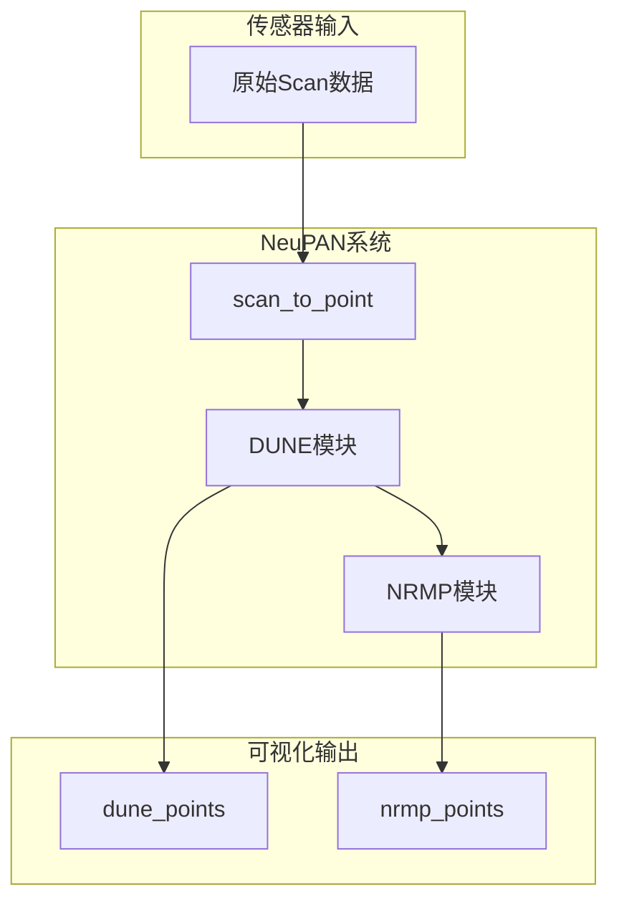

# 碰撞问题

<cite>
**本文档中引用的文件**  
- [robot.py](file://neupan/robot/robot.py)
- [dune.py](file://neupan/blocks/dune.py)
- [nrmp.py](file://neupan/blocks/nrmp.py)
- [pan.py](file://neupan/blocks/pan.py)
- [neupan.py](file://neupan/neupan.py)
- [planner.yaml](file://example/dyna_obs/acker/planner.yaml)
- [planner.yaml](file://example/dyna_obs/diff/planner.yaml)
- [planner.yaml](file://example/pf_obs/acker/planner.yaml)
</cite>

## 目录
1. [简介](#简介)
2. [机器人参数配置检查](#机器人参数配置检查)
3. [避障相关参数分析](#避障相关参数分析)
4. [传感器数据与点云转换验证](#传感器数据与点云转换验证)
5. [DUNE与NRMP模块的障碍点可视化](#dune与nrmp模块的障碍点可视化)
6. [调整建议与调试技巧](#调整建议与调试技巧)
7. [结论](#结论)

## 简介
本文档旨在为NeuPAN系统中机器人运行过程中发生碰撞的问题提供系统性排查方案。通过分析机器人模型参数、避障算法参数、传感器数据处理流程以及优化模块的内部机制，帮助用户定位并解决潜在的碰撞风险。重点包括检查机器人尺寸参数是否准确、`collision_threshold`是否设置合理、`ro_obs`权重是否足够以增强避障响应等。

**Section sources**
- [neupan.py](file://neupan/neupan.py#L1-L50)

## 机器人参数配置检查
机器人在物理世界中的实际尺寸必须与其在代码中的模型参数精确匹配，否则会导致避障判断失效。关键参数包括`length`（长度）、`width`（宽度）和`vertices`（顶点坐标）。这些参数在`robot.py`中定义，并用于生成机器人的几何约束。

在`robot.py`的`__init__`方法中，若未提供`vertices`，则会根据`length`、`width`和`wheelbase`（轴距）调用`cal_vertices_from_length_width`函数计算默认矩形顶点。因此，必须确保配置文件（如`planner.yaml`）中提供的`length`和`width`值与真实机器人一致。

例如，在`example/dyna_obs/acker/planner.yaml`中，阿克曼机器人（acker）的长度和宽度被设置为4.6和1.6。如果实际机器人尺寸与此不符，规划器将基于错误的轮廓进行避障，极易导致碰撞。

**Diagram sources**
- [robot.py](file://neupan/robot/robot.py#L50-L100)

**Section sources**
- [robot.py](file://neupan/robot/robot.py#L50-L150)
- [planner.yaml](file://example/dyna_obs/acker/planner.yaml#L10-L15)

## 避障相关参数分析
NeuPAN的避障能力由多个关键参数共同决定，不当的设置会显著削弱其有效性。

### collision_threshold
该参数定义了最小安全距离阈值。当规划器计算出的机器人与障碍物之间的最小距离（`min_distance`）低于此阈值时，系统会判定为“碰撞”并停止运行。该值在`neupan.py`的`__init__`方法中初始化，默认值为0.1米。如果此值设置过高，系统会过于敏感；若设置过低，则可能无法及时响应，导致物理碰撞。用户应根据机器人尺寸和运行环境谨慎调整。

### ro_obs
此参数是避障惩罚项的权重，直接控制避障行为的强度。它在`nrmp.py`的`NRMP`类中作为`I_cost`函数的系数出现。`I_cost`函数计算了违反障碍物约束的惩罚成本，其表达式为`0.5 * ro_obs * sum_squares(cp.neg(I_array))`。如果`ro_obs`值过小，即使机器人靠近或穿越障碍物，该惩罚成本在总优化目标中占比也很低，导致优化器优先考虑路径平滑或速度跟踪，而忽略安全性。建议在发生碰撞时首先尝试增大此值。

### adjust参数
`adjust`参数组（`q_s`, `p_u`, `eta`, `d_max`, `d_min`）在`planner.yaml`中定义，用于微调优化目标。其中`eta`是距离成本的权重（`C1_cost_d`），负的`eta`鼓励机器人尽可能远离障碍物。`d_min`和`d_max`则定义了与障碍物距离的硬性约束。这些参数共同作用，影响机器人的避障策略。

**Diagram sources**
- [neupan.py](file://neupan/neupan.py#L130-L140)
- [nrmp.py](file://neupan/blocks/nrmp.py#L200-L220)

**Section sources**
- [neupan.py](file://neupan/neupan.py#L130-L140)
- [nrmp.py](file://neupan/blocks/nrmp.py#L150-L250)

## 传感器数据与点云转换验证
确保传感器数据被正确解析和转换是避障有效的前提。`neupan.py`中的`scan_to_point`函数负责将原始的激光雷达扫描数据（`scan`）转换为全局坐标系下的点云。

该函数首先根据`ranges`和`angles`将极坐标数据转换为相对于传感器的笛卡尔坐标点。然后，通过`scan_offset`将这些点转换到机器人坐标系，最后结合当前机器人`state`（位置和朝向）将其转换到全局坐标系。用户应检查：
1.  `scan`字典中的`angle_min`、`angle_max`、`range_min`、`range_max`是否与实际传感器配置匹配。
2.  `scan_offset`参数是否正确反映了传感器在机器人上的安装位置。
3.  `angle_range`参数是否过滤了无效或干扰数据。

如果转换后的点云未能准确反映真实障碍物位置，后续所有避障计算都将失效。

**Section sources**
- [neupan.py](file://neupan/neupan.py#L170-L243)

## DUNE与NRMP模块的障碍点可视化
为了调试避障逻辑，可以利用NeuPAN提供的属性来可视化DUNE和NRMP模块实际处理的障碍点。

- `dune_points`属性（`neupan.py`中的`@property`）返回DUNE模块在当前时刻考虑的障碍点。这些点是经过下采样和坐标变换后的输入点云。
- `nrmp_points`属性返回NRMP模块在优化中实际使用的障碍点。这些点是经过DUNE网络处理并筛选出的最相关的障碍点。

通过将这两个属性返回的点云分别可视化，可以验证：
1.  `scan_to_point`函数输出的点云是否准确。
2.  DUNE模块是否成功地从原始点云中提取了关键障碍信息。
3.  点云转换和筛选逻辑是否正确执行。

如果`dune_points`显示的障碍物位置错误，则问题出在传感器数据处理阶段；如果`dune_points`正确但`nrmp_points`缺失或错误，则问题可能出在DUNE模型或其配置上。

**Diagram sources**
- [neupan.py](file://neupan/neupan.py#L380-L400)
- [pan.py](file://neupan/blocks/pan.py#L150-L180)

**Section sources**
- [neupan.py](file://neupan/neupan.py#L380-L400)
- [pan.py](file://neupan/blocks/pan.py#L150-L180)

## 调整建议与调试技巧
针对常见的碰撞问题，建议采取以下步骤进行排查和调整：

1.  **验证机器人尺寸**：核对`planner.yaml`中的`length`、`width`等参数与真实机器人是否一致。
2.  **检查传感器配置**：确认`scan_offset`和`scan`数据的元信息（角度、距离范围）配置正确。
3.  **可视化点云**：打印或绘图显示`dune_points`和`nrmp_points`，确认障碍物位置被正确感知和处理。
4.  **调整避障权重**：如果确认感知无误但机器人仍穿越障碍物，应显著增大`ro_obs`参数（例如从400增加到800或更高），以强制增强避障响应。
5.  **降低collision_threshold**：如果希望系统更早地对障碍物做出反应，可以适当降低`collision_threshold`的值。
6.  **检查DUNE模型**：确保为当前机器人模型训练了合适的DUNE网络，并在`planner.yaml`中正确指定了`dune_checkpoint`路径。

**Section sources**
- [neupan.py](file://neupan/neupan.py#L300-L350)
- [nrmp.py](file://neupan/blocks/nrmp.py#L100-L120)
- [planner.yaml](file://example/pf_obs/acker/planner.yaml#L35-L40)

## 结论
机器人碰撞问题通常源于模型参数、避障参数或传感器数据处理的不匹配。通过系统性地检查机器人尺寸、验证`scan_to_point`函数的输出、利用`dune_points`和`nrmp_points`进行可视化调试，并针对性地调整`ro_obs`等关键参数，可以有效解决和预防碰撞。核心在于确保从物理世界到优化求解的整个信息链路准确无误。