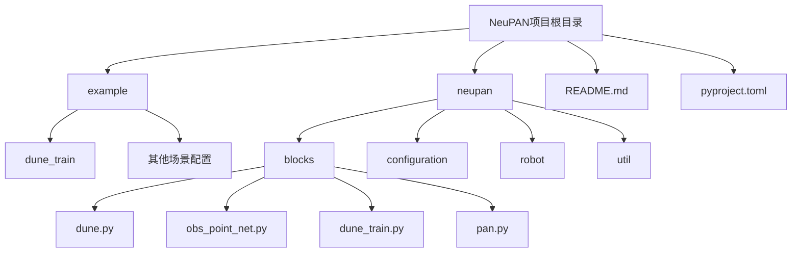
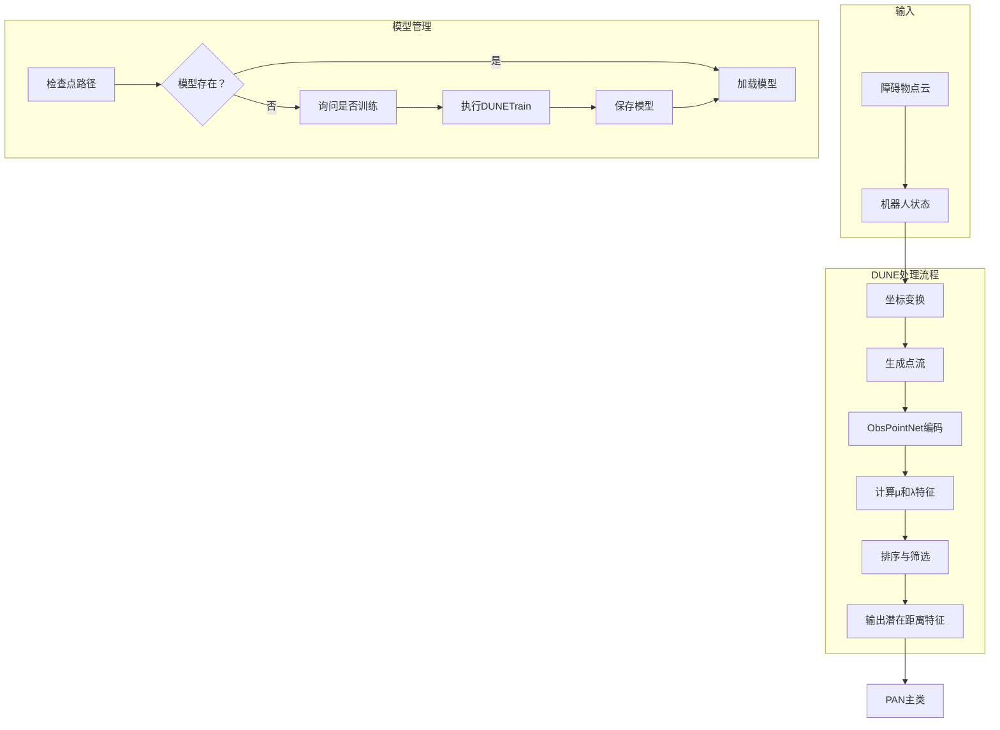
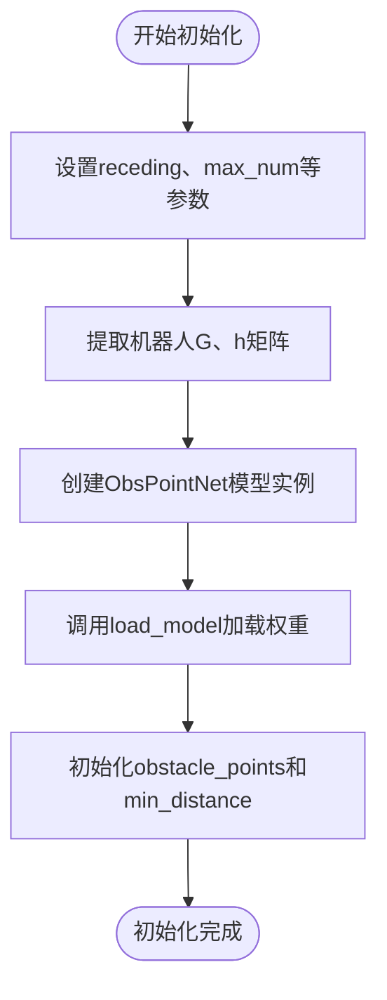
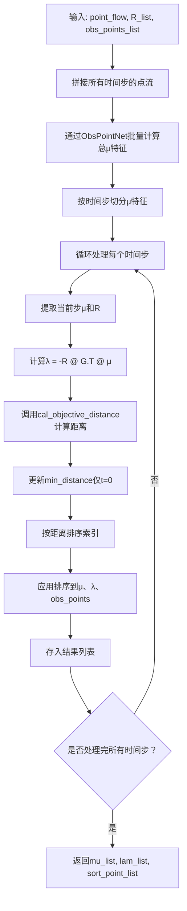
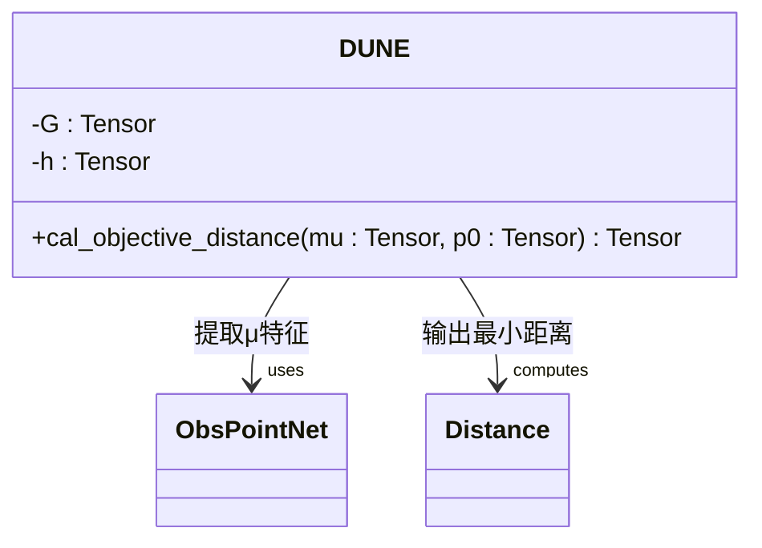
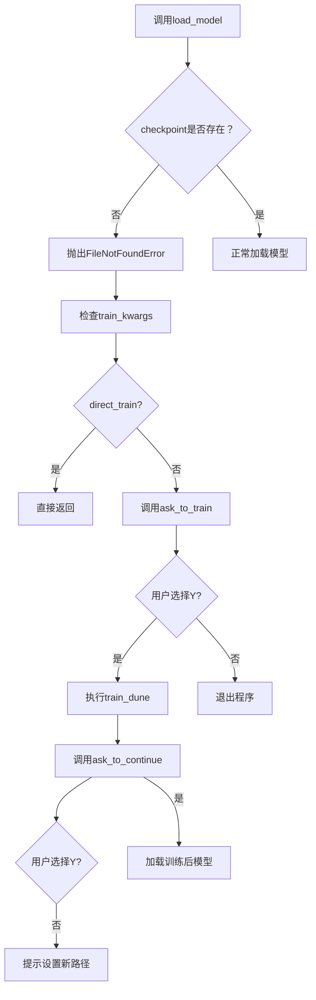
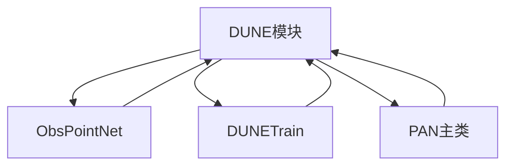

# DUNE模块

<cite>
**本文档中引用的文件**  
- [dune.py](file://neupan/blocks/dune.py)
- [obs_point_net.py](file://neupan/blocks/obs_point_net.py)
- [pan.py](file://neupan/blocks/pan.py)
- [dune_train.py](file://neupan/blocks/dune_train.py)
</cite>

## 目录
1. [简介](#简介)
2. [项目结构](#项目结构)
3. [核心组件](#核心组件)
4. [架构概述](#架构概述)
5. [详细组件分析](#详细组件分析)
6. [依赖分析](#依赖分析)
7. [性能考量](#性能考量)
8. [故障排除指南](#故障排除指南)
9. [结论](#结论)

## 简介
DUNE（深度展开神经编码器）是NeuPAN避障算法中的核心模块，负责将障碍物点云数据映射到潜在距离空间（μ和λ特征），从而实现高效、实时的机器人避障。该模块通过神经网络模型ObsPointNet提取障碍物点的几何特征，并结合机器人动力学模型进行距离估计。DUNE模块与PAN主类紧密集成，支持模型检查点加载、自动训练触发及用户交互处理，适用于多种机器人平台和复杂动态环境。

## 项目结构
NeuPAN项目的目录结构清晰地划分了示例配置、核心算法模块和训练脚本。DUNE相关代码位于`neupan/blocks/`目录下，主要包括`dune.py`、`obs_point_net.py`和`dune_train.py`三个核心文件，分别实现编码器逻辑、神经网络结构和模型训练流程。



**Diagram sources**  
- [dune.py](file://neupan/blocks/dune.py#L0-L36)
- [obs_point_net.py](file://neupan/blocks/obs_point_net.py#L0-L34)
- [pan.py](file://neupan/blocks/pan.py#L0-L30)

**Section sources**  
- [dune.py](file://neupan/blocks/dune.py#L0-L36)
- [obs_point_net.py](file://neupan/blocks/obs_point_net.py#L0-L34)

## 核心组件
DUNE模块的核心功能包括：点云数据处理、潜在特征提取、最小距离计算、模型加载与训练机制。其设计围绕`DUNE`类展开，依赖`ObsPointNet`神经网络进行特征编码，并通过`DUNETrain`类支持模型训练。该模块在PAN框架中作为关键组件，参与每一步的避障决策过程。

**Section sources**  
- [dune.py](file://neupan/blocks/dune.py#L31-L64)
- [obs_point_net.py](file://neupan/blocks/obs_point_net.py#L10-L15)

## 架构概述
DUNE模块采用深度学习与优化理论相结合的方法，将原始点云转换为可用于运动规划的距离特征。其整体架构包含数据预处理、特征编码、距离计算和模型管理四个主要部分，与PAN主控制器协同工作，形成闭环控制。



**Diagram sources**  
- [dune.py](file://neupan/blocks/dune.py#L64-L210)
- [pan.py](file://neupan/blocks/pan.py#L31-L68)

## 详细组件分析

### DUNE类设计与实现
`DUNE`类继承自`torch.nn.Module`，封装了从点云输入到潜在特征输出的完整流程。其初始化过程接收预测时域`receding`、模型检查点路径`checkpoint`、机器人模型`robot`等参数，并构建`ObsPointNet`实例用于特征提取。

#### 初始化流程


**Diagram sources**  
- [dune.py](file://neupan/blocks/dune.py#L31-L64)

**Section sources**  
- [dune.py](file://neupan/blocks/dune.py#L31-L64)

### 前向传播过程分析
`forward`方法实现了点流生成、旋转矩阵应用及特征排序的全过程，是DUNE模块的核心计算逻辑。

#### 前向传播流程图


**Diagram sources**  
- [dune.py](file://neupan/blocks/dune.py#L64-L110)

**Section sources**  
- [dune.py](file://neupan/blocks/dune.py#L64-L110)

### 距离计算机制
`cal_objective_distance`函数负责计算机器人与障碍物之间的最小距离，其数学本质是求解对偶问题中的目标函数值。

#### 距离计算公式
给定：
- μ: (edge_dim, num_points) —— 对偶变量
- p0: (state_dim, num_points) —— 机器人坐标系下的点云

计算：
```
distance = μ.T × (G × p0 - h)
```

该距离反映了点云与机器人几何体之间的穿透程度，值越小表示越接近碰撞。



**Diagram sources**  
- [dune.py](file://neupan/blocks/dune.py#L112-L130)

**Section sources**  
- [dune.py](file://neupan/blocks/dune.py#L112-L130)

### 模型加载与训练机制
`load_model`方法实现了模型检查点的安全加载，并在未找到模型时提供用户交互式训练选项。

#### 模型加载与训练决策流程


**Diagram sources**  
- [dune.py](file://neupan/blocks/dune.py#L132-L210)

**Section sources**  
- [dune.py](file://neupan/blocks/dune.py#L132-L210)

### ObsPointNet网络结构
`ObsPointNet`是一个多层感知机（MLP）结构，用于将每个障碍物点映射到潜在距离特征μ。

#### 网络结构图
```mermaid
graph LR
A[输入: 2D坐标] --> B[Linear(2→32)]
B --> C[LayerNorm]
C --> D[Tanh]
D --> E[Linear(32→32)]
E --> F[ReLU]
F --> G[Linear(32→32)]
G --> H[LayerNorm]
H --> I[Tanh]
I --> J[Linear(32→32)]
J --> K[ReLU]
K --> L[Linear(32→32)]
L --> M[LayerNorm]
M --> N[Tanh]
N --> O[Linear(32→output_dim)]
O --> P[ReLU]
P --> Q[输出: μ特征]
```

**Diagram sources**  
- [obs_point_net.py](file://neupan/blocks/obs_point_net.py#L10-L30)

**Section sources**  
- [obs_point_net.py](file://neupan/blocks/obs_point_net.py#L10-L30)

## 依赖分析
DUNE模块与其他组件存在明确的依赖关系，形成了完整的避障系统。



**Diagram sources**  
- [dune.py](file://neupan/blocks/dune.py#L0-L36)
- [pan.py](file://neupan/blocks/pan.py#L31-L68)

**Section sources**  
- [dune.py](file://neupan/blocks/dune.py#L0-L36)
- [pan.py](file://neupan/blocks/pan.py#L31-L68)

## 性能考量
DUNE模块在实时避障中表现出良好的性能：
- **前向推理速度快**：利用GPU加速，ObsPointNet可快速处理大量点云。
- **内存效率高**：通过`max_num`限制最大点数，避免内存溢出。
- **训练自动化**：`ask_to_train`机制确保模型缺失时可自动触发训练。
- **鲁棒性强**：结合坐标变换与特征排序，适应动态环境变化。

## 故障排除指南
当遇到模型检查点加载失败时，系统会自动触发用户交互流程：

1. **错误提示**：输出"Do not find the DUNE model; Do you want to train the model now, input Y or N"
2. **用户选择**：
   - 输入`Y`：启动训练流程，完成后询问是否继续运行
   - 输入`N`：程序退出，提示用户设置正确路径
   - 其他输入：循环提示，直至输入有效值

此机制确保系统在模型缺失时仍具备自恢复能力，提升用户体验。

**Section sources**  
- [dune.py](file://neupan/blocks/dune.py#L172-L210)

## 结论
DUNE模块作为NeuPAN算法的核心组件，成功实现了将原始点云数据映射到潜在距离空间的功能。其设计融合了深度学习与凸优化理论，具备高效的前向推理能力、完善的模型管理机制和良好的用户交互体验。通过与PAN主类的协同工作，DUNE为机器人提供了实时、可靠的避障能力，适用于多种复杂动态环境。