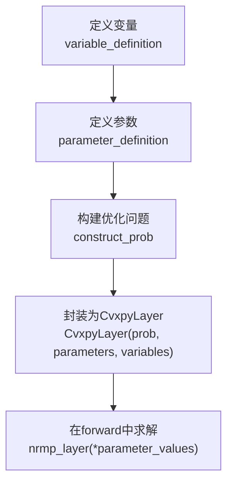
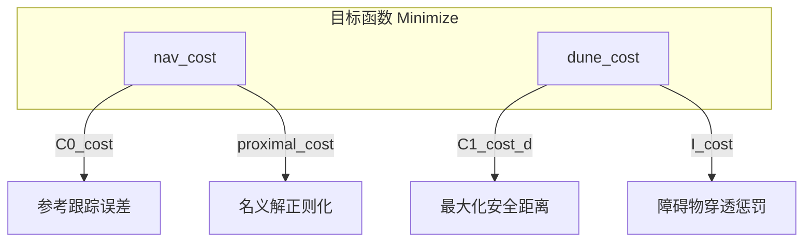
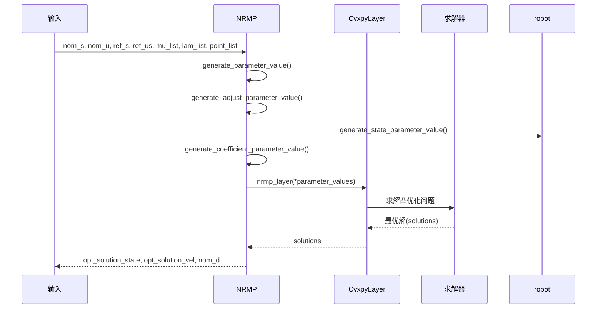

# NRMP模块

<cite>
**本文档中引用的文件**  
- [nrmp.py](file://neupan/blocks/nrmp.py)
- [robot.py](file://neupan/robot/robot.py)
</cite>

## 目录
1. [NRMP模块概述](#nrmp模块概述)
2. [轨迹求解的凸优化框架](#轨迹求解的凸优化框架)
3. [CvxpyLayer与优化问题封装](#cvxpylayer与优化问题封装)
4. [目标函数构建：nav_cost_cons与dune_cost_cons](#目标函数构建nav_cost_cons与dune_cost_cons)
5. [约束系数生成：generate_coefficient_parameter_value](#约束系数生成generate_coefficient_parameter_value)
6. [安全距离限制：bound_dis_constraints](#安全距离限制bound_dis_constraints)
7. [动力学模型与状态转移矩阵](#动力学模型与状态转移矩阵)
8. [参数调节机制：adjust_parameters](#参数调节机制adjust_parameters)
9. [前向传播流程：forward方法](#前向传播流程forward方法)

## NRMP模块概述

NRMP（非线性递归最小化规划器）是NeuPAN系统的核心优化模块，负责在考虑障碍物的环境中生成最优的运动轨迹。该模块通过整合神经网络生成的潜在距离空间，构建并求解一个凸优化问题，以输出最优的状态序列和控制输入。NRMP继承自PyTorch的`torch.nn.Module`，使其能够无缝集成到深度学习框架中。其核心思想是将复杂的非线性规划问题转化为一个可微的凸优化层，从而实现端到端的学习和优化。

**Section sources**
- [nrmp.py](file://neupan/blocks/nrmp.py#L29-L325)

## 轨迹求解的凸优化框架

NRMP模块的核心工作流程是基于凸优化的轨迹求解。它将运动规划问题建模为一个带约束的最小化问题。该问题的目标函数由两部分组成：导航成本（navigation cost）和DUNE成本（DUNE cost）。导航成本确保生成的轨迹尽可能接近参考路径和速度，而DUNE成本则负责处理与障碍物的安全距离。整个优化问题在有限的时域（receding horizon）内进行求解，即只计算未来T个时间步长的最优解，然后执行第一步，再进行下一轮滚动优化。这种滚动时域优化（receding horizon optimization）策略使得规划器能够实时响应环境变化。

**Section sources**
- [nrmp.py](file://neupan/blocks/nrmp.py#L29-L325)

## CvxpyLayer与优化问题封装

NRMP模块利用`cvxpylayers.torch.CvxpyLayer`来封装其优化问题。`CvxpyLayer`是一个关键组件，它将一个用`cvxpy`定义的凸优化问题转换为一个可微的PyTorch层。在`problem_definition`方法中，首先通过`construct_prob`方法构建`cvxpy`问题对象，然后将其与参数列表（`para_list`）和变量列表（`indep_list`）一起传递给`CvxpyLayer`的构造函数。这使得`forward`方法能够像调用一个普通的神经网络层一样，传入参数值并获得优化解。这种封装方式使得优化过程对梯度下降算法是透明的，允许整个NeuPAN系统进行联合训练。

**Diagram sources**
- [nrmp.py](file://neupan/blocks/nrmp.py#L143-L155)
- [nrmp.py](file://neupan/blocks/nrmp.py#L137-L141)

## 目标函数构建：nav_cost_cons与dune_cost_cons

NRMP的目标函数由`nav_cost_cons`和`dune_cost_cons`两个方法共同构建。

`nav_cost_cons`方法定义了导航相关的成本和约束。其成本项包括：
- **C0_cost**: 一个二次项，最小化实际状态与加权参考状态（`q_s * ref_s`）以及实际控制输入与加权参考速度（`p_u * ref_us`）之间的差异。
- **proximal_cost**: 一个正则化项，最小化当前解与名义解（nominal solution）之间的距离，确保解的平滑性。

其约束项包括：
- **dynamics_constraint**: 由`robot.py`提供的动力学约束，确保状态转移符合车辆模型。
- **bound_su_constraints**: 速度和加速度的边界约束。

`dune_cost_cons`方法则负责处理障碍物相关的成本和约束。其成本项包括：
- **C1_cost_d**: 一个负向成本，最大化安全距离`indep_dis`的总和（通过`-eta * sum(indep_dis)`实现），鼓励规划器选择更远离障碍物的路径。
- **I_cost**: 一个惩罚项，当车辆与障碍物的距离小于安全距离时，该项会产生一个很大的惩罚，其强度由`ro_obs`参数控制。

其约束项`bound_dis_constraints`则确保安全距离`indep_dis`被限制在`d_min`和`d_max`之间。

**Diagram sources**
- [nrmp.py](file://neupan/blocks/nrmp.py#L276-L287)
- [nrmp.py](file://neupan/blocks/nrmp.py#L289-L301)
- [nrmp.py](file://neupan/blocks/nrmp.py#L303-L317)
- [robot.py](file://neupan/robot/robot.py#L128-L138)

## 约束系数生成：generate_coefficient_parameter_value

`generate_coefficient_parameter_value`方法负责将DUNE模块输出的`mu`和`lambda`（`lam`）矩阵转化为优化问题中的约束系数`fa`和`fb`。这些系数是构建障碍物避免约束的关键。

该方法的输入是`mu_list`、`lam_list`和`point_list`。对于每个时间步`t`，它从列表中取出对应的`mu`、`lam`和障碍物点`point`。然后，它执行以下计算：
- `fa = lam.T`：直接将`lam`的转置作为`fa`。
- `fb = (lam.T @ point.T).squeeze(1) + mu.T @ h`：计算一个偏置项，其中`h`是机器人形状的不等式约束向量。

计算出的`fa`和`fb`被填充到预分配的`fa_list`和`fb_list`中。如果实际的障碍物数量少于最大数量`max_num`，则使用第一个障碍物的系数进行填充。最终，这些`fa`和`fb`列表作为参数传递给`CvxpyLayer`，用于构建`I_cost`中的不等式约束`I_dpp = fa @ indep_t - fb - indep_dis`。

**Section sources**
- [nrmp.py](file://neupan/blocks/nrmp.py#L157-L198)

## 安全距离限制：bound_dis_constraints

`bound_dis_constraints`方法定义了对安全距离变量`indep_dis`的边界约束。这些约束确保了规划器生成的安全距离在一个合理的物理范围内。

该方法创建了两个简单的线性不等式约束：
- `indep_dis >= para_d_min`：确保安全距离不小于一个最小值`d_min`。这防止了规划器计算出一个不切实际的、过小的安全距离。
- `indep_dis <= para_d_max`：确保安全距离不大于一个最大值`d_max`。这可以防止规划器过于保守，导致路径效率低下。

这两个约束与`dune_cost_cons`中的成本项共同作用，使得规划器在保证安全的前提下，尽可能地接近障碍物以优化路径。

**Section sources**
- [nrmp.py](file://neupan/blocks/nrmp.py#L309-L315)

## 动力学模型与状态转移矩阵

NRMP模块依赖`robot.py`中的动力学模型来生成状态转移矩阵（A, B, C）。在`generate_state_parameter_value`方法中，它会遍历每个时间步，并根据名义状态`nom_st`和名义控制输入`nom_ut`，调用相应的线性化模型。

对于阿克曼转向（Ackermann）车辆，`linear_ackermann_model`方法使用当前的航向角`phi`、速度`v`和转向角`psi`来计算雅可比矩阵。它将非线性的阿克曼运动学模型在名义轨迹点附近进行一阶泰勒展开，得到线性的状态转移方程`x_{t+1} = A @ x_t + B @ u_t + C`。

对于差速驱动（Differential drive）车辆，`linear_diff_model`方法执行类似的操作，但其雅可比矩阵的结构不同，反映了差速驱动的运动学特性。

这些计算出的`A`、`B`、`C`矩阵作为参数被传递给优化问题，构成了`dynamics_constraint`的核心，确保了生成的轨迹在车辆动力学上是可行的。

**Section sources**
- [robot.py](file://neupan/robot/robot.py#L228-L278)

## 参数调节机制：adjust_parameters

`adjust_parameters`是一个可学习的参数列表，包含`q_s`、`p_u`、`eta`、`d_max`和`d_min`。这些参数的值在NRMP的`__init__`方法中被初始化为可训练的PyTorch张量（通过`value_to_tensor(..., True)`），这意味着它们可以在训练过程中被优化。

`update_adjust_parameters_value`方法提供了一个接口，允许在运行时动态更新这些参数的值。例如，可以根据当前的环境复杂度或任务要求，调整`q_s`（状态跟踪权重）和`p_u`（控制输入权重）来平衡路径跟踪精度和控制平滑性，或者调整`eta`（安全距离权重）来改变对障碍物的规避程度。这种机制使得NRMP具有很强的适应性。

**Section sources**
- [nrmp.py](file://neupan/blocks/nrmp.py#L58-L67)
- [nrmp.py](file://neupan/blocks/nrmp.py#L119-L135)

## 前向传播流程：forward方法

`forward`方法是NRMP模块的入口，它执行从参数生成到最优解输出的完整数据流。

1.  **输入处理**：接收名义状态`nom_s`、名义控制`nom_u`、参考状态`ref_s`、参考速度`ref_us`以及来自DUNE的`mu_list`、`lam_list`和`point_list`。
2.  **参数生成**：调用`generate_parameter_value`方法，该方法依次调用：
    - `generate_adjust_parameter_value`：获取可调参数的当前值。
    - `robot.generate_state_parameter_value`：生成状态相关的参数，包括线性化后的`A`、`B`、`C`矩阵。
    - `generate_coefficient_parameter_value`：将`mu`和`lam`转换为`fa`和`fb`。
3.  **求解优化**：将所有生成的参数值打包，作为输入传递给`self.nrmp_layer`（即`CvxpyLayer`实例）。求解器（如ECOS）会在此时求解凸优化问题。
4.  **输出解析**：从求解器返回的`solutions`中提取最优状态`opt_solution_state`、最优控制`opt_solution_vel`和最优安全距离`nom_d`，并返回。

这个流程将复杂的优化求解过程封装在一个简洁的函数调用中，是整个NeuPAN规划系统高效运行的关键。

**Diagram sources**
- [nrmp.py](file://neupan/blocks/nrmp.py#L79-L117)
- [nrmp.py](file://neupan/blocks/nrmp.py#L101-L115)
- [robot.py](file://neupan/robot/robot.py#L189-L226)

**Section sources**
- [nrmp.py](file://neupan/blocks/nrmp.py#L79-L117)