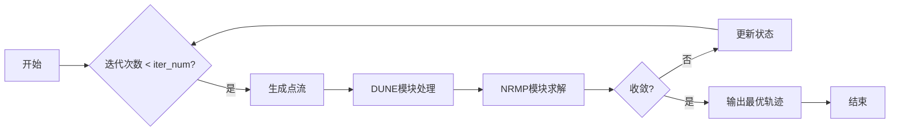
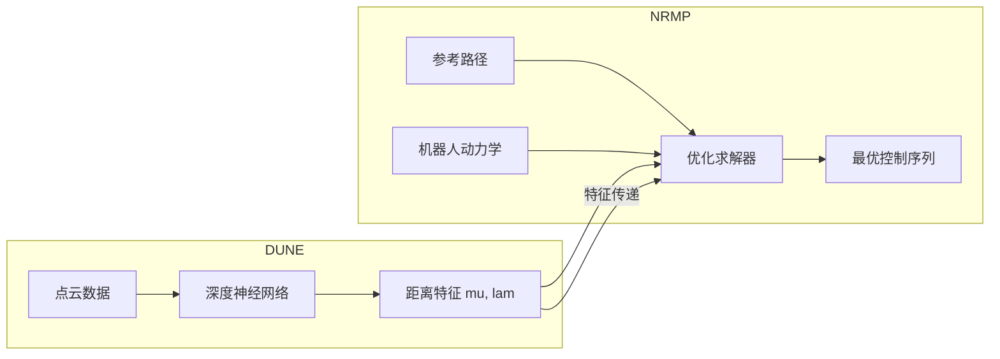
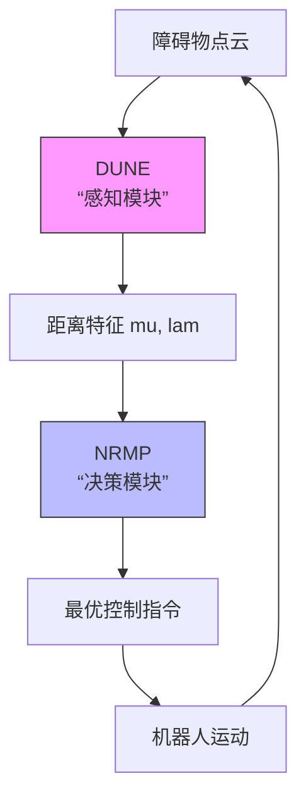

# 核心概念

<cite>
**本文档中引用的文件**  
- [dune.py](file://neupan/blocks/dune.py)
- [nrmp.py](file://neupan/blocks/nrmp.py)
- [pan.py](file://neupan/blocks/pan.py)
- [robot.py](file://neupan/robot/robot.py)
- [neupan.py](file://neupan/neupan.py)
- [README.md](file://README.md)
</cite>

## 目录
1. [MPC基础](#mpc基础)  
2. [PAN算法原理](#pan算法原理)  
3. [DUNE与NRMP协同工作机制](#dune与nrmp协同工作机制)  
4. [差速驱动与阿克曼转向运动学差异](#差速驱动与阿克曼转向运动学差异)  
5. [DUNE点云特征生成机制](#dune点云特征生成机制)  
6. [NRMP最优轨迹求解过程](#nrmp最优轨迹求解过程)  
7. [PAN封装层作用](#pan封装层作用)  
8. [直观比喻与图表](#直观比喻与图表)  

## MPC基础

模型预测控制（MPC）是一种先进的控制策略，通过在每个时间步长求解一个有限时域的优化问题来生成控制指令。NeuPAN采用MPC框架，在每个控制周期内预测未来一段时间（由`receding`参数定义）的机器人状态，并优化控制输入以最小化目标函数。该目标函数包含跟踪参考路径、保持参考速度和避免碰撞等多个成本项。MPC的滚动时域特性使其能够实时响应环境变化，实现动态避障和路径跟踪。

**Section sources**
- [README.md](file://README.md#L1-L243)
- [neupan.py](file://neupan/neupan.py#L35-L67)

## PAN算法原理

PAN（Proximal Alternating-minimization Network）是NeuPAN的核心算法，它通过交替最小化框架将复杂的非凸优化问题分解为两个可管理的子问题。该算法在每个MPC步骤中迭代执行，直到收敛。PAN的交替过程类似于一个“猜测与验证”的循环：首先，DUNE模块根据当前的障碍物点云“猜测”出一个安全距离场；然后，NRMP模块利用这个距离场“验证”并求解出一条最优轨迹。这个过程反复进行，直到轨迹和距离场的更新量小于预设的`iter_threshold`阈值，表明算法已收敛。

**Diagram sources**
- [pan.py](file://neupan/blocks/pan.py#L105-L140)

**Section sources**
- [pan.py](file://neupan/blocks/pan.py#L31-L68)

## DUNE与NRMP协同工作机制

DUNE（深度展开神经编码器）和NRMP（非线性递归最小化规划器）是PAN算法的两个核心组件，它们通过紧密的协同工作实现端到端的导航。DUNE是一个深度神经网络，负责处理原始的点云数据，将其编码为高维的“距离特征”（mu和lam）。这些特征捕捉了机器人与障碍物之间的几何关系。NRMP是一个基于优化的规划器，它接收DUNE生成的特征作为输入，并构建一个包含动力学约束、状态成本和基于特征的碰撞避免成本的凸优化问题。通过求解这个问题，NRMP生成最优的控制序列。这种协同机制将学习（DUNE）和优化（NRMP）的优势结合起来：DUNE从数据中学习高效的特征表示，而NRMP则提供可解释且满足物理约束的规划结果。

**Diagram sources**
- [dune.py](file://neupan/blocks/dune.py#L31-L64)
- [nrmp.py](file://neupan/blocks/nrmp.py#L34-L80)

**Section sources**
- [dune.py](file://neupan/blocks/dune.py#L0-L36)
- [nrmp.py](file://neupan/blocks/nrmp.py#L0-L38)

## 差速驱动与阿克曼转向运动学差异

NeuPAN支持两种常见的机器人运动学模型：差速驱动（`diff`）和阿克曼转向（`acker`）。它们的运动学差异主要体现在控制输入和转向机制上。对于差速驱动机器人，其控制输入是线速度和角速度，通过调节左右轮的转速差来实现转向，其运动轨迹可以是任意方向的圆弧。对于阿克曼转向机器人（如汽车），其控制输入是线速度和前轮转向角，转向时所有车轮围绕一个瞬时中心旋转，后轮轨迹半径小于前轮，这导致其无法像差速驱动那样原地转向。在代码中，这一差异通过`robot.py`文件中的`linear_ackermann_model`和`linear_diff_model`函数实现，它们为NRMP模块提供了不同的雅可比矩阵（A, B, C），从而确保生成的轨迹符合各自的物理约束。

**Section sources**
- [robot.py](file://neupan/robot/robot.py#L234-L273)
- [README.md](file://README.md#L180-L193)

## DUNE点云特征生成机制

DUNE模块处理点云数据并生成特征的过程可以分为三个关键步骤。首先，`generate_point_flow`函数将全局坐标系下的障碍物点云，根据机器人在预测时域内的名义状态（nominal state），变换到机器人自身的坐标系下，并考虑点云的运动（如果提供了速度信息），生成一个“点流”（point flow）。其次，`ObsPointNet`神经网络（在`dune.py`中实例化）接收这个点流作为输入，通过深度学习模型将其映射到一个潜在的距离特征空间，输出为`mu`。最后，`forward`方法利用机器人的几何信息（由`G`和`h`定义的不等式约束）和旋转矩阵`R`，将`mu`转换为`lam`，并对所有特征根据其到机器人的距离进行排序。`mu`和`lam`共同编码了障碍物点对机器人各条边的“影响强度”，为NRMP的避障优化提供了关键输入。

**Section sources**
- [dune.py](file://neupan/blocks/dune.py#L137-L173)
- [pan.py](file://neupan/blocks/pan.py#L105-L140)

## NRMP最优轨迹求解过程

NRMP模块基于DUNE提供的特征求解最优轨迹。其核心是一个使用`cvxpylayers`构建的可微优化层。该过程首先调用`generate_parameter_value`函数，将来自DUNE的`mu_list`和`lam_list`特征、当前的名义状态`nom_s`以及参考状态`ref_s`等，组合成优化问题的参数。然后，`construct_prob`函数构建一个凸优化问题，其目标函数包含两部分：`nav_cost`（导航成本，包括跟踪参考路径和速度的成本）和`dune_cost`（DUNE成本，即`-eta * sum(indep_dis)`，鼓励机器人远离障碍物）。约束条件包括机器人的动力学约束（通过`dynamics_constraint`定义）、控制输入的边界约束以及安全距离约束（`bound_dis_constraints`）。最后，`cvxpylayer`求解器高效地求解这个优化问题，输出最优的状态序列和控制序列。

**Section sources**
- [nrmp.py](file://neupan/blocks/nrmp.py#L76-L114)
- [nrmp.py](file://neupan/blocks/nrmp.py#L260-L324)

## PAN封装层作用

PAN类作为DUNE和NRMP的封装层，起到了协调和集成的关键作用。它在`__init__`方法中初始化了DUNE和NRMP两个子模块，并管理它们之间的数据流。在`forward`方法中，PAN实现了PAN算法的主循环：它负责调用`generate_point_flow`准备DUNE的输入，然后将DUNE的输出（`mu_list`, `lam_list`）传递给NRMP，并接收NRMP返回的优化结果来更新名义状态。此外，PAN还实现了`stop_criteria`方法来判断迭代是否收敛。通过这种封装，外部用户（如`neupan.py`）只需与PAN这一个简洁的接口交互，而无需关心DUNE和NRMP之间复杂的协同细节，极大地简化了系统的使用和维护。

**Section sources**
- [pan.py](file://neupan/blocks/pan.py#L64-L107)
- [pan.py](file://neupan/blocks/pan.py#L105-L140)

## 直观比喻与图表

可以将NeuPAN的导航过程比喻为一位经验丰富的司机在陌生城市中驾驶。DUNE模块就像司机的眼睛和大脑，快速扫描周围的建筑物（点云），并判断哪些是需要特别注意的近处障碍物（生成距离特征）。NRMP模块则像司机的驾驶决策系统，它知道车辆的转弯半径限制（动力学约束），并根据“眼睛”提供的信息，规划出一条既安全又平滑的行驶路线（最优轨迹）。PAN算法就是这位司机的完整驾驶循环：他不断观察路况（DUNE），调整方向盘和油门（NRMP），并根据实际行驶情况修正自己的判断，直到安全到达目的地。

**Diagram sources**
- [dune.py](file://neupan/blocks/dune.py#L31-L64)
- [nrmp.py](file://neupan/blocks/nrmp.py#L34-L80)