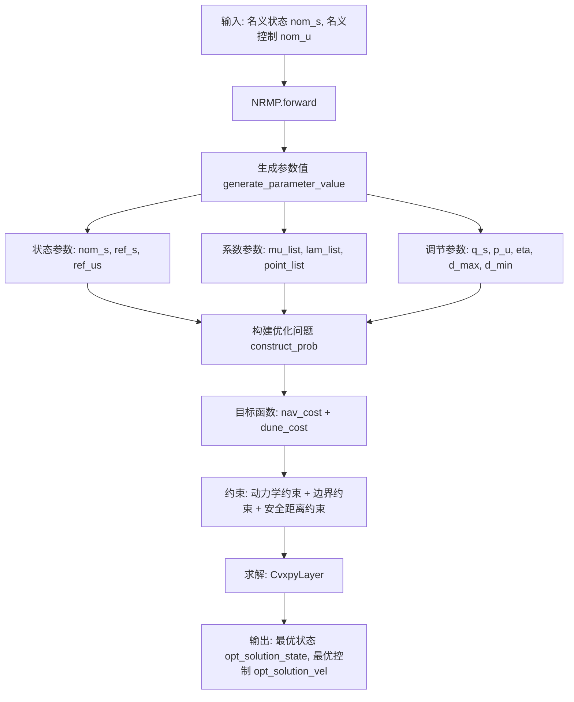

# PAN算法配置

<cite>
**本文档中引用的文件**  
- [neupan/blocks/pan.py](file://neupan/blocks/pan.py)
- [neupan/blocks/nrmp.py](file://neupan/blocks/nrmp.py)
- [neupan/robot/robot.py](file://neupan/robot/robot.py)
- [example/corridor/acker/planner.yaml](file://example/corridor/acker/planner.yaml)
- [example/dyna_obs/acker/planner.yaml](file://example/dyna_obs/acker/planner.yaml)
- [example/non_obs/acker/planner.yaml](file://example/non_obs/acker/planner.yaml)
</cite>

## 目录
1. [引言](#引言)
2. [核心参数解析](#核心参数解析)
3. [优化问题构建机制](#优化问题构建机制)
4. [典型场景调参建议](#典型场景调参建议)
5. [结论](#结论)

## 引言
PAN（Proximal Alternating-minimization Network）是NeuPAN算法的核心模块，结合NRMP（Neural Regularized Motion Planner）与DUNE模型，在每个控制周期内求解包含大量点级避障约束的优化问题。该算法通过交替最小化策略实现高效路径规划，适用于动态复杂环境下的实时导航任务。本文档深入解析其配置块中的关键参数，阐明其对规划性能的影响机制，并提供实际调参指导。

## 核心参数解析

### 预测步长（receding）与时间步长（step_time）

**receding** 参数定义了模型预测控制（MPC）框架中的预测时域长度，即规划器向前展望的步数。较大的 `receding` 值增强了规划的前瞻性，使机器人能更早地感知并规避远距离障碍物，提升路径安全性。然而，这会显著增加优化变量的数量，导致计算负载呈非线性增长，影响实时性。

**step_time** 表示每一步的时间间隔（单位：秒），直接决定了控制频率（1/step_time）。较小的 `step_time` 可提高控制精度和轨迹平滑性，但同样会增加单位时间内的优化求解次数。`receding` 与 `step_time` 共同决定了总预测时长（`T = receding × step_time`），二者需协同调整以平衡实时性与规划质量。

例如，在 `example/corridor/acker/planner.yaml` 中，`receding: 10` 且 `step_time: 0.2`，意味着总预测时长为2秒，适用于中等速度场景。

**Section sources**
- [neupan/blocks/pan.py](file://neupan/blocks/pan.py#L45-L50)
- [neupan/blocks/nrmp.py](file://neupan/blocks/nrmp.py#L34-L40)

### 代价权重（cost_weights）及其调节原则

代价函数中的各项权重通过 `adjust` 配置块中的参数进行调节，直接影响机器人的行为策略。

- **q_s**：状态跟踪误差的权重。增大 `q_s` 会使机器人更严格地跟踪参考轨迹（如初始路径），适用于需要高精度路径跟随的场景。
- **p_u**：控制量变化的权重。增大 `p_u` 可抑制控制输入的剧烈波动，提升控制平滑性，但可能导致响应变慢。
- **eta**：安全距离代价的权重。该参数出现在 `C1_cost_d` 中，表达式为 `-eta × sum(indep_dis)`。增大 `eta` 会鼓励优化器选择更远离障碍物的路径，增强安全性。
- **d_max** 与 **d_min**：分别为允许的最大和最小安全距离。`d_min` 设定了机器人与障碍物的最小容忍距离，用于硬性避障；`d_max` 则限制了安全距离的上限，防止过度保守。

这些参数共同构成了优化问题的目标函数，其调节需根据具体任务需求权衡安全性、效率与平滑性。

**Section sources**
- [neupan/blocks/nrmp.py](file://neupan/blocks/nrmp.py#L34-L80)
- [neupan/robot/robot.py](file://neupan/robot/robot.py#L130-L140)

## 优化问题构建机制

PAN算法的优化问题由NRMP模块构建，其核心是将非线性规划问题转化为可通过凸优化求解的形式。

**Diagram sources**
- [neupan/blocks/nrmp.py](file://neupan/blocks/nrmp.py#L82-L120)
- [neupan/robot/robot.py](file://neupan/robot/robot.py#L120-L200)

如上图所示，NRMP模块接收来自PAN主循环的名义轨迹和DUNE生成的障碍物信息（`mu_list`, `lam_list`），结合用户设定的权重参数，构建完整的优化问题。目标函数由两部分组成：
1. **导航代价（nav_cost）**：包含状态跟踪误差（`C0_cost`）和邻近项（`proximal_cost`），确保轨迹平滑且贴近名义解。
2. **避障代价（dune_cost）**：包含负安全距离和（`C1_cost_d`）及障碍物排斥力（`I_cost`），强制机器人远离障碍物。

约束条件则包括机器人动力学模型、控制输入边界以及安全距离边界（`bound_dis_constraints`）。

**Section sources**
- [neupan/blocks/nrmp.py](file://neupan/blocks/nrmp.py#L122-L324)
- [neupan/robot/robot.py](file://neupan/robot/robot.py#L202-L349)

## 典型场景调参建议

根据不同的应用场景，应针对性地调整核心参数：

- **狭窄走廊通行**：应显著增加障碍物相关权重。例如，提高 `eta` 值（如从默认10提升至15以上），并适当增大 `d_min`，确保机器人与墙壁保持足够距离。可参考 `example/corridor/acker/planner.yaml` 中 `eta: 15.0` 的设置。
- **高速动态避障**：需降低 `receding` 或增大 `step_time` 以减轻计算负担，保证实时性。同时，可适当降低 `q_s` 和 `p_u`，允许更大的轨迹偏差和更快的控制响应。如 `example/dyna_obs/acker/planner.yaml` 中 `step_time: 0.1` 以提高响应速度。
- **无障碍物路径跟踪**：可将 `nrmp_max_num` 和 `dune_max_num` 设为0以关闭避障模块，专注于高精度路径跟踪。此时应增大 `q_s` 和 `p_u`，如 `example/non_obs/acker/planner.yaml` 所示。
- **低延迟控制需求**：优先减小 `step_time` 以提高控制频率，并确保 `receding` 不宜过大，避免单步求解时间过长。同时，可通过调整 `iter_num`（PAN迭代次数）在精度与速度间权衡。

所有参数调整均可通过 `neupan.neupan.NeuPAN` 类的 `update_adjust_parameters` 方法在运行时动态完成。

**Section sources**
- [example/corridor/acker/planner.yaml](file://example/corridor/acker/planner.yaml#L35-L41)
- [example/dyna_obs/acker/planner.yaml](file://example/dyna_obs/acker/planner.yaml#L34-L40)
- [example/non_obs/acker/planner.yaml](file://example/non_obs/acker/planner.yaml#L34-L40)
- [neupan/neupan.py](file://neupan/neupan.py#L354-L374)

## 结论
PAN算法通过精心设计的配置参数实现了灵活性与鲁棒性的统一。`receding` 和 `step_time` 共同决定了规划的时空分辨率，而 `cost_weights` 中的各项权重则精细调控了机器人的行为偏好。理解这些参数在NRMP优化问题构建中的具体作用，是实现高效、安全导航的关键。通过结合具体场景的调参实践，可充分发挥NeuPAN算法在复杂环境下的卓越性能。