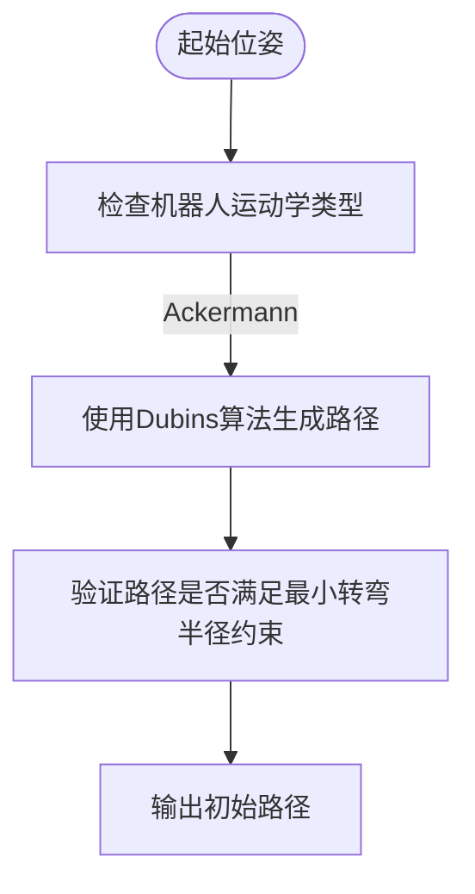
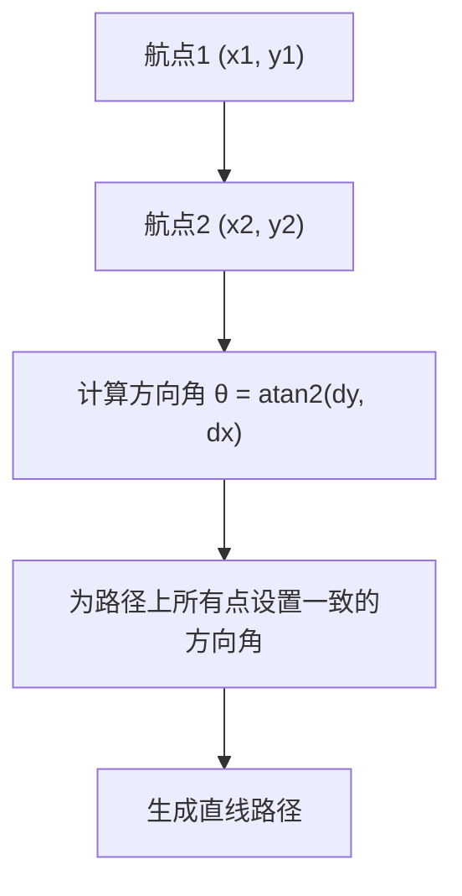
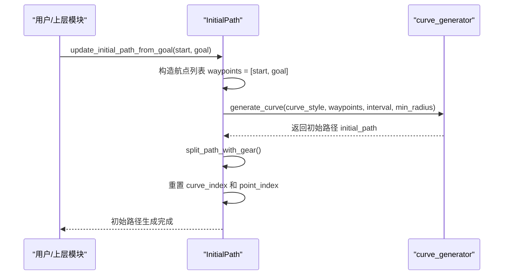

# 初始路径配置

<cite>
**本文档中引用的文件**  
- [initial_path.py](file://neupan/blocks/initial_path.py)
- [planner.yaml](file://example/LON/planner.yaml)
- [LON_corridor.yaml](file://example/LON/LON_corridor.yaml)
- [corridor/acker/planner.yaml](file://example/corridor/acker/planner.yaml)
- [dyna_non_obs/acker/planner.yaml](file://example/dyna_non_obs/acker/planner.yaml)
- [convex_obs/acker/planner.yaml](file://example/convex_obs/acker/planner.yaml)
- [dyna_obs/acker/planner.yaml](file://example/dyna_obs/acker/planner.yaml)
</cite>

## 目录
1. [引言](#引言)
2. [路径生成算法选择](#路径生成算法选择)
3. [waypoint_dist参数与路径点密度](#waypoint_dist参数与路径点密度)
4. [初始路径自动生成机制](#初始路径自动生成机制)
5. [初始路径质量对PAN算法收敛的影响](#初始路径质量对pan算法收敛的影响)
6. [配置示例分析](#配置示例分析)
7. [总结](#总结)

## 引言
本文深入讲解NeuPAN框架中`ipath`配置块的路径生成策略选择与配置方法。重点分析dubins、reeds和line三种路径生成算法的适用场景，解释`waypoint_dist`参数（在代码中体现为`interval`）对路径点密度的影响及其与规划频率的协同调优策略。结合`neupan/blocks/initial_path.py`中的实现，说明如何根据起始位姿和目标位姿自动生成初始轨迹，并讨论初始路径质量对PAN算法收敛速度的影响。

**Section sources**
- [initial_path.py](file://neupan/blocks/initial_path.py#L1-L50)

## 路径生成算法选择
在NeuPAN系统中，路径生成策略由`ipath`配置块中的`curve_style`参数决定，支持`dubins`、`reeds`和`line`三种算法。这三种算法针对不同的机器人运动学模型和应用场景进行了优化。

### Dubins路径算法
Dubins路径适用于具有转向约束的车辆，如阿克曼转向车辆（Ackermann steering vehicle）。这类车辆无法横向移动或原地转向，其运动受到最小转弯半径的限制。Dubins路径通过组合直线段和最大曲率的圆弧段（左转或右转），在满足车辆动力学约束的前提下，生成从起始位姿到目标位姿的最短可行路径。

在配置文件中，通过设置`curve_style: 'dubins'`来启用该算法，并需指定`min_radius`参数以定义车辆的最小转弯半径。

**Diagram sources**
- [initial_path.py](file://neupan/blocks/initial_path.py#L65-L75)
- [planner.yaml](file://example/LON/planner.yaml#L20-L22)

### Reeds-Shepp路径算法
Reeds-Shepp路径适用于能够前后移动的机器人。与Dubins路径相比，Reeds-Shepp路径允许车辆在路径中进行倒车操作，这使得它在狭窄空间或需要复杂机动的场景中（如平行泊车）比Dubins路径更短、更灵活。

在NeuPAN中，通过设置`curve_style: 'reeds'`来选择此算法。它特别适用于需要高机动性的差速驱动机器人或可逆向行驶的车辆。

**Section sources**
- [initial_path.py](file://neupan/blocks/initial_path.py#L65-L75)

### 直线路径算法
`line`路径算法用于生成无障碍的直线路径。它不考虑机器人的运动学约束，简单地在相邻航点之间生成直线段。此算法适用于环境简单、无障碍物且机器人机动性极高的场景。

当`curve_style`设置为`'line'`时，系统会调用`_ensure_consistent_angles`方法，确保路径上所有点的方向角与行进方向一致，从而生成平滑的直线轨迹。

**Diagram sources**
- [initial_path.py](file://neupan/blocks/initial_path.py#L450-L480)

## waypoint_dist参数与路径点密度
在NeuPAN中，路径点的密度由`interval`参数控制，该参数在初始化时通常由`dt * ref_speed`计算得出，其中`dt`是控制周期，`ref_speed`是参考速度。`interval`参数直接决定了路径上相邻点之间的距离，即路径点密度。

### 参数影响
- **高密度路径**（小`interval`值）：路径点更密集，能更精确地描述曲线路径，有利于下游的PAN优化器进行精细调整。但会增加计算负担。
- **低密度路径**（大`interval`值）：路径点稀疏，计算效率高，但在曲率大的路径段可能丢失细节，导致初始路径质量下降。

### 与规划频率的协同调优
`interval`参数与规划频率（由`step_time`决定）紧密相关。一个经验法则是：`interval ≈ ref_speed * step_time`。这确保了在每个规划周期内，参考点在路径上前进的距离与机器人的预期移动距离相匹配。

例如，在`example/LON/planner.yaml`中，`step_time: 0.1`且`ref_speed: 4`，因此默认`interval`为0.4米。这种协同调优避免了参考点跳跃过大或过小，保证了MPC控制器的稳定跟踪。

**Section sources**
- [initial_path.py](file://neupan/blocks/initial_path.py#L65-L70)
- [planner.yaml](file://example/LON/planner.yaml#L3-L4)

## 初始路径自动生成机制
`InitialPath`类负责根据给定的起始位姿和目标位姿自动生成初始轨迹。其核心方法是`update_initial_path_from_goal`和`init_path_with_state`。

### 自动生成流程
1.  **输入位姿**：提供机器人的当前状态`start`和目标状态`goal`。
2.  **生成航点序列**：若`loop`为`False`，则航点序列为`[start, goal]`。
3.  **调用曲线生成器**：使用`gctl`库中的`curve_generator`，根据`curve_style`、航点、`interval`和`min_radius`生成平滑的初始路径。
4.  **路径分段**：`split_path_with_gear`方法根据路径点的“档位”信息（前进/后退）将路径分割成多个子路径（`curve_list`），便于后续处理。

**Diagram sources**
- [initial_path.py](file://neupan/blocks/initial_path.py#L380-L400)

## 初始路径质量对PAN算法收敛的影响
初始路径的质量对PAN（Proximal Alternating Minimization Network）算法的收敛速度和最终性能有显著影响。

### 高质量初始路径的优势
- **更快的收敛速度**：一条平滑、接近最优且满足动力学约束的初始路径（如合适的Dubins路径）为PAN优化器提供了一个良好的起点，使其能在更少的迭代次数内收敛到最优解。
- **避免局部最优**：高质量的初始路径能引导优化过程避开较差的局部最优解。

### 低质量初始路径的劣势
- **收敛缓慢**：一条不合理的初始路径（如在有转向约束的车辆上使用直线路径）会导致PAN需要进行大量调整，显著增加计算时间。
- **收敛失败风险**：在极端情况下，糟糕的初始路径可能导致优化过程发散或无法在规定迭代次数内达到收敛阈值。

因此，选择合适的`curve_style`并配置合理的`min_radius`和`interval`，是确保PAN算法高效运行的关键。

**Section sources**
- [initial_path.py](file://neupan/blocks/initial_path.py#L100-L150)

## 配置示例分析
通过分析不同场景下的`planner.yaml`配置文件，可以更直观地理解参数配置。

### LON走廊场景
在`example/LON/planner.yaml`中，机器人类型为`diff`，但`curve_style`仍设置为`'dubins'`。这表明即使对于差速驱动机器人，也可以使用Dubins路径作为高质量的初始猜测，以利用其平滑的特性。

### 阿克曼车辆场景
在`example/corridor/acker/planner.yaml`和`example/dyna_non_obs/acker/planner.yaml`中，`kinematics`明确为`'acker'`，`curve_style`为`'dubins'`，`min_radius`为3.0。这完美匹配了阿克曼车辆的运动学约束，生成的初始路径天然满足车辆的转向限制。

### 动态障碍物场景
在`example/dyna_obs/acker/planner.yaml`中，`waypoints`包含多个航点，表明在复杂环境中需要更精细的路径规划。`curve_style`依然选择`'dubins'`，确保了每个路径段都符合车辆的运动学要求。

**Section sources**
- [planner.yaml](file://example/LON/planner.yaml#L15-L25)
- [corridor/acker/planner.yaml](file://example/corridor/acker/planner.yaml#L15-L25)
- [dyna_obs/acker/planner.yaml](file://example/dyna_obs/acker/planner.yaml#L15-L25)

## 总结
本文档详细阐述了NeuPAN中`ipath`配置块的核心配置方法。`dubins`、`reeds`和`line`三种路径生成算法应根据机器人的运动学模型和应用场景进行选择。`interval`参数（由`dt`和`ref_speed`决定）控制路径点密度，需与规划频率协同调优。`InitialPath`类能够根据起始和目标位姿自动生成初始轨迹，而初始路径的质量直接决定了PAN算法的收敛效率。通过合理配置`curve_style`、`min_radius`等参数，可以为PAN优化器提供一个高质量的起点，从而提升整个规划系统的性能和鲁棒性。