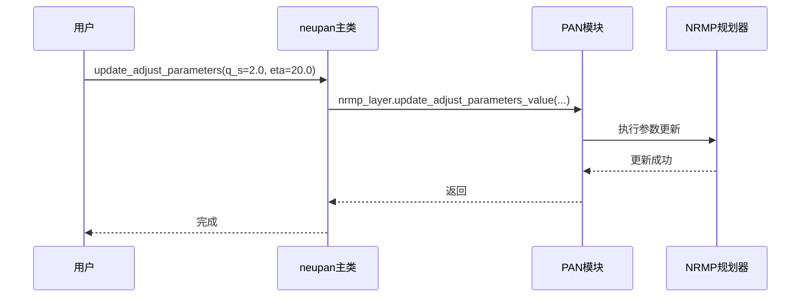

# 动态调整配置

<cite>
**Referenced Files in This Document**   
- [planner.yaml](file://example/pf/diff/planner.yaml)
- [nrmp.py](file://neupan/blocks/nrmp.py)
- [neupan.py](file://neupan/neupan.py)
- [pan.py](file://neupan/blocks/pan.py)
</cite>

## 目录
1. [引言](#引言)
2. [adjust配置块的作用](#adjust配置块的作用)
3. [参数动态更新机制](#参数动态更新机制)
4. [线程安全与状态一致性保障](#线程安全与状态一致性保障)
5. [典型用例：环境区域切换行为模式](#典型用例：环境区域切换行为模式)
6. [结论](#结论)

## 引言

在NeuPAN路径规划系统中，`adjust`配置块为模型参数的动态调整提供了核心支持。该机制允许系统在运行时根据性能反馈或外部指令，实时修改规划器的关键参数，如速度限制、避障权重等。尽管配置文件中未直接定义`enable_adjust`开关和`adjust_interval`更新周期，但系统通过`update_adjust_parameters`接口实现了灵活的动态调整能力。本文将深入解析`adjust`配置块的设计原理、参数更新机制及其在复杂环境中的实际应用。

## adjust配置块的作用

`adjust`配置块在`planner.yaml`配置文件中定义了一组可动态调整的参数，这些参数直接影响路径规划器的行为特性。其主要作用包括：

- **状态与控制权重调节**：`q_s`和`p_u`分别控制状态误差和控制输入的优化权重，影响轨迹平滑度与跟踪精度的平衡。
- **避障行为调控**：`eta`参数调节避障成本项的强度，值越大则规划路径越远离障碍物。
- **安全距离管理**：`d_max`和`d_min`定义了与障碍物保持的安全距离上下限，确保机器人在安全范围内运行。
- **优化过程调节**：`bk`参数用于调节邻近项成本，影响优化收敛性。

这些参数在初始化时从YAML配置文件加载，并作为`NRMP`（神经正则化运动规划器）模块的可学习参数进行管理。

**Section sources**
- [planner.yaml](file://example/pf/diff/planner.yaml#L40-L45)
- [nrmp.py](file://neupan/blocks/nrmp.py#L30-L45)

## 参数动态更新机制

系统通过`neupan`主类提供的`update_adjust_parameters`方法实现运行时参数更新。该机制的工作流程如下：

1. **参数封装**：在`PAN`（近端交替最小化网络）初始化过程中，`adjust_kwargs`从配置中提取并传递给`NRMP`实例。
2. **动态更新接口**：`neupan`类暴露`update_adjust_parameters(**kwargs)`方法，允许外部调用者传入需要更新的参数。
3. **内部更新逻辑**：该方法调用`NRMP`模块的`update_adjust_parameters_value`，使用`value_to_tensor`安全地更新参数张量，并同步刷新内部参数列表`adjust_parameters`。

此设计支持在不中断系统运行的情况下，根据环境变化或任务需求实时调整规划行为。例如，当机器人进入狭窄走廊时，可通过增大`eta`值强化避障行为；在开阔区域则可降低该值以提高通行效率。

**Diagram sources**
- [neupan.py](file://neupan/neupan.py#L380-L398)
- [nrmp.py](file://neupan/blocks/nrmp.py#L135-L149)

## 线程安全与状态一致性保障

虽然当前代码未显式实现锁机制，但其设计天然具备良好的线程安全与状态一致性基础：

- **原子性更新**：参数更新通过`kwargs.get()`模式进行，确保单次调用只更新指定参数，避免部分更新导致的状态不一致。
- **张量封装**：所有参数均封装为PyTorch张量（`value_to_tensor`），利用框架的内存管理机制保证数据一致性。
- **集中式管理**：`adjust_parameters`列表在`NRMP`内部统一维护，任何更新后立即重构该列表，确保优化问题接收的参数视图始终一致。
- **无共享可变状态**：`DUNE`和`NRMP`模块间通过函数调用传递不可变数据快照，而非共享可变状态，降低了竞态条件风险。

在典型的MPC（模型预测控制）闭环中，参数更新通常发生在控制周期之间，进一步减少了并发冲突的可能性。

**Section sources**
- [nrmp.py](file://neupan/blocks/nrmp.py#L135-L149)
- [pan.py](file://neupan/blocks/pan.py#L30-L45)

## 典型用例：环境区域切换行为模式

一个典型的动态调整用例是机器人在不同环境区域间切换时的行为模式调整：

1. **狭窄区域（如走廊）**：
   - **启用**：调用`update_adjust_parameters(eta=20.0, d_max=0.5)`，强化避障并缩小最大安全距离以适应狭窄空间。
   - **效果**：生成更保守、远离墙壁的轨迹，降低碰撞风险。

2. **开阔区域**：
   - **启用**：调用`update_adjust_parameters(eta=5.0, q_s=0.5)`，降低避障权重并调整状态权重以追求更高速度。
   - **效果**：生成更直接、高效的路径，提升通行速度。

3. **动态障碍物区域**：
   - **启用**：结合传感器反馈，动态调整`p_u`（控制权重）以增加轨迹平滑度，减少急转弯。
   - **效果**：提高在动态环境中的运动平稳性和安全性。

此机制使得单一规划器能够适应多样化场景，无需切换不同的规划算法或配置文件。

**Section sources**
- [neupan.py](file://neupan/neupan.py#L380-L398)
- [planner.yaml](file://example/corridor/diff/planner.yaml#L45-L50)

## 结论

`adjust`配置块是NeuPAN系统实现自适应路径规划的核心组件。它通过一组精心设计的可调参数，结合`update_adjust_parameters`运行时更新接口，赋予了规划器动态响应环境变化的能力。系统的模块化设计和参数集中管理机制，在无需复杂同步原语的情况下，有效保障了参数更新的原子性与状态一致性。这种动态调整能力使得机器人能够在复杂多变的环境中智能地切换行为模式，显著提升了系统的鲁棒性和实用性。未来可考虑引入`enable_adjust`开关以完全禁用调整逻辑，并通过`adjust_interval`实现周期性自动调整，进一步增强系统的灵活性。