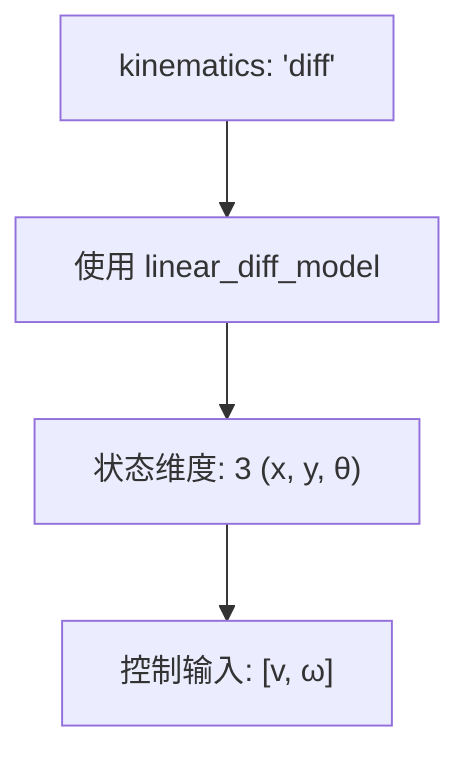
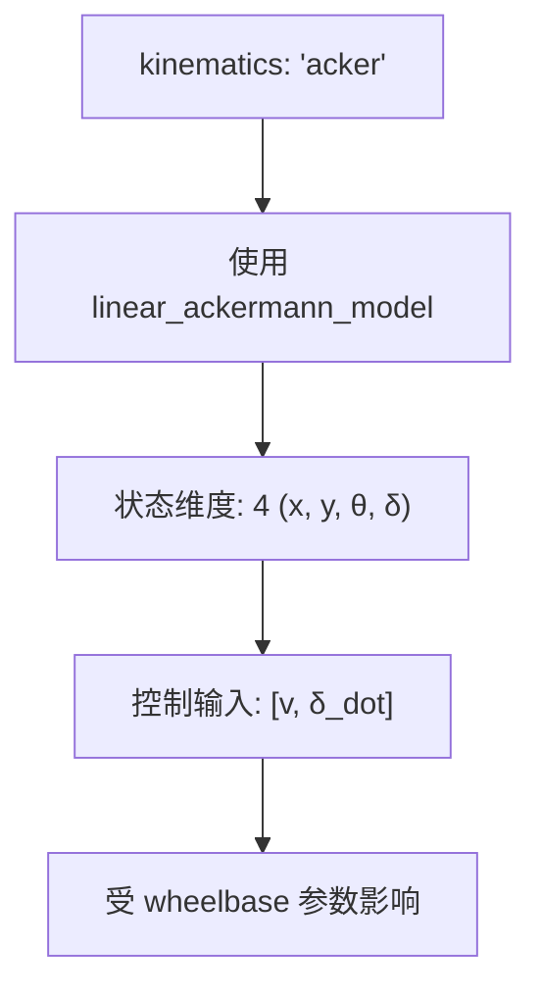
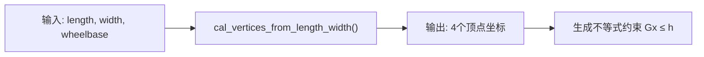
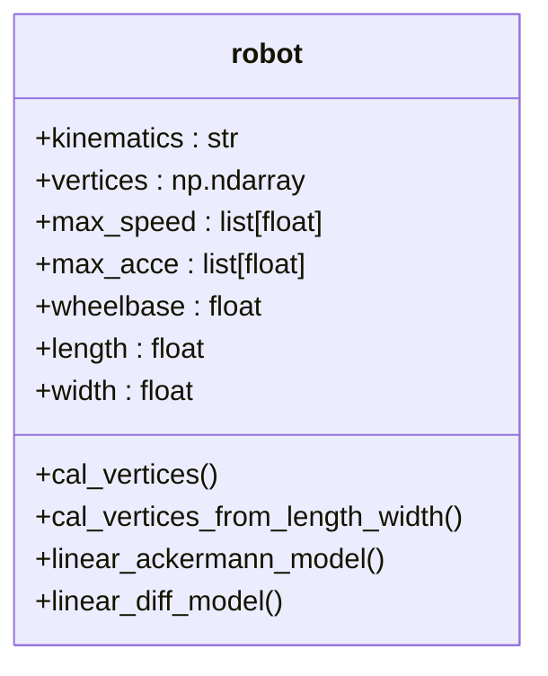
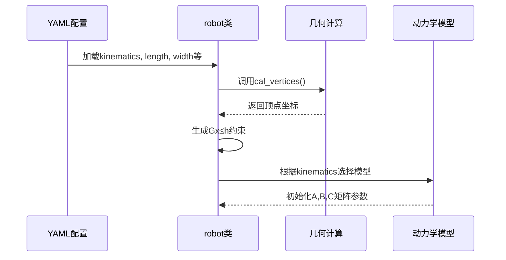

# 机器人配置

<cite>
**本文档引用的文件**
- [robot.py](file://neupan/robot/robot.py#L0-L349)
- [dune_train_diff.yaml](file://example/dune_train/dune_train_diff.yaml#L1-L21)
- [env.yaml](file://example/corridor/diff/env.yaml#L1-L54)
- [env.yaml](file://example/corridor/acker/env.yaml#L1-L53)
</cite>

## 目录
1. [简介](#简介)
2. [机器人配置结构](#机器人配置结构)
3. [运动学模型选择](#运动学模型选择)
4. [机器人几何形状定义](#机器人几何形状定义)
5. [物理参数配置](#物理参数配置)
6. [配置示例分析](#配置示例分析)
7. [参数边界检查机制](#参数边界检查机制)
8. [代码实现逻辑解析](#代码实现逻辑解析)
9. [总结](#总结)

## 简介
本文档详细解析NeuPAN系统中机器人YAML配置文件的结构与参数含义，重点阐述`kinematics`参数如何决定使用差速驱动（diff）或阿克曼转向（acker）模型，以及`vertices`参数如何定义机器人几何形状。同时解释`max_speed`、`max_steer`、`wheel_base`等关键物理参数的配置规则及其对路径规划行为的影响。

**Section sources**
- [robot.py](file://neupan/robot/robot.py#L0-L349)

## 机器人配置结构
机器人配置块主要包含以下核心参数：
- **kinematics**: 指定机器人运动学类型（'diff' 或 'acker'）
- **vertices**: 定义机器人多边形顶点坐标
- **length/width**: 机器人长宽尺寸
- **wheelbase**: 轴距（仅阿克曼模型需要）
- **max_speed**: 最大速度限制
- **max_acce**: 最大加速度限制
- **receding**: 预测时域步数
- **step_time**: 时间步长

这些参数共同定义了机器人的动力学模型和几何特性，为路径规划提供基础约束。

**Section sources**
- [robot.py](file://neupan/robot/robot.py#L15-L30)

## 运动学模型选择
`kinematics`参数决定了机器人采用的运动学模型，直接影响状态转移方程和控制输入维度。

### 差速驱动模型（diff）
差速驱动模型通过左右轮速度差实现转向，其状态向量为 `[x, y, θ]`，控制输入为 `[v, ω]`（线速度和角速度）。该模型适用于两轮差速或全向移动机器人。



### 阿克曼转向模型（acker）
阿克曼转向模型模拟汽车转向机制，前轮转向角独立控制，其状态向量为 `[x, y, θ, δ]`（包含转向角），控制输入为 `[v, δ_dot]`（线速度和转向角变化率）。



**Diagram sources**
- [robot.py](file://neupan/robot/robot.py#L270-L285)
- [robot.py](file://neupan/robot/robot.py#L250-L267)

## 机器人几何形状定义
机器人几何形状通过`vertices`参数定义，支持两种方式：

### 顶点坐标直接定义
直接提供机器人轮廓的多边形顶点坐标列表，格式为 `[[x1,y1], [x2,y2], ...]`，适用于任意多边形机器人。

### 长宽参数生成
通过`length`和`width`参数自动生成矩形机器人顶点，系统会调用`cal_vertices_from_length_width`方法计算四个角点坐标。



当`vertices`未指定时，系统自动根据`length`和`width`生成矩形顶点，并记录`shape="rectangle"`。

**Diagram sources**
- [robot.py](file://neupan/robot/robot.py#L310-L349)
- [robot.py](file://neupan/robot/robot.py#L300-L309)

## 物理参数配置
关键物理参数对机器人运动能力和规划行为有重要影响。

### 速度与加速度限制
- **max_speed**: 二维列表 `[v_max, ω_max]` 或 `[v_max, δ_dot_max]`
- **max_acce**: 二维列表 `[a_max, α_max]` 或 `[a_max, δ_ddot_max]`

这些参数用于构建速度和加速度边界约束，在`bound_su_constraints`方法中实现。

### 轴距参数（wheelbase）
仅阿克曼模型需要，表示前后轴之间的距离，直接影响转向半径和运动学方程中的非线性项。



**Diagram sources**
- [robot.py](file://neupan/robot/robot.py#L15-L30)
- [robot.py](file://neupan/robot/robot.py#L300-L349)

## 配置示例分析
### 差速驱动机器人配置
```yaml
robot:
  kinematics: 'diff'
  length: 1.6
  width: 2.0
```
此配置定义了一个长1.6米、宽2.0米的差速驱动机器人，系统将自动生成矩形顶点并使用差速运动学模型。

### 阿克曼转向机器人配置
```yaml
robot:
  - kinematics: {name: 'acker'} 
    shape: {name: 'rectangle', length: 4.6, width: 1.6, wheelbase: 3}
```
此配置定义了一个长4.6米、宽1.6米、轴距3米的阿克曼转向机器人，具有更复杂的转向动力学特性。

**Section sources**
- [dune_train_diff.yaml](file://example/dune_train/dune_train_diff.yaml#L1-L5)
- [env.yaml](file://example/corridor/acker/env.yaml#L10-L12)

## 参数边界检查机制
系统在初始化时对关键参数进行边界检查和自动修正：

### 阿克曼转向角限制
当`kinematics='acker'`时，系统会检查最大转向角：
```python
if self.max_speed[1] >= 1.57:
    print(f"Warning: max steering angle of acker robot is {self.max_speed[1]} rad, which is larger than 1.57 rad, so it is limited to 1.57 rad")
    self.max_speed[1] = 1.57
```
此机制确保转向角不超过90度（1.57弧度），符合物理合理性。

### 顶点数量验证
系统强制要求顶点数量不少于3个：
```python
assert vertices_np.shape[1] >= 3, "vertices must be a numpy array of shape (2, N), N >= 3"
```

**Section sources**
- [robot.py](file://neupan/robot/robot.py#L45-L50)
- [robot.py](file://neupan/robot/robot.py#L340-L342)

## 代码实现逻辑解析
机器人配置参数在`robot.py`的`__init__`方法中被加载和处理，最终实例化为具体的动力学模型。

### 参数加载流程


### 动力学模型选择
在`generate_state_parameter_value`方法中，根据`kinematics`值动态选择线性化模型：
- `kinematics == 'acker'`: 调用`linear_ackermann_model`
- `kinematics == 'diff'`: 调用`linear_diff_model`

这种设计实现了运动学模型的灵活切换，支持多种机器人类型。

**Diagram sources**
- [robot.py](file://neupan/robot/robot.py#L220-L248)
- [robot.py](file://neupan/robot/robot.py#L250-L285)

## 总结
NeuPAN系统的机器人配置通过YAML文件定义，核心参数`kinematics`决定了运动学模型的选择，`vertices`或`length/width`参数定义了几何形状。物理参数如`max_speed`、`wheelbase`等直接影响机器人的运动能力和规划行为。系统在初始化时进行参数验证和边界检查，确保配置的合理性和安全性。通过`robot.py`中的面向对象设计，实现了配置参数到具体动力学模型的无缝转换。

**Section sources**
- [robot.py](file://neupan/robot/robot.py#L0-L349)
- [dune_train_diff.yaml](file://example/dune_train/dune_train_diff.yaml#L1-L21)