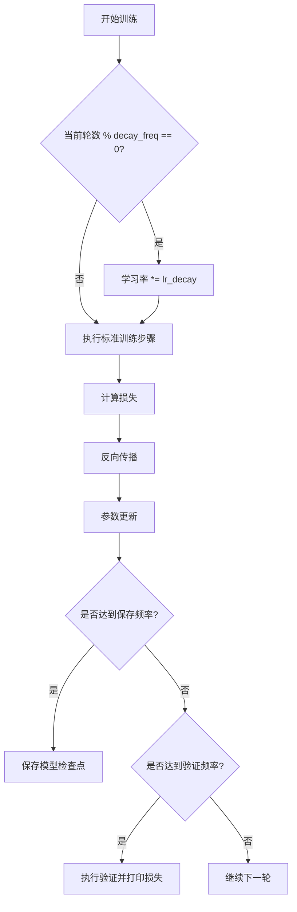
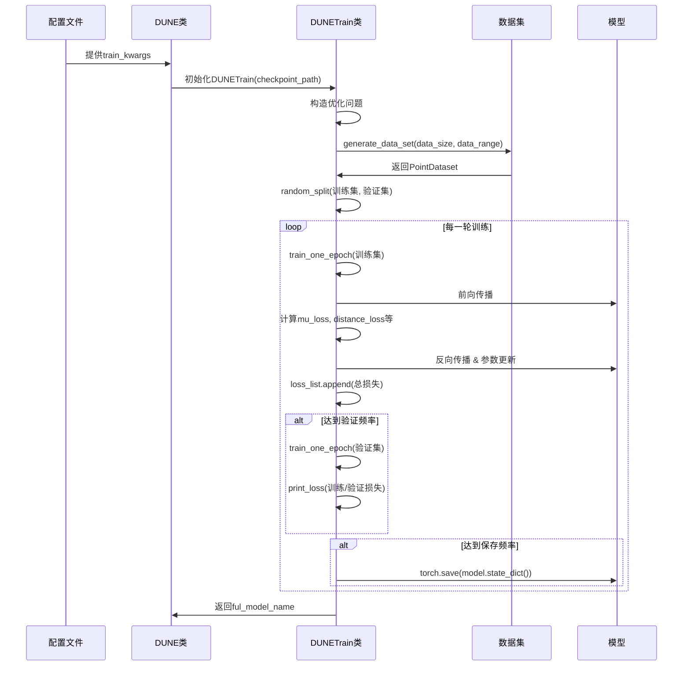

# 训练配置

<cite>
**本文档引用的文件**  
- [dune_train.py](file://neupan/blocks/dune_train.py)
- [dune.py](file://neupan/blocks/dune.py)
- [dune_train_acker.yaml](file://example/dune_train/dune_train_acker.yaml)
</cite>

## 目录
1. [训练配置块概述](#训练配置块概述)
2. [核心训练超参数解析](#核心训练超参数解析)
3. [数据与模型路径配置](#数据与模型路径配置)
4. [训练流程与配置驱动机制](#训练流程与配置驱动机制)
5. [防止过拟合的配置建议](#防止过拟合的配置建议)

## 训练配置块概述

在NeuPAN框架中，`train`配置块是DUNE模型训练过程的核心控制单元，它定义了从数据生成到模型持久化的完整训练策略。该配置通过YAML文件（如`dune_train_acker.yaml`）进行声明式定义，并由`DUNETrain`类解析执行。配置块不仅控制训练的基本参数，还通过`direct_train`等标志位决定训练流程的自动化程度。

**Section sources**
- [dune_train_acker.yaml](file://example/dune_train/dune_train_acker.yaml#L6-L19)
- [dune.py](file://neupan/blocks/dune.py#L175-L185)

## 核心训练超参数解析

### epochs（训练轮数）
`epoch`参数定义了整个训练数据集被完整遍历的次数。在示例配置中，`epoch: 5000`表示模型将进行5000轮训练。较高的epoch值允许模型更充分地学习数据特征，但需配合验证频率（`valid_freq`）和学习率衰减（`lr_decay`）来防止过拟合。训练过程通过`start`方法中的循环实现，每轮更新进度条并计算损失。

### batch_size（批次大小）
`batch_size: 256`指定了每次梯度更新所使用的样本数量。较大的批次能提供更稳定的梯度估计，加快训练速度，但会增加内存消耗。该值直接影响`DataLoader`的配置，决定了`train_one_epoch`方法中每次迭代处理的数据量。

### learning_rate（学习率）
学习率`lr: 5e-5`控制了模型参数更新的步长。初始值通过`self.optimizer.param_groups[0]["lr"] = float(lr)`设置。为优化收敛过程，系统实现了周期性学习率衰减机制：每`decay_freq: 1500`轮，学习率乘以`lr_decay: 0.5`，形成阶梯式下降曲线，有助于模型在训练后期更精细地调整参数。

**Diagram sources**
- [dune_train.py](file://neupan/blocks/dune_train.py#L145-L270)

**Section sources**
- [dune_train.py](file://neupan/blocks/dune_train.py#L145-L150)
- [dune_train_acker.yaml](file://example/dune_train/dune_train_acker.yaml#L13-L19)

## 数据与模型路径配置

### data_path（数据路径）
尽管配置文件中未显式出现`data_path`，但`data_range: [-25, -25, 25, 25]`参数间接定义了训练数据的生成范围。`generate_data_set`方法根据此范围使用`np.random.uniform`生成随机点，作为训练数据的来源。因此，`data_range`实质上充当了虚拟数据路径，控制着输入数据的分布。

### model_save_path（模型持久化路径）
模型的保存路径由`checkpoint_path`参数决定，其值在`DUNE`类的`train_dune`方法中构建：`sys.path[0] + '/model' + '/' + model_name`。模型按`save_freq: 500`的频率保存，文件名为`model_{epoch}.pth`。此外，`train_dict.pkl`文件会保存完整的训练配置，确保训练过程可复现。

**Section sources**
- [dune.py](file://neupan/blocks/dune.py#L180-L185)
- [dune_train.py](file://neupan/blocks/dune_train.py#L134-L136)

## 训练流程与配置驱动机制

完整的训练pipeline由`DUNETrain.start`方法驱动，其执行流程如下：

1. **配置持久化**：将所有训练参数（包括`data_size`, `robot_G`, `robot_h`等）序列化为`train_dict.pkl`，确保可追溯性。
2. **数据集生成**：调用`generate_data_set`根据`data_size`和`data_range`生成训练数据，并通过`random_split`划分为训练集（80%）和验证集（20%）。
3. **训练循环**：使用`DataLoader`迭代数据，执行`train_one_epoch`进行前向传播、损失计算和反向传播。
4. **验证与监控**：每`valid_freq`轮在验证集上评估模型性能，输出多维度损失（Mu Loss, Distance Loss等）。
5. **模型持久化**：每`save_freq`轮保存一次模型检查点。

**Diagram sources**
- [dune.py](file://neupan/blocks/dune.py#L180-L185)
- [dune_train.py](file://neupan/blocks/dune_train.py#L134-L270)

**Section sources**
- [dune_train.py](file://neupan/blocks/dune_train.py#L134-L270)

## 防止过拟合的配置建议

为提升模型泛化能力，建议采用以下配置策略：

1. **分层学习率衰减**：保持`lr_decay: 0.5`和`decay_freq: 1500`的组合，使模型在初期快速收敛，在后期精细调整。
2. **正则化**：`Adam`优化器已内置`weight_decay=1e-4`，可有效抑制权重过大。
3. **早停机制**：虽然代码未直接实现，但可通过监控验证损失，在损失不再下降时手动终止训练。
4. **数据增强**：`cal_loss_fab`方法中随机生成的旋转矩阵`R`，为损失计算引入了数据扰动，起到了隐式的数据增强作用。
5. **合理设置epoch**：避免过度训练，建议通过`valid_freq`密切监控验证损失，当验证损失开始上升时停止训练。

**Section sources**
- [dune_train.py](file://neupan/blocks/dune_train.py#L78-L80)
- [dune_train.py](file://neupan/blocks/dune_train.py#L350-L365)