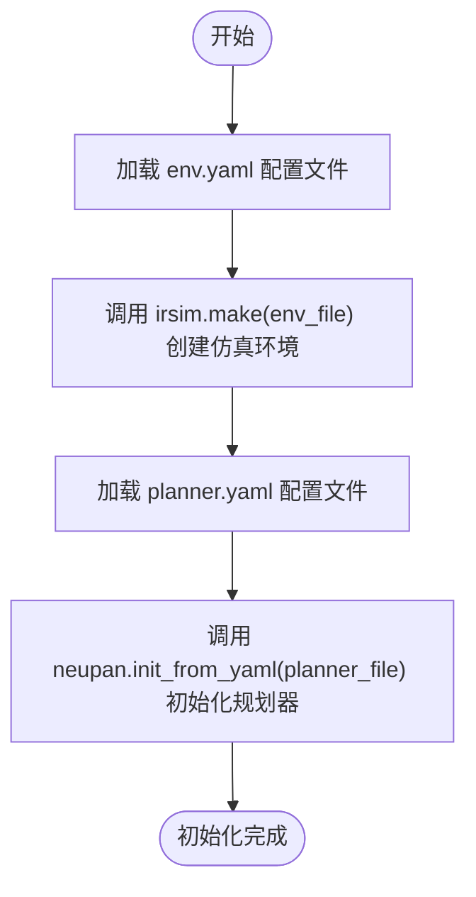
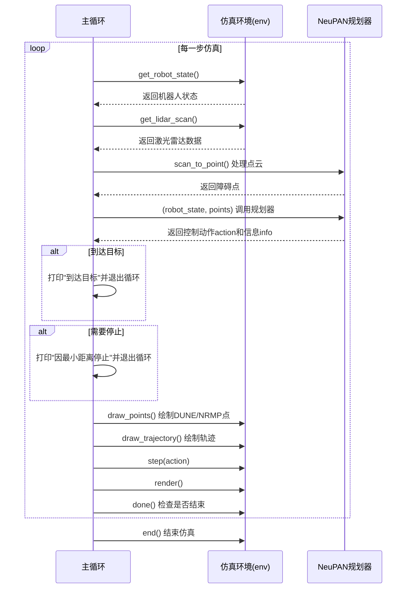

# IR-SIM仿真环境集成

<cite>
**本文档中引用的文件**  
- [run_exp.py](file://example/run_exp.py)
- [env.yaml](file://example/corridor/acker/env.yaml)
- [planner.yaml](file://example/corridor/acker/planner.yaml)
- [neupan.py](file://neupan/neupan.py)
</cite>

## 目录
1. [简介](#简介)
2. [仿真环境初始化](#仿真环境初始化)
3. [主循环流程分析](#主循环流程分析)
4. [可视化与动画记录](#可视化与动画记录)
5. [反向行驶场景处理](#反向行驶场景处理)
6. [命令行参数配置](#命令行参数配置)
7. [结论](#结论)

## 简介
本文档详细说明NeuPAN与IR-SIM仿真环境的集成方法。通过分析`run_exp.py`中的核心逻辑，阐述如何初始化仿真环境、加载配置文件、执行主循环、可视化关键轨迹，并支持灵活的实验配置。文档涵盖从环境搭建到高级功能的完整流程，适用于不同机器人运动学模型和实验场景。

## 仿真环境初始化

NeuPAN与IR-SIM的集成始于仿真环境的创建和规划器的初始化。通过`irsim.make()`函数加载`env.yaml`文件，配置仿真世界参数、机器人状态和传感器信息；同时通过`neupan.init_from_yaml()`加载`planner.yaml`文件，初始化NeuPAN规划器。



**Diagram sources**  
- [run_exp.py](file://example/run_exp.py#L15-L16)

**Section sources**  
- [run_exp.py](file://example/run_exp.py#L15-L16)
- [env.yaml](file://example/corridor/acker/env.yaml#L1-L53)
- [planner.yaml](file://example/corridor/acker/planner.yaml#L1-L42)

### 环境配置文件 (env.yaml)
`env.yaml`定义了仿真世界的基本参数，包括：
- **world**: 仿真世界的尺寸、时间步长、碰撞模式和控制模式。
- **robot**: 机器人的运动学模型（如`acker`或`diff`）、形状、初始状态、目标位置、速度限制和传感器配置（如激光雷达）。
- **obstacle**: 静态或动态障碍物的数量、分布方式、形状和位置。

### 规划器配置文件 (planner.yaml)
`planner.yaml`定义了NeuPAN规划器的核心参数，包括：
- **mpc**: 预测时域`receding`、时间步长`step_time`、参考速度`ref_speed`等。
- **robot**: 机器人运动学参数，与`env.yaml`中的定义保持一致。
- **ipath**: 初始路径生成参数，如航点`waypoints`、路径类型`curve_style`（Dubins或Reeds-Shepp）。
- **pan**: DUNE和NRMP模块的参数，如最大障碍点数`dune_max_num`、`nrmp_max_num`和模型检查点路径。
- **adjust**: 调整权重参数，用于平衡状态成本、速度成本和避障成本。

## 主循环流程分析

`run_exp.py`中的主循环是NeuPAN与IR-SIM交互的核心，其流程如下：



**Diagram sources**  
- [run_exp.py](file://example/run_exp.py#L20-L74)

**Section sources**  
- [run_exp.py](file://example/run_exp.py#L20-L74)
- [neupan.py](file://neupan/neupan.py#L100-L200)

### 详细步骤说明
1. **状态获取**: 在每个仿真步，通过`env.get_robot_state()`获取机器人的当前状态（位置、姿态、速度）。
2. **激光雷达数据处理**: 通过`env.get_lidar_scan()`获取激光雷达扫描数据，并调用`neupan_planner.scan_to_point()`将其转换为全局坐标系下的障碍物点云。
3. **NeuPAN规划器调用**: 将机器人状态和障碍物点云作为输入，调用`neupan_planner(robot_state, points)`执行规划。该函数内部会生成参考轨迹、执行DUNE和NRMP优化，并输出最优控制动作。
4. **动作执行与渲染**: 将规划出的动作`action`传递给`env.step(action)`执行，并调用`env.render()`更新可视化界面。
5. **终止条件检查**: 检查`info["arrive"]`或`info["stop"]`标志位，或调用`env.done()`判断仿真是否结束，以决定是否跳出循环。

## 可视化与动画记录

NeuPAN提供了丰富的可视化功能，用于调试和分析规划过程。

### 关键点与轨迹可视化
通过以下方法可以实时绘制关键信息：
- `env.draw_points(neupan_planner.dune_points, s=25, c="g", refresh=True)`: 以绿色绘制DUNE模块生成的障碍点。
- `env.draw_points(neupan_planner.nrmp_points, s=13, c="r", refresh=True)`: 以红色绘制NRMP模块考虑的障碍点。
- `env.draw_trajectory(neupan_planner.opt_trajectory, "r", refresh=True)`: 以红色绘制优化后的轨迹（MPC预测时域内的轨迹）。
- `env.draw_trajectory(neupan_planner.ref_trajectory, "b", refresh=True)`: 以蓝色绘制参考轨迹（初始路径上的参考点）。
- `env.draw_trajectory(neupan_planner.initial_path, traj_type="-k", show_direction=False)`: 以黑色绘制初始路径。

```mermaid
graph TD
A[可视化功能] --> B[DUNE点]
A --> C[NRMP点]
A --> D[优化轨迹]
A --> E[参考轨迹]
A --> F[初始路径]
B --> G["c='g'", "s=25"]
C --> H["c='r'", "s=13"]
D --> I["color='r'"]
E --> J["color='b'"]
F --> K["traj_type='-k'"]
```

**Diagram sources**  
- [run_exp.py](file://example/run_exp.py#L49-L54)

### 动画记录
通过在`main`函数中设置`save_animation=True`，并指定`ani_name`，可以将仿真过程保存为动画文件。在命令行中使用`-a`或`--save_animation`参数即可启用此功能。

## 反向行驶场景处理

对于需要倒车入库等反向行驶的场景（如`reverse`示例），需要特殊配置初始路径。在`run_exp.py`的主循环中，当`reverse=True`时，会修改初始路径中每个状态的档位（gear）为-1（倒档），并调整航向角。

```python
if reverse:
    for j in range(len(neupan_planner.initial_path)):
        neupan_planner.initial_path[j][-1, 0] = -1  # 设置为倒档
        neupan_planner.initial_path[j][-2, 0] = neupan_planner.initial_path[j][-2, 0] + 3.14  # 调整航向角
    env.draw_trajectory(neupan_planner.initial_path, traj_type="-k", show_direction=True)
```

此配置确保了规划器在生成轨迹时考虑了反向运动的动力学约束。

**Section sources**  
- [run_exp.py](file://example/run_exp.py#L60-L66)
- [reverse/acker/planner.yaml](file://example/reverse/acker/planner.yaml#L1-L40)

## 命令行参数配置

`run_exp.py`通过`argparse`库提供了灵活的命令行参数，允许用户无需修改代码即可切换不同的实验场景和机器人模型。

| 参数 | 缩写 | 可选值 | 说明 |
| :--- | :--- | :--- | :--- |
| `--example` | `-e` | `pf`, `pf_obs`, `corridor`, `dyna_obs`, `dyna_non_obs`, `convex_obs`, `non_obs`, `polygon_robot`, `reverse` | 选择实验场景 |
| `--kinematics` | `-d` | `acker`, `diff` | 选择机器人运动学模型 |
| `--save_animation` | `-a` | (标志位) | 保存仿真动画 |
| `--full` | `-f` | (标志位) | 全屏显示 |
| `--no_display` | `-n` | (标志位) | 是否显示仿真界面 |
| `--point_vel` | `-v` | (标志位) | 是否使用点云速度信息 |
| `--max_steps` | `-m` | 整数 | 最大仿真步数 |

例如，运行`python run_exp.py -e reverse -d acker -a`将使用阿克曼转向机器人在倒车场景中运行，并保存动画。

**Section sources**  
- [run_exp.py](file://example/run_exp.py#L76-L92)

## 结论
本文档全面阐述了NeuPAN与IR-SIM仿真环境的集成方法。通过`irsim.make()`和`neupan.init_from_yaml()`加载配置，主循环实现了状态获取、感知处理、规划决策和动作执行的闭环。利用`draw_points`和`draw_trajectory`等方法可有效可视化内部状态，而命令行参数则提供了极大的实验灵活性。该集成方案为算法的测试、验证和优化提供了一个强大且易用的平台。