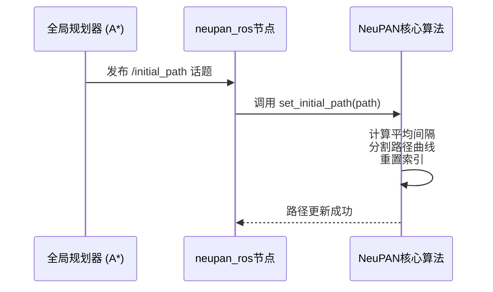
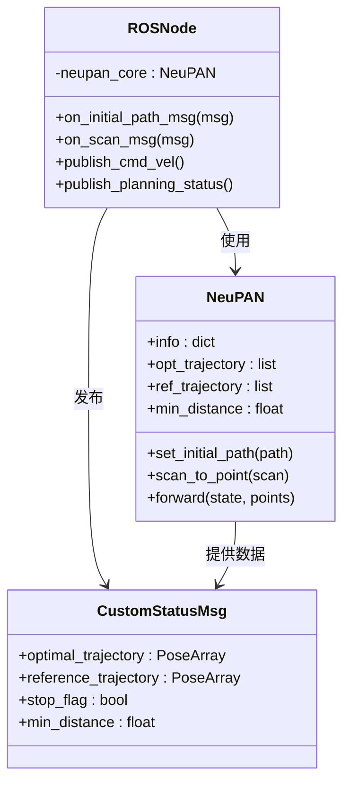

# ROS系统集成

<cite>
**本文档中引用的文件**  
- [neupan.py](file://neupan/neupan.py)
- [initial_path.py](file://neupan/blocks/initial_path.py)
- [README.md](file://README.md)
</cite>

## 目录
1. [介绍](#介绍)
2. [初始路径管理](#初始路径管理)
3. [传感器数据处理](#传感器数据处理)
4. [规划动作与状态发布](#规划动作与状态发布)
5. [ROS节点设计与最佳实践](#ros节点设计与最佳实践)
6. [常见集成问题解决方案](#常见集成问题解决方案)

## 介绍

NeuPAN通过其独立的`neupan_ros`仓库与ROS系统实现无缝集成，为机器人提供实时、端到端的运动规划能力。该集成方案的核心是将NeuPAN的Python核心算法与ROS的通信框架相结合，利用ROS话题（topics）进行数据交换。NeuPAN接收来自全局规划器的路径和来自传感器的障碍物数据，经过内部的模型预测控制（MPC）和神经网络优化计算后，输出最优的控制动作，并通过ROS发布到机器人控制器。这种设计实现了“直接点云导航”，无需构建环境地图，即可在复杂未知环境中安全高效地导航。

**Section sources**
- [README.md](file://README.md#L210-L214)

## 初始路径管理

NeuPAN的初始路径管理是其与全局规划器（如A*）集成的关键。系统通过`set_initial_path` API动态更新初始路径，允许实时响应环境变化或新的目标点。

### 订阅initial_path话题

NeuPAN的ROS节点会订阅一个名为`/initial_path`的ROS话题。该话题应发布一个包含路径点的列表，每个路径点是一个包含`[x, y, theta, gear]`的4x1向量。其中，`gear`表示档位，1为前进，-1为后退。当`neupan_ros`节点接收到此话题的消息时，它会调用核心NeuPAN类的`set_initial_path`方法来更新内部的初始路径。

### 动态更新初始路径

`set_initial_path`方法是动态更新路径的核心。它接收一个路径点列表作为输入，计算路径的平均间隔，并根据档位变化将路径分割成多个曲线段。这使得NeuPAN能够处理包含前进和后退的复杂路径。此外，NeuPAN还提供了`update_initial_path_from_goal`和`update_initial_path_from_waypoints`等便捷方法，可以根据机器人的当前位置和目标位置，或根据一组航路点，自动生成并更新初始路径。



**Diagram sources**
- [neupan.py](file://neupan/neupan.py#L276-L327)
- [initial_path.py](file://neupan/blocks/initial_path.py#L35-L75)

**Section sources**
- [neupan.py](file://neupan/neupan.py#L276-L327)
- [initial_path.py](file://neupan/blocks/initial_path.py#L35-L75)
- [README.md](file://README.md#L210-L214)

## 传感器数据处理

NeuPAN直接处理原始的传感器数据，如激光雷达扫描，将其转换为内部算法所需的点云格式。这一过程是实现“端到端”导航的关键。

### 激光雷达数据到点云的转换

`scan_to_point`方法负责将ROS中的`LaserScan`消息转换为NeuPAN所需的二维点云。该方法接收机器人的当前状态（`[x, y, theta]`）、`LaserScan`数据和传感器相对于机器人坐标系的偏移量。它首先根据扫描的`ranges`和`angles`计算出传感器坐标系下的点云，然后通过坐标变换，将这些点转换到机器人坐标系下，并最终转换到世界坐标系。此过程确保了障碍物点云的坐标与机器人的运动规划坐标系一致。

### 支持动态障碍物速度信息

为了应对动态障碍物，NeuPAN提供了`scan_to_point_velocity`接口。该接口扩展了`scan_to_point`的功能，能够从`LaserScan`消息中提取每个扫描点的速度信息（通常通过多普勒雷达或点云配准算法获得）。该方法返回两个数组：转换后的点云坐标和对应的速度向量。这些速度信息被输入到NeuPAN的PAN（Proximal Alternating-minimization Network）模块中，用于预测未来时刻障碍物的位置，从而实现更安全的动态避障。

```mermaid
flowchart TD
A[ROS LaserScan消息] --> B{包含速度信息?}
B --> |是| C[调用 scan_to_point_velocity]
B --> |否| D[调用 scan_to_point]
C --> E[提取 ranges, angles, velocity]
D --> F[提取 ranges, angles]
E --> G[坐标变换到机器人坐标系]
F --> G
G --> H[生成 (2, n) 点云和 (2, n) 速度矩阵]
H --> I[输入到NeuPAN核心算法]
```

**Diagram sources**
- [neupan.py](file://neupan/neupan.py#L130-L243)

**Section sources**
- [neupan.py](file://neupan/neupan.py#L130-L243)

## 规划动作与状态发布

NeuPAN完成计算后，会通过ROS话题发布规划结果，并提供丰富的内部状态信息供监控和调试。

### 发布规划动作

NeuPAN的规划动作（即控制指令）通过ROS控制话题发布。对于差速驱动机器人（diff），输出是线速度和角速度；对于阿克曼转向机器人（acker），输出是线速度和前轮转角。`neupan_ros`节点会将NeuPAN核心算法计算出的`action`（一个2x1的向量）转换为ROS标准的`Twist`消息，并发布到如`/cmd_vel`之类的控制话题上，从而驱动机器人运动。

### 传递规划状态信息

除了控制指令，NeuPAN还通过其`info`字典和一系列属性（properties）提供详细的规划状态。`neupan_ros`节点可以将这些信息打包成自定义的ROS消息类型进行发布。关键的状态信息包括：
- **最优轨迹 (`opt_trajectory`)**: MPC在预测时域内的最优状态序列。
- **参考轨迹 (`ref_trajectory`)**: 当前初始路径上的参考状态序列。
- **停止标志 (`stop`)**: 一个布尔值，当机器人与障碍物的最小距离小于`collision_threshold`时，此标志被置为`True`，表示应停止运动。
- **到达标志 (`arrive`)**: 表示机器人是否已到达路径终点。

这些信息对于上层任务规划、可视化和故障诊断至关重要。



**Diagram sources**
- [neupan.py](file://neupan/neupan.py#L130-L175)
- [neupan.py](file://neupan/neupan.py#L368-L401)

**Section sources**
- [neupan.py](file://neupan/neupan.py#L130-L175)
- [neupan.py](file://neupan/neupan.py#L368-L401)

## ROS节点设计与最佳实践

设计一个高效、可靠的`neupan_ros`节点需要遵循特定的设计模式和最佳实践。

### 节点设计模式

推荐采用**状态机模式**或**行为树模式**来组织节点逻辑。节点应包含以下几个核心状态：
1.  **初始化 (INIT)**: 加载NeuPAN配置，初始化核心算法实例。
2.  **等待路径 (WAIT_PATH)**: 等待`/initial_path`话题的消息。在收到有效路径前，不进行规划。
3.  **规划中 (PLANNING)**: 接收传感器数据，调用`forward`方法进行规划，并发布控制指令和状态。
4.  **已到达 (ARRIVED)**: 当`info["arrive"]`为`True`时进入此状态，发布零速度指令。
5.  **已停止 (STOPPED)**: 当`info["stop"]`为`True`时进入此状态，发布零速度指令并告警。

### 话题命名规范

遵循ROS的命名约定，使用小写字母和下划线：
- **订阅 (Subscriptions)**:
  - `/initial_path` (类型: `nav_msgs/Path` 或自定义消息)
  - `/scan` (类型: `sensor_msgs/LaserScan`)
  - `/odom` (类型: `nav_msgs/Odometry`)
- **发布 (Publications)**:
  - `/cmd_vel` (类型: `geometry_msgs/Twist`)
  - `/neupan/status` (类型: `neupan_msgs/PlanningStatus` - 自定义消息)

### 消息同步机制

由于规划需要同时获取机器人的状态（来自`/odom`）和传感器数据（来自`/scan`），必须使用`message_filters`包中的`ApproximateTimeSynchronizer`来同步这些不同步但时间戳相近的消息。这可以确保规划算法使用的是同一时刻或相近时刻的状态和环境感知数据，避免因时间不同步导致的规划错误。

**Section sources**
- [neupan.py](file://neupan/neupan.py)

## 常见集成问题解决方案

在集成过程中，可能会遇到一些常见问题，以下是解决方案。

### 坐标系变换

**问题**: 激光雷达的坐标系与机器人基座坐标系不一致，导致点云位置错误。
**解决方案**: 在`scan_to_point`和`scan_to_point_velocity`方法中，正确设置`scan_offset`参数。该参数是一个`[x, y, theta]`的列表，表示激光雷达相对于机器人基座坐标系的偏移。确保该偏移量与机器人URDF模型中的定义完全一致。

### 时间戳同步

**问题**: `odom`和`scan`消息的时间戳不同步，导致规划使用过时或未来的数据。
**解决方案**: 如上所述，使用`message_filters.ApproximateTimeSynchronizer`。设置一个合理的`slop`参数（例如0.01秒），允许在时间上略有偏差的消息被同步处理。同时，确保所有传感器和里程计都使用相同的时钟源（如NTP）进行时间同步。

**Section sources**
- [neupan.py](file://neupan/neupan.py#L130-L243)