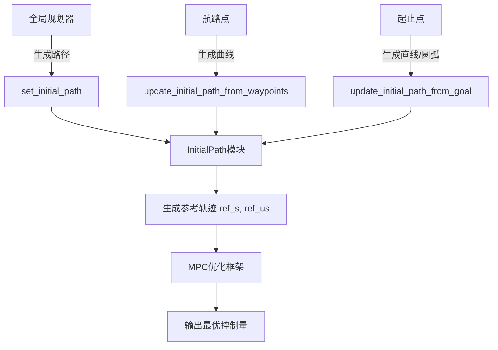

# 全局规划器集成

<cite>
**本文档中引用的文件**  
- [neupan.py](file://neupan/neupan.py)
- [initial_path.py](file://neupan/blocks/initial_path.py)
</cite>

## 目录
1. [分层规划架构概述](#分层规划架构概述)
2. [初始路径注入机制](#初始路径注入机制)
3. [MPC优化框架中的初始路径作用](#mpc优化框架中的初始路径作用)
4. [与常见全局规划器的集成方法](#与常见全局规划器的集成方法)
5. [动态环境下的路径更新与恢复机制](#动态环境下的路径更新与恢复机制)

## 分层规划架构概述

NeuPAN采用分层规划架构，将全局规划器（如A*、RRT）生成的粗略路径作为初始参考路径，结合模型预测控制（MPC）框架进行局部动态调整。该架构分为两层：
- **上层**：由传统全局规划器生成从起点到目标点的完整路径，确保全局可达性。
- **下层**：NeuPAN以该路径为初始输入，在MPC框架内实时优化控制指令，以应对未知障碍物和动态环境变化。

这种架构兼顾了全局最优性和局部反应性，适用于复杂、动态的机器人导航场景。

**Section sources**
- [neupan.py](file://neupan/neupan.py#L286-L293)
- [initial_path.py](file://neupan/blocks/initial_path.py#L127-L140)

## 初始路径注入机制

NeuPAN提供了多种API接口，用于将全局规划器生成的路径注入系统作为初始参考路径。

### set_initial_path
该方法允许直接设置一个完整的初始路径，路径中的每个点包含位置、朝向和档位信息。

```python
def set_initial_path(self, path):
    """
    path: list of [x, y, theta, gear] 4x1 vector, gear is -1 (back gear) or 1 (forward gear)
    """
```

此接口适用于A*或RRT等规划器输出离散路径点的情况，用户需将路径点转换为指定格式后传入。

### update_initial_path_from_waypoints
通过一系列航路点（waypoints）动态生成初始路径。

```python
def update_initial_path_from_waypoints(self, waypoints):
    """
    waypoints: list of [x, y, theta] or 3x1 vector
    """
```

该方法内部调用曲线生成器（curve_generator）根据航路点生成平滑路径，适用于NavFn等基于势场的规划器输出航路点的场景。

### update_initial_path_from_goal
根据当前状态和目标状态直接更新初始路径。

```python
def update_initial_path_from_goal(self, start, goal):
    """
    start: [x, y, theta] or 3x1 vector
    goal: [x, y, theta] or 3x1 vector
    """
```

此方法适用于SBPL等增量式规划器，在目标点已知时可快速生成直线或圆弧路径作为初始参考。

**Section sources**
- [neupan.py](file://neupan/neupan.py#L313-L331)
- [initial_path.py](file://neupan/blocks/initial_path.py#L351-L370)

## MPC优化框架中的初始路径作用

初始路径在NeuPAN的MPC优化框架中扮演关键角色，主要体现在以下几个方面：

1. **参考轨迹生成**：系统根据当前机器人状态，在初始路径上查找最近点，并沿路径向前推演，生成未来T个时间步的参考状态序列（`ref_s`）和参考速度序列（`ref_us`）。
2. **名义状态初始化**：MPC迭代优化的初始猜测值（nominal state）基于当前状态和初始路径推演得到，有助于加速优化收敛。
3. **档位控制依据**：路径点中的gear字段（1为前进，-1为后退）指导机器人运动方向，支持倒车等复杂机动。
4. **路径一致性约束**：优化过程中通过状态代价项（state cost）引导实际轨迹贴近初始路径，保证整体行进方向正确。

初始路径作为“先验知识”，使NeuPAN能够在保证全局目标的前提下进行局部避障，实现高效稳定的导航。



**Diagram sources**
- [neupan.py](file://neupan/neupan.py#L286-L331)
- [initial_path.py](file://neupan/blocks/initial_path.py#L127-L370)

## 与常见全局规划器的集成方法

### 与NavFn集成
NavFn通常输出一系列二维路径点（x, y）。集成时需补充朝向角θ和档位信息：
```python
# 示例：将NavFn路径转换为NeuPAN输入格式
navfn_path = [[x1, y1], [x2, y2], ...]
waypoints = []
for i in range(len(navfn_path)-1):
    x, y = navfn_path[i]
    dx = navfn_path[i+1][0] - x
    dy = navfn_path[i+1][1] - y
    theta = math.atan2(dy, dx)
    waypoints.append([x, y, theta, 1])  # 假设全程前进
neupan.set_initial_path(waypoints)
```

### 与SBPL集成
SBPL可能输出离散动作序列或网格路径。需将其映射到连续坐标系，并进行路径平滑处理：
```python
# 示例：从SBPL网格路径生成平滑曲线
grid_path = sbpl_planner.search(start, goal)
continuous_waypoints = convert_grid_to_continuous(grid_path)
neupan.update_initial_path_from_waypoints(continuous_waypoints)
```

### 坐标系对齐
确保全局规划器输出的坐标系与NeuPAN使用的坐标系一致（如：世界坐标系原点、方向定义）。必要时使用`get_transform`工具函数进行坐标变换。

**Section sources**
- [neupan.py](file://neupan/neupan.py#L324-L331)
- [initial_path.py](file://neupan/blocks/initial_path.py#L444-L483)
- [util/__init__.py](file://neupan/util/__init__.py#L119-L169)

## 动态环境下的路径更新与恢复机制

在动态环境中，初始路径可能因障碍物出现而失效。NeuPAN通过以下策略保持路径有效性：

1. **定期更新机制**：外部系统可定期调用`update_initial_path_from_waypoints`或`update_initial_path_from_goal`刷新初始路径，反映最新的环境信息。
2. **到达检测与自动重规划**：`check_arrive`方法检测是否接近路径终点。若路径失效或目标变更，可触发上层规划器重新计算路径并注入。
3. **循环路径支持**：当`loop=True`时，路径到达终点后自动重置到起点，适用于巡逻等任务。
4. **局部避障优先**：即使初始路径被阻塞，MPC框架仍能通过障碍物代价项引导机器人绕行，保持运动连续性。

当全局路径完全失效时，可采用“重置-重规划”策略：调用`reset()`方法重置内部状态，再注入新路径，实现无缝恢复。

**Section sources**
- [initial_path.py](file://neupan/blocks/initial_path.py#L153-L198)
- [neupan.py](file://neupan/neupan.py#L368-L401)