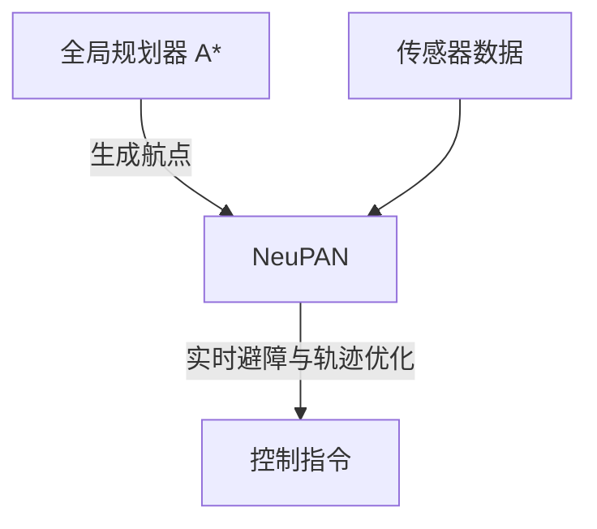

# 集成指南

<cite>
**本文档中引用的文件**  
- [README.md](file://README.md)
- [neupan.py](file://neupan/neupan.py)
- [initial_path.py](file://neupan/blocks/initial_path.py)
- [run_exp.py](file://example/run_exp.py)
- [LON_corridor.py](file://example/LON/LON_corridor.py)
- [planner.yaml](file://example/LON/planner.yaml)
</cite>

## 目录
1. [简介](#简介)
2. [与IR-SIM仿真环境集成](#与ir-sim仿真环境集成)
3. [与ROS系统集成](#与ros系统集成)
4. [与全局规划器结合使用](#与全局规划器结合使用)
5. [真实世界部署注意事项](#真实世界部署注意事项)
6. [结论](#结论)

## 简介
NeuPAN（Neural Proximal Alternating-minimization Network）是一种端到端、实时、无需地图且易于部署的基于模型预测控制（MPC）的机器人运动规划器。它通过将学习型方法与优化型方法相结合，直接将障碍点数据映射为控制动作，从而在复杂和未知环境中实现高效安全的导航。本指南详细说明了如何将NeuPAN与其他系统集成，包括IR-SIM仿真环境、ROS系统以及A*等全局规划器，并提供真实世界部署的关键建议。

## 与IR-SIM仿真环境集成
NeuPAN通过IR-SIM仿真环境进行测试和验证。IR-SIM是一个轻量级的机器人仿真平台，支持多种机器人模型和场景配置。

### 环境配置
要运行NeuPAN在IR-SIM中的示例，首先需要安装IR-SIM：
```bash
pip install ir-sim
```
然后克隆NeuPAN仓库并安装依赖：
```bash
git clone https://github.com/hanruihua/NeuPAN
cd NeuPAN
pip install -e .
```

### 通信机制
NeuPAN通过读取机器人的状态和激光雷达扫描数据来生成控制指令。`run_exp.py`脚本展示了如何与IR-SIM进行交互：
1. 使用`irsim.make()`创建仿真环境。
2. 调用`neupan.init_from_yaml()`从YAML配置文件初始化NeuPAN规划器。
3. 在主循环中，通过`env.get_robot_state()`获取机器人当前状态，通过`env.get_lidar_scan()`获取激光雷达数据。
4. 将传感器数据传递给NeuPAN规划器，得到控制动作并执行。

```python
robot_state = env.get_robot_state()
lidar_scan = env.get_lidar_scan()
points = neupan_planner.scan_to_point(robot_state, lidar_scan)
action, info = neupan_planner(robot_state, points)
```

**Section sources**
- [run_exp.py](file://example/run_exp.py#L0-L43)
- [README.md](file://README.md#L46-L58)

## 与ROS系统集成
NeuPAN提供了ROS封装器（neupan_ros），便于在ROS生态系统中使用。该封装器支持Gazebo仿真和真实机器人部署。

### /initial_path话题动态更新初始路径
在ROS系统中，可以通过`/initial_path`话题动态更新NeuPAN的初始路径。具体步骤如下：
1. 在NeuPAN配置中启用`refresh_initial_path`参数。
2. 发布包含路径点的消息到`/initial_path`话题，消息格式为一系列`[x, y, theta, gear]`四维向量，其中gear表示前进（1）或后退（-1）档位。
3. NeuPAN接收到新路径后会自动调用`set_initial_path()`方法更新内部路径。

此机制允许高层规划器（如A*）实时调整路径，实现动态重规划。

**Section sources**
- [neupan.py](file://neupan/neupan.py#L276-L327)
- [initial_path.py](file://neupan/blocks/initial_path.py#L0-L41)

## 与全局规划器结合使用
NeuPAN可以与A*等全局规划器结合，构建分层规划架构。在这种架构中，全局规划器负责生成粗略的无碰撞路径，而NeuPAN作为局部规划器，负责实时避障和轨迹优化。

### 利用set_initial_path API实现分层规划
通过`set_initial_path` API，可以将全局规划器生成的路径传递给NeuPAN作为初始参考路径。具体实现方式包括：
- **从航点生成路径**：使用`update_initial_path_from_waypoints()`方法，将A*输出的航点列表转换为平滑路径（直线、Dubins或Reeds-Shepp曲线）。
- **从起点到目标点生成路径**：使用`update_initial_path_from_goal()`方法，直接根据起始点和目标点生成初始路径。

这种分层设计使得NeuPAN能够在遵循全局路径的同时，灵活应对动态障碍物和环境变化。



**Diagram sources**
- [neupan.py](file://neupan/neupan.py#L322-L374)
- [initial_path.py](file://neupan/blocks/initial_path.py#L320-L361)

**Section sources**
- [neupan.py](file://neupan/neupan.py#L322-L374)
- [initial_path.py](file://neupan/blocks/initial_path.py#L320-L361)

## 真实世界部署注意事项
将NeuPAN部署到真实机器人时，需考虑以下关键因素：

### 传感器数据预处理
NeuPAN期望输入2D障碍点数据。对于3D激光雷达，需将其点云投影到2D平面：
- 使用`pointcloud_to_laserscan`等工具将3D点云转换为2D激光扫描数据。
- 在代码中调用`scan_to_point()`方法将激光扫描数据转换为2D点云坐标。

```python
points = neupan_planner.scan_to_point(robot_state, lidar_scan)
```

### 硬件平台选择建议
由于NeuPAN依赖于CPU进行实时优化求解，推荐使用高性能CPU（如Intel i7）以确保控制频率高于10Hz。虽然训练过程可利用GPU加速，但推理阶段建议使用CPU设备以获得更稳定的性能。

**Section sources**
- [neupan.py](file://neupan/neupan.py#L170-L203)
- [README.md](file://README.md#L210-L214)

## 结论
NeuPAN提供了一种高效的端到端机器人导航解决方案，能够无缝集成到IR-SIM仿真环境、ROS系统以及分层规划架构中。通过合理配置初始路径、优化参数和硬件平台，可以在复杂动态环境中实现安全可靠的自主导航。未来工作可进一步扩展对更多机器人运动学模型的支持，并提升在极端条件下的鲁棒性。