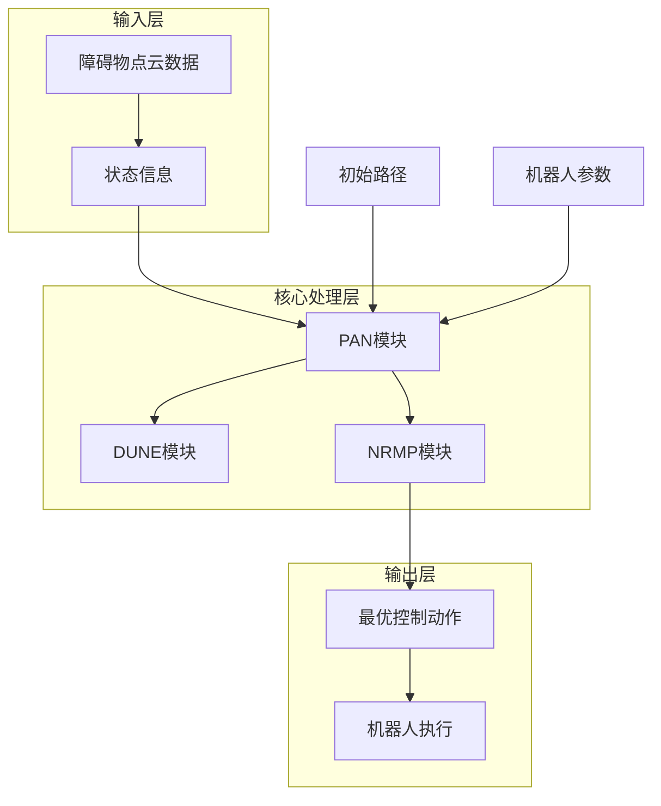

# 项目概述

<cite>
**本文档引用的文件**
- [README.md](file://README.md)
- [neupan.py](file://neupan/neupan.py)
- [pan.py](file://neupan/blocks/pan.py)
- [dune.py](file://neupan/blocks/dune.py)
- [nrmp.py](file://neupan/blocks/nrmp.py)
- [robot.py](file://neupan/robot/robot.py)
</cite>

## 目录
1. [引言](#引言)
2. [核心价值与设计理念](#核心价值与设计理念)
3. [技术特点](#技术特点)
4. [系统架构与工作流程](#系统架构与工作流程)
5. [应用场景与机器人支持](#应用场景与机器人支持)
6. [参数配置说明](#参数配置说明)
7. [DUNE模型训练](#dune模型训练)
8. [实际部署与性能优化](#实际部署与性能优化)
9. [与其他方法的对比优势](#与其他方法的对比优势)
10. [资源与参考资料](#资源与参考资料)

## 引言

NeuPAN（Neural Proximal Alternating-minimization Network）是一种端到端、实时、无需地图的基于模型预测控制（MPC）的机器人运动规划器。该系统通过整合学习与优化技术，直接将障碍物点云数据映射到控制动作，消除了传统模块化方法中因中间模块设计而产生的误差传播问题。NeuPAN能够在复杂未知环境中实现安全高效的导航，支持差速驱动和阿克曼转向机器人。

**Section sources**
- [README.md](file://README.md#L1-L242)

## 核心价值与设计理念

NeuPAN的核心价值在于其端到端的设计理念，通过直接将感知到的障碍物点云数据映射到控制动作，避免了传统导航系统中感知-定位-建图-路径规划-运动控制等多模块串联带来的累积误差。这种设计不仅提高了系统的整体精度，还显著增强了在动态和未知环境中的适应能力。

NeuPAN采用基于学习的DUNE（Deep Unfolded Neural Encoder）模块与基于优化的NRMP（Neural Regularized Motion Planner）模块相结合的方式，在每个控制周期内解决包含大量点级碰撞避免约束的数学优化问题。这种方法实现了高精度的实时运动规划，使机器人能够在密集和未知环境中高效安全地导航。

**Section sources**
- [README.md](file://README.md#L1-L242)
- [neupan.py](file://neupan/neupan.py#L1-L402)

## 技术特点

NeuPAN的技术特点主要体现在以下几个方面：

1. **端到端映射**：直接从障碍物点云数据到控制动作的映射，消除中间模块误差传播。
2. **实时性能**：基于MPC框架，在保证实时性的同时实现精确控制。
3. **无需地图**：不依赖预先构建的环境地图，适用于未知和动态环境。
4. **易于部署**：提供清晰的接口和配置文件，便于在不同机器人平台上部署。
5. **支持多种机器人类型**：兼容差速驱动和阿克曼转向机器人。

这些技术特点使得NeuPAN在复杂环境下的导航性能优于传统的模块化方法。

**Section sources**
- [README.md](file://README.md#L1-L242)
- [pan.py](file://neupan/blocks/pan.py#L1-L272)

## 系统架构与工作流程

NeuPAN的系统架构由多个关键组件构成，整体流程如下：



**Diagram sources**
- [README.md](file://README.md#L1-L242)
- [pan.py](file://neupan/blocks/pan.py#L1-L272)

系统工作流程包括：
1. 接收当前机器人状态和障碍物点云数据
2. 生成名义状态和控制输入
3. 通过DUNE模块提取潜在距离特征
4. 在NRMP模块中求解优化问题
5. 输出最优控制动作

**Section sources**
- [README.md](file://README.md#L1-L242)
- [pan.py](file://neupan/blocks/pan.py#L1-L272)

## 应用场景与机器人支持

NeuPAN适用于多种应用场景，包括但不限于：
- 复杂走廊环境导航
- 动态障碍物避障
- 非凸障碍物环境
- 路径跟随任务
- 多边形机器人导航
- 汽车倒车入库

系统支持两种主要的机器人运动学模型：
- **差速驱动机器人**（diff）：输出为线速度和角速度
- **阿克曼转向机器人**（acker）：输出为线速度和转向角

用户可以通过修改NRMP层中的运动学约束来支持其他类型的机器人。

**Section sources**
- [README.md](file://README.md#L1-L242)
- [robot.py](file://neupan/robot/robot.py#L1-L349)

## 参数配置说明

NeuPAN使用YAML文件进行参数配置，主要参数包括：

### MPC参数
| 参数名称 | 类型/默认值 | 描述 |
|---------|------------|------|
| `receding` | `int` / 10 | MPC预测步数 |
| `step_time` | `float` / 0.1 | MPC时间步长（秒） |
| `ref_speed` | `float` / 4.0 | MPC参考速度（米/秒） |

### 机器人参数
| 参数名称 | 类型/默认值 | 描述 |
|---------|------------|------|
| `kinematics` | `str` / "diff" | 机器人运动学类型 |
| `vertices` | `list[list[float]]` / None | 机器人顶点坐标 |
| `max_speed` | `list[float]` / [inf, inf] | 最大速度限制 |

### PAN参数
| 参数名称 | 类型/默认值 | 描述 |
|---------|------------|------|
| `iter_num` | `int` / 2 | PAN算法迭代次数 |
| `dune_max_num` | `int` / 100 | DUNE层考虑的最大点数 |
| `nrmp_max_num` | `int` / 10 | NRMP层考虑的最大点数 |

**Section sources**
- [README.md](file://README.md#L1-L242)

## DUNE模型训练

对于具有特定凸几何形状的机器人，需要训练DUNE模型。训练过程包括：

1. 定义机器人几何形状（通过vertices或length和width参数）
2. 设置训练参数（data_size, batch_size, epoch等）
3. 执行训练脚本

DUNE模型只需为新的机器人几何形状训练一次，之后可在各种环境中重复使用而无需重新训练。

```python
# 训练DUNE模型示例
def train_dune(self, train_kwargs):
    model_name = train_kwargs.get("model_name", self.robot.name)
    checkpoint_path = sys.path[0] + '/model' + '/' + model_name
    self.train_model = DUNETrain(self.model, self.G, self.h, checkpoint_path)
    self.full_model_name = self.train_model.start(**train_kwargs)
```

**Section sources**
- [README.md](file://README.md#L1-L242)
- [dune.py](file://neupan/blocks/dune.py#L1-L211)

## 实际部署与性能优化

在实际部署中，建议使用强大的CPU硬件平台（如Intel i7）以实现高于10Hz的控制频率。影响NeuPAN性能的主要因素包括：

1. CPU计算能力
2. adjust参数的调整
3. 提供的初始路径质量

为优化性能，可以调整以下参数：
- `receding`：减小预测步数
- `nrmp_max_num`和`dune_max_num`：减少考虑的障碍物点数
- `iter_num`和`iter_threshold`：调整迭代次数和收敛阈值

系统已提供ROS封装，可通过[neupan_ros](https://github.com/hanruihua/neupan_ros)仓库进行实际机器人部署。

**Section sources**
- [README.md](file://README.md#L1-L242)
- [neupan.py](file://neupan/neupan.py#L1-L402)

## 与其他方法的对比优势

与传统模块化方法相比，NeuPAN具有明显优势：

1. **精度更高**：端到端设计消除了中间模块的误差累积
2. **响应更快**：直接从感知到控制的映射减少了处理延迟
3. **适应性更强**：无需预先构建地图，适用于未知和动态环境
4. **部署更简单**：统一的框架减少了系统集成的复杂性

通过整合学习与优化技术，NeuPAN实现了在复杂环境下的安全高效导航，为机器人运动规划提供了新的解决方案。

**Section sources**
- [README.md](file://README.md#L1-L242)
- [pan.py](file://neupan/blocks/pan.py#L1-L272)

## 资源与参考资料

NeuPAN项目提供了丰富的资源供用户参考：

- **论文**：[IEEE Xplore](https://ieeexplore.ieee.org/abstract/document/10938329) | [ArXiv](https://arxiv.org/pdf/2403.06828.pdf)
- **视频演示**：[YouTube](https://youtu.be/SdSLWUmZZgQ) | [Bilibili](https://www.bilibili.com/video/BV1Zx421y778/?vd_source=cf6ba629063343717a192a5be9fe8985)
- **项目网站**：[NeuPAN官网](https://hanruihua.github.io/neupan_project/)
- **ROS封装**：[neupan_ros](https://github.com/hanruihua/neupan_ros)
- **安装教程**：通过pip安装`ir-sim`仿真环境

所有代码均在GNU General Public License v3.0许可下开源，欢迎贡献和反馈。

**Section sources**
- [README.md](file://README.md#L1-L242)