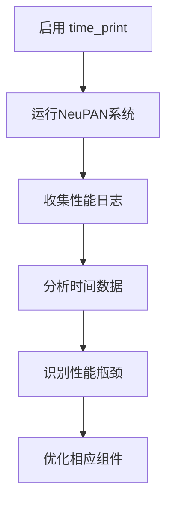
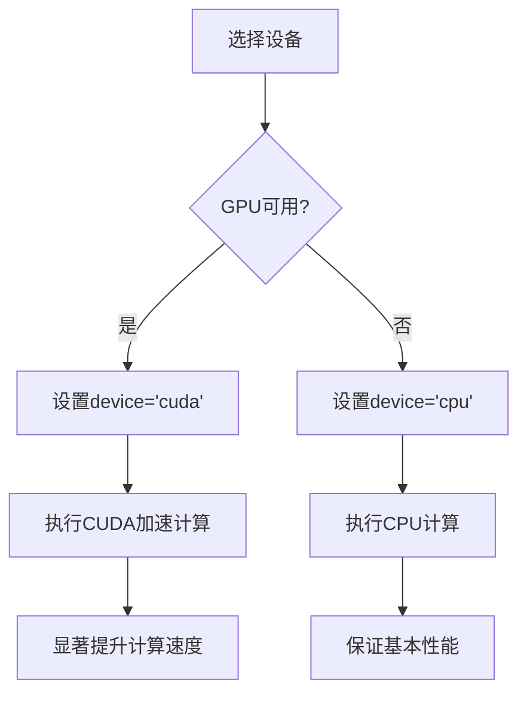
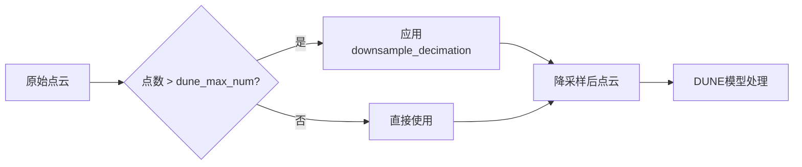

# 性能优化技巧

<cite>
**本文档中引用的文件**  
- [nrmp.py](file://neupan/blocks/nrmp.py)
- [pan.py](file://neupan/blocks/pan.py)
- [__init__.py](file://neupan/configuration/__init__.py)
- [__init__.py](file://neupan/util/__init__.py)
- [neupan.py](file://neupan/neupan.py)
</cite>

## 目录
1. [引言](#引言)
2. [迭代参数优化](#迭代参数优化)
3. [性能剖析与瓶颈识别](#性能剖析与瓶颈识别)
4. [设备加速与计算优化](#设备加速与计算优化)
5. [数据处理优化](#数据处理优化)
6. [综合优化策略](#综合优化策略)

## 引言
NeuPAN系统通过结合神经网络与优化算法实现高效运动规划。本指南深入探讨其性能优化策略，重点分析计算效率与规划精度之间的权衡。文档将详细说明关键参数配置、性能剖析方法以及计算加速技术，帮助用户在不同应用场景下实现最优性能。

## 迭代参数优化

NeuPAN系统的NRMP求解器通过迭代优化过程生成最优控制序列。其中，`iter_num`（迭代次数）和`iter_threshold`（收敛阈值）是两个核心参数，直接影响计算效率与规划质量。

`iter_num`参数控制PAN（Proximal Alternating Minimization Network）算法的最大迭代次数。较高的迭代次数可以提高规划精度，但会增加计算延迟。在实时性要求高的场景中，建议降低`iter_num`以减少延迟。例如，在`example/convex_obs/acker/planner.yaml`配置文件中，`iter_num`被设置为2，以平衡计算效率与规划质量。

`iter_threshold`参数定义了迭代收敛的判断阈值。该参数在`PAN`类的`stop_criteria`方法中使用，通过比较连续迭代间的状态差异来判断是否收敛。较小的阈值要求更高的收敛精度，适用于复杂障碍物环境；较大的阈值则允许更快的收敛速度，适用于简单场景。在`example/LON/planner.yaml`中，`iter_threshold`被设置为0.5，以适应走廊环境的规划需求。

**Section sources**
- [pan.py](file://neupan/blocks/pan.py#L64-L107)
- [pan.py](file://neupan/blocks/pan.py#L105-L140)
- [pan.py](file://neupan/blocks/pan.py#L206-L245)
- [planner.yaml](file://example/LON/planner.yaml#L40-L42)
- [planner.yaml](file://example/convex_obs/acker/planner.yaml#L33-L35)

## 性能剖析与瓶颈识别

NeuPAN系统提供了强大的性能剖析工具，帮助用户识别和解决性能瓶颈。核心工具是`time_it`装饰器和`forward`方法中的`time_print`功能。

`time_it`装饰器是一个通用的性能测量工具，用于测量函数执行时间。它通过在函数执行前后记录时间戳来计算执行时间，并在`configuration.time_print`标志启用时输出结果。该装饰器被应用于`NRMP`类的`forward`方法，标记为"- nrmp forward"，用于监控核心优化过程的执行时间。

`time_print`功能由`configuration`模块中的全局变量控制。当设置为`True`时，系统会输出各关键函数的执行时间，帮助用户识别性能瓶颈。在`example/convex_obs/acker/planner.yaml`配置文件中，`time_print`被设置为`True`，以启用详细的性能日志输出。

性能剖析流程如下：首先在配置文件中启用`time_print`，然后运行系统并收集性能数据，最后分析输出的时间日志以识别耗时最长的组件。例如，如果"- nrmp forward"的执行时间过长，可能需要优化NRMP求解器的参数配置或减少迭代次数。

**Diagram sources**
- [__init__.py](file://neupan/util/__init__.py#L15-L30)
- [__init__.py](file://neupan/configuration/__init__.py#L4-L6)
- [nrmp.py](file://neupan/blocks/nrmp.py#L76-L78)

**Section sources**
- [__init__.py](file://neupan/util/__init__.py#L15-L30)
- [__init__.py](file://neupan/configuration/__init__.py#L4-L6)
- [nrmp.py](file://neupan/blocks/nrmp.py#L76-L78)
- [planner.yaml](file://example/convex_obs/acker/planner.yaml#L4-L6)

## 设备加速与计算优化

NeuPAN系统支持CPU和CUDA设备，通过`device`参数控制计算设备的选择。该参数在`neupan`类的初始化过程中设置，并影响整个系统的计算性能。

`device`参数可以设置为'cpu'或'cuda'。在GPU可用时启用CUDA加速可以显著提高计算速度，特别是在处理大规模点云数据和深度神经网络推理时。系统通过`configuration.device`全局变量统一管理设备设置，确保所有张量操作都在指定设备上执行。

CUDA加速的最佳实践包括：确保系统安装了兼容的CUDA驱动和PyTorch CUDA版本，在配置文件中将`device`设置为'cuda'，并验证GPU内存足够处理预期的工作负载。在`example/LON/planner.yaml`中，`device`被设置为'cpu'，适用于计算资源受限的场景。

`cur_vel_array`缓存机制是另一个重要的性能优化技术。该缓存存储了连续规划周期中的速度数组，避免了重复计算。在`neupan`类的`forward`方法中，优化后的速度序列被保存到`cur_vel_array`中，作为下一次规划的初始猜测，从而加速收敛过程。

**Diagram sources**
- [__init__.py](file://neupan/configuration/__init__.py#L4-L6)
- [neupan.py](file://neupan/neupan.py#L20-L25)

**Section sources**
- [__init__.py](file://neupan/configuration/__init__.py#L4-L6)
- [neupan.py](file://neupan/neupan.py#L20-L25)
- [neupan.py](file://neupan/neupan.py#L130-L135)
- [planner.yaml](file://example/LON/planner.yaml#L5-L7)

## 数据处理优化

NeuPAN系统通过多种技术优化数据处理速度，其中`down_sample`参数是关键的优化手段之一。该参数用于减少点云数据的采样率，从而降低计算复杂度。

`down_sample`参数在`scan_to_point`和`scan_to_point_velocity`方法中使用，控制激光雷达扫描数据转换为点云时的下采样率。较高的下采样率（即较大的`down_sample`值）会减少点云中的点数，显著提高数据处理速度，但可能降低障碍物检测的精度。用户需要根据具体应用场景权衡精度与效率。

在`dune_layer`中，系统还实现了自动的点云下采样机制。当输入的障碍物点数超过`dune_max_num`时，系统会自动调用`downsample_decimation`函数进行降采样。这一机制确保了DUNE模型的输入规模保持稳定，避免了因点云规模波动导致的性能不稳定。

**Diagram sources**
- [neupan.py](file://neupan/neupan.py#L170-L206)
- [pan.py](file://neupan/blocks/pan.py#L136-L174)
- [__init__.py](file://neupan/util/__init__.py#L280-L290)

**Section sources**
- [neupan.py](file://neupan/neupan.py#L170-L206)
- [pan.py](file://neupan/blocks/pan.py#L136-L174)
- [__init__.py](file://neupan/util/__init__.py#L280-L290)

## 综合优化策略

为了实现最佳性能，建议采用综合优化策略，根据具体应用场景调整参数配置。对于实时性要求高的场景，推荐降低`iter_num`、增加`down_sample`率，并启用CUDA加速。对于复杂障碍物环境，建议提高`iter_threshold`以确保收敛质量，同时适当增加`dune_max_num`以提高障碍物检测精度。

参数调优应遵循系统化流程：首先确定应用的基本需求（实时性、精度等），然后选择合适的设备配置，接着调整迭代参数，最后优化数据处理参数。通过这种分层优化方法，可以有效平衡计算效率与规划质量，实现NeuPAN系统的最佳性能表现。

**Section sources**
- [planner.yaml](file://example/LON/planner.yaml)
- [planner.yaml](file://example/convex_obs/acker/planner.yaml)
- [nrmp.py](file://neupan/blocks/nrmp.py)
- [pan.py](file://neupan/blocks/pan.py)
- [neupan.py](file://neupan/neupan.py)