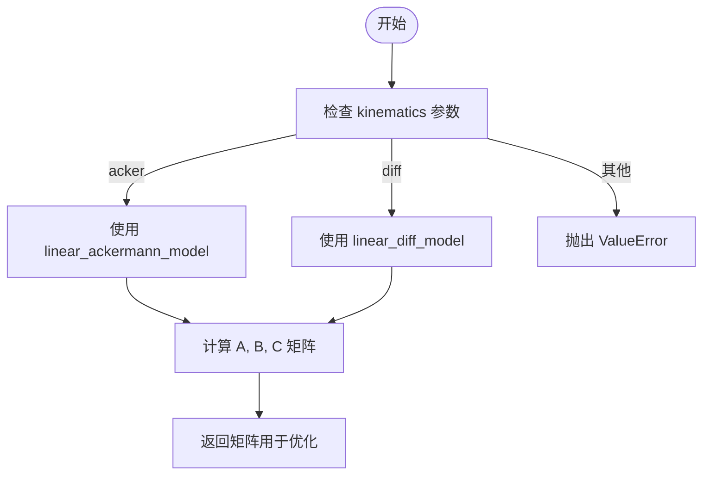
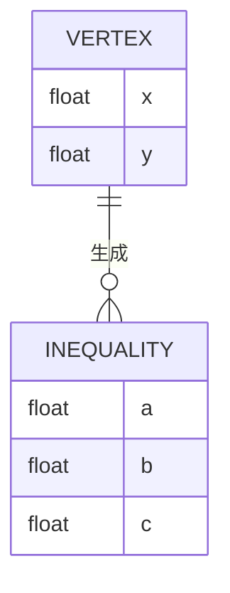
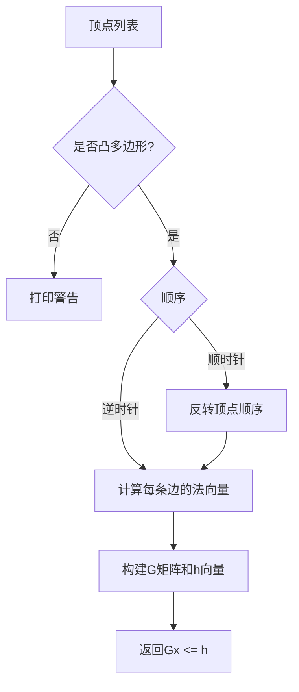

# 自定义机器人动力学

<cite>
**本文档中引用的文件**  
- [robot.py](file://neupan/robot/robot.py#L0-L349)
- [__init__.py](file://neupan/util/__init__.py#L160-L205)
- [env.yaml](file://example/polygon_robot/diff/env.yaml#L0-L42)
</cite>

## 目录
1. [引言](#引言)
2. [机器人动力学参数处理机制](#机器人动力学参数处理机制)
3. [自定义动力学模型的实现方法](#自定义动力学模型的实现方法)
4. [全向移动机器人模型示例](#全向移动机器人模型示例)
5. [顶点参数与机器人几何建模](#顶点参数与机器人几何建模)
6. [速度与加速度约束机制](#速度与加速度约束机制)
7. [碰撞避免中的G和h矩阵生成](#碰撞避免中的g和h矩阵生成)
8. [总结](#总结)

## 引言
NeuPAN 是一个基于优化的运动规划框架，其核心在于对机器人动力学模型的灵活支持。本文档详细说明如何扩展 NeuPAN 以支持新的机器人运动学模型，重点解析 `robot.py` 中的动力学参数处理机制，并通过具体示例展示如何定义新型机器人模型，包括状态方程雅可比矩阵的推导、非矩形轮廓建模、控制输入约束设置以及碰撞避免中的几何约束生成。

## 机器人动力学参数处理机制

NeuPAN 的 `robot` 类通过 `kinematics` 参数指定机器人类型，目前支持阿克曼转向（`acker`）和差速驱动（`diff`）两种模型。该参数在初始化时必须提供，否则将抛出异常。系统根据此参数选择相应的线性化动力学模型函数（`linear_ackermann_model` 或 `linear_diff_model`），用于生成优化问题中的状态转移矩阵 A、B、C。

在 `generate_state_parameter_value` 方法中，系统遍历预测时域 T，根据当前标称状态和控制输入，调用对应的动力学模型函数计算每个时间步的雅可比矩阵。这些矩阵随后作为参数注入优化问题中，实现对非线性动力学的局部线性近似。

**Section sources**
- [robot.py](file://neupan/robot/robot.py#L43-L45)
- [robot.py](file://neupan/robot/robot.py#L194-L218)

## 自定义动力学模型的实现方法

要扩展 NeuPAN 以支持新的机器人动力学模型，用户需继承 `robot` 类并重写 `linear_ackermann_model` 或 `linear_diff_model` 方法。这两个方法返回状态转移方程的雅可比矩阵 A、B 和常数项 C，形式为：

$$
x_{t+1} = A_t x_t + B_t u_t + C_t
$$

其中：
- $ A_t = \frac{\partial f}{\partial x} \big|_{x_t, u_t} $
- $ B_t = \frac{\partial f}{\partial u} \big|_{x_t, u_t} $
- $ C_t = f(x_t, u_t) - A_t x_t - B_t u_t $

新模型的实现应遵循相同的接口规范，确保返回的张量维度与状态空间一致（3×3 对于 A，3×2 对于 B，3×1 对于 C），并使用 `to_device` 函数确保张量位于正确的计算设备上。



**Diagram sources**
- [robot.py](file://neupan/robot/robot.py#L194-L218)

**Section sources**
- [robot.py](file://neupan/robot/robot.py#L219-L254)

## 全向移动机器人模型示例

假设我们要定义一种全向移动机器人（Omni-directional Robot），其运动学模型为：

$$
\begin{bmatrix}
\dot{x} \\
\dot{y} \\
\dot{\theta}
\end{bmatrix}
=
\begin{bmatrix}
v_x \\
v_y \\
\omega
\end{bmatrix}
$$

其离散化后的线性模型为：

$$
x_{t+1} = x_t + v_x \Delta t \\
y_{t+1} = y_t + v_y \Delta t \\
\theta_{t+1} = \theta_t + \omega \Delta t
$$

对应的雅可比矩阵为：
- $ A = I_3 $
- $ B = \Delta t \cdot I_3 $
- $ C = 0 $

在代码中可实现为：

```python
class omni_robot(robot):
    def linear_omni_model(self, nom_state, nom_u, dt):
        A = torch.eye(3)
        B = torch.diag(torch.tensor([dt, dt, dt]))
        C = torch.zeros(3, 1)
        return to_device(A), to_device(B), to_device(C)
```

在 `generate_state_parameter_value` 中添加对该模型的支持即可。

## 顶点参数与机器人几何建模

`vertices` 参数用于定义机器人的几何轮廓，支持非矩形形状。用户可通过提供顶点坐标列表（如 `[[x1,y1], [x2,y2], ...]`）直接定义任意凸多边形机器人。若未提供顶点，则系统根据 `length`、`width` 和 `wheelbase` 自动生成矩形轮廓。

顶点坐标经 `cal_vertices` 方法处理后，传递给 `gen_inequal_from_vertex` 函数生成线性不等式约束 $ Gx \leq h $，用于碰撞检测。该函数通过计算相邻顶点连线的法向量来构建约束矩阵 G 和向量 h，确保机器人在规划路径时不与障碍物发生碰撞。



**Diagram sources**
- [robot.py](file://neupan/robot/robot.py#L256-L287)
- [__init__.py](file://neupan/util/__init__.py#L160-L205)

**Section sources**
- [robot.py](file://neupan/robot/robot.py#L256-L287)
- [__init__.py](file://neupan/util/__init__.py#L160-L205)
- [env.yaml](file://example/polygon_robot/diff/env.yaml#L10-L11)

## 速度与加速度约束机制

`max_speed` 和 `max_acce` 参数分别定义了机器人控制输入的最大速度和加速度。系统在初始化时将其转换为列向量，并分别赋值给 `speed_bound` 和 `acce_bound`（后者乘以时间步长 `dt`）。

这些约束通过 `bound_su_constraints` 方法实现，具体包括：
- 控制输入绝对值不超过速度上限：`cp.abs(self.indep_u) <= self.speed_bound`
- 相邻时间步控制输入变化率不超过加速度上限：`cp.abs(self.indep_u[:, 1:] - self.indep_u[:, :-1]) <= self.acce_bound`

对于阿克曼转向机器人，系统还对最大转向角进行特殊处理，若超过 1.57 弧度（约 90 度），则自动限制为 1.57 并发出警告。

**Section sources**
- [robot.py](file://neupan/robot/robot.py#L59-L68)
- [robot.py](file://neupan/robot/robot.py#L178-L184)

## 碰撞避免中的G和h矩阵生成

G 和 h 矩阵由 `gen_inequal_from_vertex` 函数生成，用于表示机器人轮廓的凸包不等式约束。对于每个顶点边，函数计算其法向量 (a, b) 和截距 c，形成不等式 $ ax + by \leq c $。

具体步骤如下：
1. 检查顶点是否构成凸多边形
2. 若为顺时针顺序，则反转为逆时针
3. 遍历每条边，计算方向向量 $ \vec{d} = (dx, dy) $
4. 法向量为 $ (a, b) = (dy, -dx) $
5. 截距 $ c = a \cdot x_0 + b \cdot y_0 $

这些不等式共同定义了机器人占据的空间区域，在优化过程中用于确保路径点与障碍物保持安全距离。



**Diagram sources**
- [__init__.py](file://neupan/util/__init__.py#L160-L205)

**Section sources**
- [__init__.py](file://neupan/util/__init__.py#L160-L205)

## 总结
本文档详细阐述了如何通过继承和重写 `robot` 类的方法来扩展 NeuPAN 以支持新的机器人动力学模型。通过合理设置 `vertices`、`max_speed` 和 `max_acce` 参数，用户可以精确建模真实机器人的几何形状和动力学限制。G 和 h 矩阵的生成机制确保了规划结果在几何上的可行性，为实现安全、高效的运动规划提供了基础。