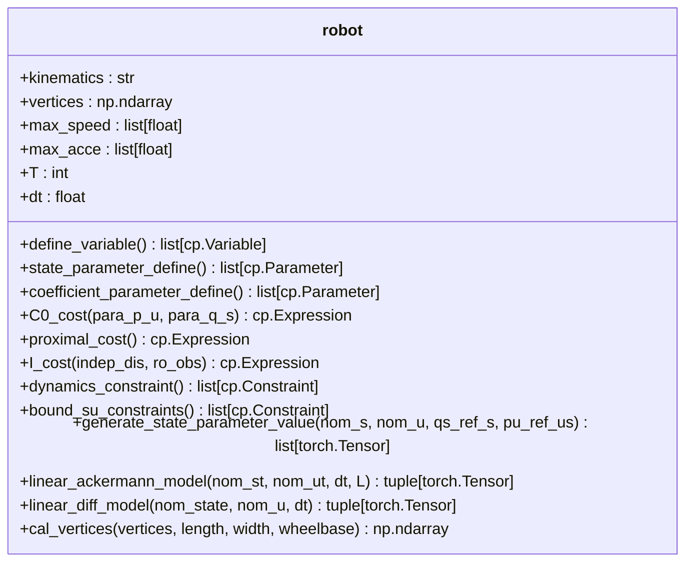
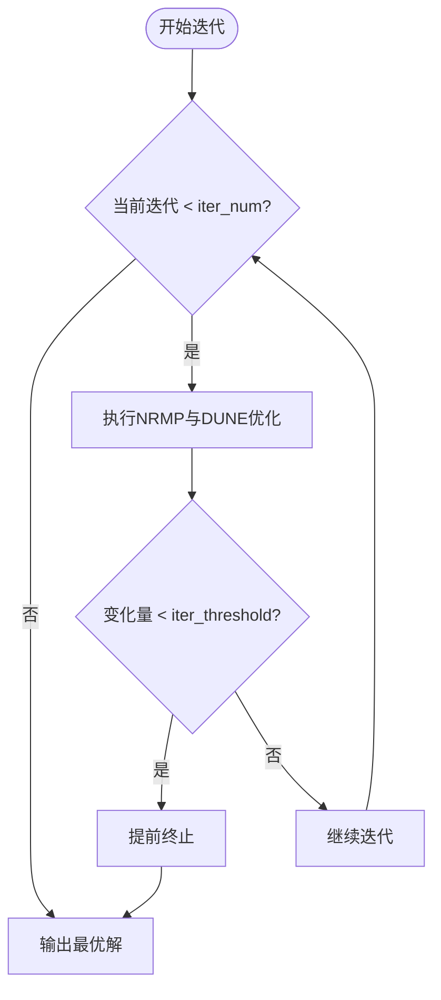

# 高级用法

<cite>
**本文档中引用的文件**  
- [robot.py](file://neupan/robot/robot.py)
- [neupan.py](file://neupan/neupan.py)
- [pan.py](file://neupan/blocks/pan.py)
- [initial_path.py](file://neupan/blocks/initial_path.py)
- [planner.yaml](file://example/corridor/diff/planner.yaml)
- [LON_corridor.py](file://example/LON/LON_corridor.py)
</cite>

## 目录
1. [引言](#引言)
2. [扩展机器人运动学模型](#扩展机器人运动学模型)
3. [实时调整adjust参数](#实时调整adjust参数)
4. [性能优化技巧](#性能优化技巧)
5. [自定义初始路径生成](#自定义初始路径生成)
6. [回调机制与复杂控制逻辑](#回调机制与复杂控制逻辑)

## 引言
NeuPAN 是一种基于近端交替最小化网络（Proximal Alternating Minimization Network, PAN）的高效运动规划算法，适用于动态环境中具有复杂运动学约束的机器人。本指南深入探讨其高级使用技巧与定制化方法，涵盖如何扩展系统以支持新的机器人模型、实时调整关键参数以适应不同场景、优化计算性能，以及通过回调机制实现更复杂的控制逻辑。

**Section sources**
- [neupan.py](file://neupan/neupan.py#L1-L50)

## 扩展机器人运动学模型
NeuPAN 支持多种机器人运动学模型，当前主要实现包括阿克曼转向（acker）和差速驱动（diff）。用户可通过修改 `robot.py` 文件中的 `robot` 类来扩展系统以支持新的机器人模型。

### 动力学约束定义
在 `robot.py` 中，`linear_ackermann_model` 和 `linear_diff_model` 方法分别定义了阿克曼和差速机器人的线性化动力学模型。这些模型用于生成状态转移矩阵 A、B 和 C，作为优化问题中的约束条件。

要添加新的运动学模型，需在 `generate_state_parameter_value` 方法中增加对应分支，并实现相应的线性化模型函数。该函数应返回状态雅可比矩阵（A）、控制雅可比矩阵（B）和常数项（C），以构建线性化的状态转移方程。

### 自定义机器人几何
机器人形状由 `vertices` 参数定义，可通过顶点列表或长宽参数生成矩形轮廓。若需支持非矩形机器人，可在初始化时传入自定义顶点列表，系统将自动计算不等式约束（G 和 h 矩阵）用于碰撞检测。



**Diagram sources**
- [robot.py](file://neupan/robot/robot.py#L50-L350)

**Section sources**
- [robot.py](file://neupan/robot/robot.py#L50-L350)

## 实时调整adjust参数
`adjust` 参数集在运行时可动态调整，以适应不同环境场景（如狭窄通道与开阔区域），从而优化避障行为与路径平滑性。

### 关键adjust参数
| 参数 | 说明 |
|------|------|
| `q_s` | 状态跟踪成本权重，影响路径跟踪精度 |
| `p_u` | 控制输入成本权重，影响控制平滑性 |
| `eta` | 障碍物避障成本权重，控制避障强度 |
| `d_max` | 最大感知距离，决定避障作用范围 |
| `d_min` | 最小安全距离，影响避障紧迫性 |

### 场景自适应策略
- **狭窄通道**：提高 `eta` 值以增强避障反应，适当降低 `q_s` 以允许路径轻微偏离参考轨迹。
- **开阔区域**：降低 `eta` 以减少不必要的绕行，提高 `q_s` 和 `p_u` 以保持高速平稳行驶。

通过 `neupan` 实例的 `update_adjust_parameters` 方法可实时更新这些参数：
```python
planner.update_adjust_parameters(eta=20.0, q_s=0.8)
```

**Section sources**
- [neupan.py](file://neupan/neupan.py#L300-L320)
- [pan.py](file://neupan/blocks/pan.py#L112-L149)

## 性能优化技巧
为平衡计算开销与收敛精度，可通过调整迭代参数优化性能。

### 迭代控制参数
| 参数 | 默认值 | 说明 |
|------|--------|------|
| `iter_num` | 2 | PAN 算法最大迭代次数 |
| `iter_threshold` | 0.1 | 收敛阈值，低于此值则提前终止迭代 |

### 优化策略
- **高动态环境**：设置较低的 `iter_threshold`（如 0.05）以确保更高精度，但会增加计算时间。
- **实时性要求高**：减少 `iter_num`（如设为 1）以降低延迟，牺牲部分优化质量。
- **稳定环境**：可适当提高 `iter_threshold`（如 0.2）以加快收敛速度。

这些参数在 YAML 配置文件中定义，例如 `example/corridor/diff/planner.yaml` 中的 `pan` 段落。



**Diagram sources**
- [pan.py](file://neupan/blocks/pan.py#L105-L140)
- [pan.py](file://neupan/blocks/pan.py#L206-L245)

**Section sources**
- [pan.py](file://neupan/blocks/pan.py#L31-L68)
- [planner.yaml](file://example/corridor/diff/planner.yaml#L30-L35)

## 自定义初始路径生成
初始路径由 `InitialPath` 类生成，支持从航点列表创建直线、Dubins 或 Reeds-Shepp 曲线。用户可通过继承或修改 `initial_path.py` 实现自定义路径生成逻辑。

### 扩展路径生成方式
通过 `curve_style` 参数指定曲线类型：
- `'line'`：线性插值
- `'dubins'`：Dubins 曲线
- `'reeds'`：Reeds-Shepp 曲线

自定义逻辑可重写 `generate_nom_ref_state` 方法，以实现基于环境感知的动态路径预测或融合全局规划器（如 A*）输出。

### 动态更新路径
使用 `update_initial_path_from_goal` 或 `update_initial_path_from_waypoints` 方法可在运行时更新路径，适用于目标点变化或重新规划场景。

**Section sources**
- [initial_path.py](file://neupan/blocks/initial_path.py#L0-L483)
- [neupan.py](file://neupan/neupan.py#L350-L380)

## 回调机制与复杂控制逻辑
NeuPAN 提供多种属性与方法作为回调接口，支持实现复杂控制逻辑。

### 可访问的关键属性
| 属性 | 说明 |
|------|------|
| `min_distance` | 当前到障碍物的最小距离 |
| `opt_trajectory` | 优化后的状态轨迹 |
| `ref_trajectory` | 参考状态轨迹 |
| `info` | 包含到达、停止、碰撞状态的字典 |

### 典型应用场景
- **安全监控**：监测 `min_distance`，低于阈值时触发紧急制动。
- **任务调度**：当 `info["arrive"]` 为 True 时切换至下一任务。
- **速度自适应**：根据轨迹曲率动态调整 `ref_speed`。

通过组合这些接口，可构建状态机或行为树实现高级自主决策。

**Section sources**
- [neupan.py](file://neupan/neupan.py#L200-L300)
- [initial_path.py](file://neupan/blocks/initial_path.py#L320-L361)