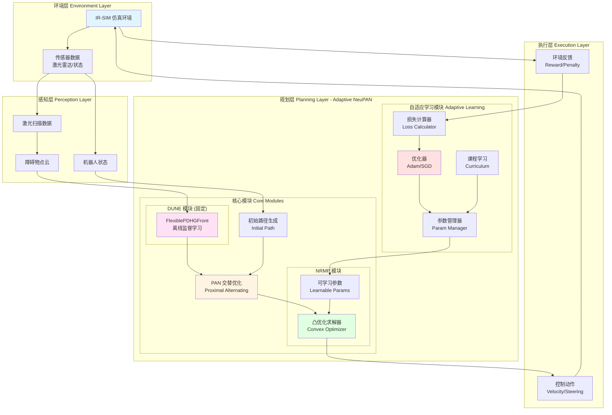
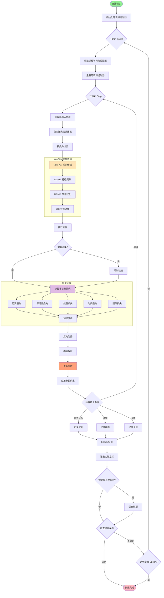
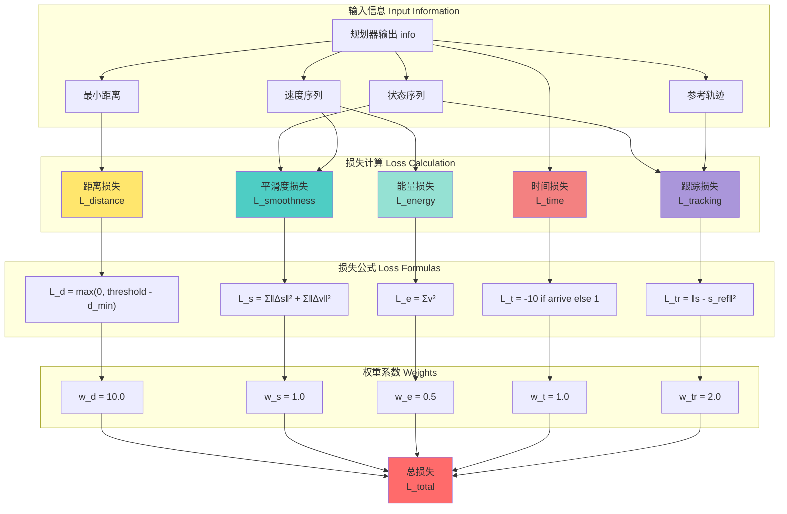
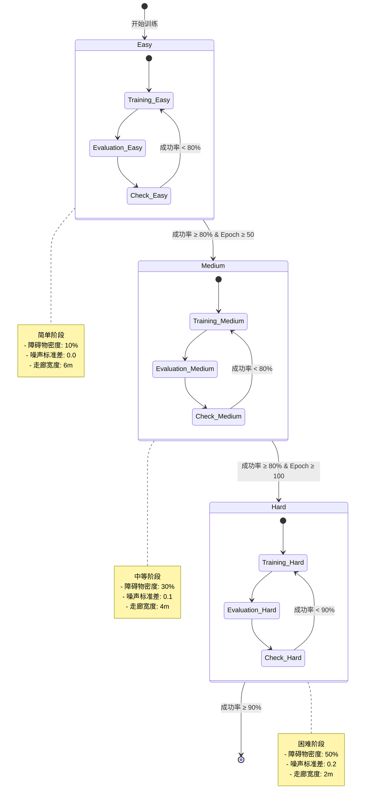
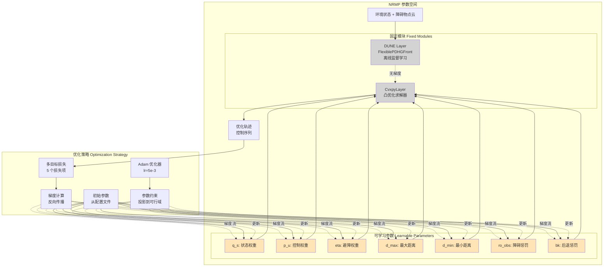
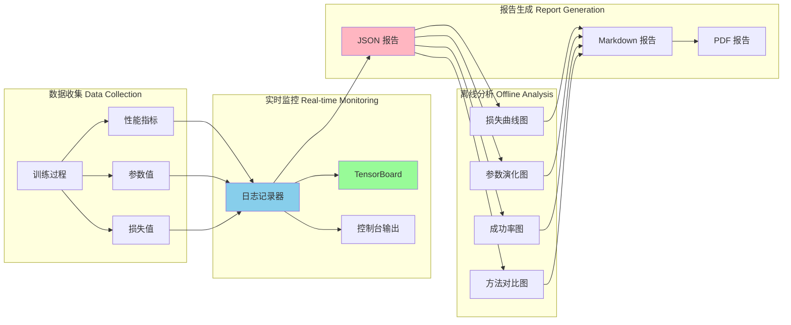
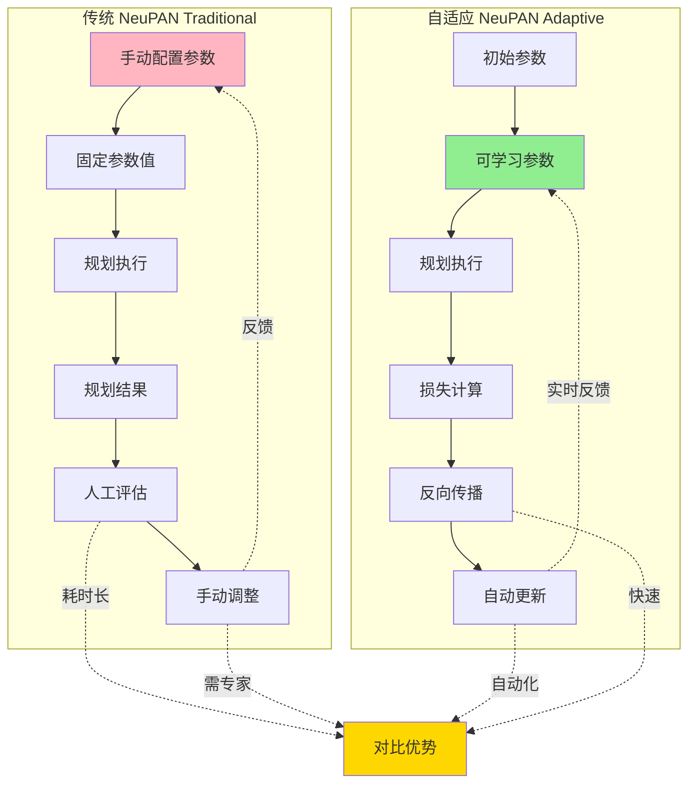

# LON 改进 NeuPAN 方案架构图与流程图

## 1. 整体系统架构



## 2. LON 在线学习流程



## 3. 参数优化流程

```mermaid
flowchart LR
    subgraph "参数空间 Parameter Space"
        P1[q_s: 状态权重]
        P2[p_u: 控制权重]
        P3[eta: 避障权重]
        P4[d_max: 最大距离]
        P5[d_min: 最小距离]
    end
    
    subgraph "优化过程 Optimization Process"
        INIT_PARAMS[初始参数<br/>从配置文件]
        FORWARD_PASS[前向传播<br/>生成轨迹]
        LOSS_COMP[损失计算<br/>多目标]
        BACKWARD_PASS[反向传播<br/>计算梯度]
        GRADIENT[梯度信息<br/>∂L/∂θ]
        OPTIMIZER_STEP[优化器更新<br/>Adam]
        NEW_PARAMS[新参数值]
        CONSTRAINT[约束投影<br/>参数范围]
    end
    
    subgraph "约束条件 Constraints"
        C1[q_s ∈ [0.01, 5.0]]
        C2[p_u ∈ [0.1, 10.0]]
        C3[eta ∈ [1.0, 50.0]]
        C4[d_max ∈ [0.1, 2.0]]
        C5[d_min ∈ [0.01, 0.5]]
    end
    
    P1 --> INIT_PARAMS
    P2 --> INIT_PARAMS
    P3 --> INIT_PARAMS
    P4 --> INIT_PARAMS
    P5 --> INIT_PARAMS
    
    INIT_PARAMS --> FORWARD_PASS
    FORWARD_PASS --> LOSS_COMP
    LOSS_COMP --> BACKWARD_PASS
    BACKWARD_PASS --> GRADIENT
    GRADIENT --> OPTIMIZER_STEP
    OPTIMIZER_STEP --> NEW_PARAMS
    NEW_PARAMS --> CONSTRAINT
    
    C1 --> CONSTRAINT
    C2 --> CONSTRAINT
    C3 --> CONSTRAINT
    C4 --> CONSTRAINT
    C5 --> CONSTRAINT
    
    CONSTRAINT -.更新.-> P1
    CONSTRAINT -.更新.-> P2
    CONSTRAINT -.更新.-> P3
    CONSTRAINT -.更新.-> P4
    CONSTRAINT -.更新.-> P5
    
    style INIT_PARAMS fill:#B0E0E6
    style OPTIMIZER_STEP fill:#FFB6C1
    style CONSTRAINT fill:#98FB98
```

## 4. 多目标损失函数结构



## 5. 课程学习策略



## 6. NRMP 参数优化架构



## 7. 性能监控与可视化



## 8. 对比：传统 NeuPAN vs Adaptive NeuPAN



---

**说明**：
- 以上图表使用 Mermaid 语法绘制，可在支持 Mermaid 的 Markdown 渲染器中查看
- 建议使用 Typora、VS Code (Markdown Preview Enhanced) 或 GitHub 查看
- 图表颜色编码：
  - 🟦 蓝色：输入/数据层
  - 🟨 黄色：处理/计算层
  - 🟩 绿色：输出/结果层
  - 🟥 红色：关键/核心模块

